# Exploratory Data Analysis Starter


<!-- WARNING: THIS FILE WAS AUTOGENERATED! DO NOT EDIT! -->

## File management

### Import packages

``` python
import os
import polars as pl
import matplotlib.pyplot as plt
import seaborn as sns
from pathlib import Path
from IPython.display import display
```

### Folder and data loading

``` python
root = Path("../").resolve()
source = root/"resources" 
path_client_data = source/"client_data.csv"
path_price_data = source/"price_data.csv"

assert path_client_data.exists(), f"Client data file not found at {path_client_data}"
assert path_price_data.exists(), f"Price data file not found at {path_price_data}"
```

``` python
client_df = pl.read_csv(path_client_data, try_parse_dates=True)
price_df = pl.read_csv(path_price_data, try_parse_dates=True)
```

## Info of the dataframes

``` python
def print_polars_shape(df=client_df, df_element_name:str="Clients"):
    table = pl.DataFrame(data=[df.shape], schema=[df_element_name, "Columns"], orient="row")
    display(table)
```

### Client Dataset

#### Datatypes

``` python
client_df.schema
```

    Schema([('id', String),
            ('channel_sales', String),
            ('cons_12m', Int64),
            ('cons_gas_12m', Int64),
            ('cons_last_month', Int64),
            ('date_activ', Date),
            ('date_end', Date),
            ('date_modif_prod', Date),
            ('date_renewal', Date),
            ('forecast_cons_12m', Float64),
            ('forecast_cons_year', Int64),
            ('forecast_discount_energy', Float64),
            ('forecast_meter_rent_12m', Float64),
            ('forecast_price_energy_off_peak', Float64),
            ('forecast_price_energy_peak', Float64),
            ('forecast_price_pow_off_peak', Float64),
            ('has_gas', String),
            ('imp_cons', Float64),
            ('margin_gross_pow_ele', Float64),
            ('margin_net_pow_ele', Float64),
            ('nb_prod_act', Int64),
            ('net_margin', Float64),
            ('num_years_antig', Int64),
            ('origin_up', String),
            ('pow_max', Float64),
            ('churn', Int64)])

``` python
client_df.sample(3)
```

<div><style>
.dataframe > thead > tr,
.dataframe > tbody > tr {
  text-align: right;
  white-space: pre-wrap;
}
</style>
<small>shape: (3, 26)</small>

<table class="dataframe" data-quarto-postprocess="true" data-border="1">
<thead>
<tr>
<th data-quarto-table-cell-role="th">id</th>
<th data-quarto-table-cell-role="th">channel_sales</th>
<th data-quarto-table-cell-role="th">cons_12m</th>
<th data-quarto-table-cell-role="th">cons_gas_12m</th>
<th data-quarto-table-cell-role="th">cons_last_month</th>
<th data-quarto-table-cell-role="th">date_activ</th>
<th data-quarto-table-cell-role="th">date_end</th>
<th data-quarto-table-cell-role="th">date_modif_prod</th>
<th data-quarto-table-cell-role="th">date_renewal</th>
<th data-quarto-table-cell-role="th">forecast_cons_12m</th>
<th data-quarto-table-cell-role="th">forecast_cons_year</th>
<th data-quarto-table-cell-role="th">forecast_discount_energy</th>
<th data-quarto-table-cell-role="th">forecast_meter_rent_12m</th>
<th data-quarto-table-cell-role="th">forecast_price_energy_off_peak</th>
<th data-quarto-table-cell-role="th">forecast_price_energy_peak</th>
<th data-quarto-table-cell-role="th">forecast_price_pow_off_peak</th>
<th data-quarto-table-cell-role="th">has_gas</th>
<th data-quarto-table-cell-role="th">imp_cons</th>
<th data-quarto-table-cell-role="th">margin_gross_pow_ele</th>
<th data-quarto-table-cell-role="th">margin_net_pow_ele</th>
<th data-quarto-table-cell-role="th">nb_prod_act</th>
<th data-quarto-table-cell-role="th">net_margin</th>
<th data-quarto-table-cell-role="th">num_years_antig</th>
<th data-quarto-table-cell-role="th">origin_up</th>
<th data-quarto-table-cell-role="th">pow_max</th>
<th data-quarto-table-cell-role="th">churn</th>
</tr>
<tr>
<th>str</th>
<th>str</th>
<th>i64</th>
<th>i64</th>
<th>i64</th>
<th>date</th>
<th>date</th>
<th>date</th>
<th>date</th>
<th>f64</th>
<th>i64</th>
<th>f64</th>
<th>f64</th>
<th>f64</th>
<th>f64</th>
<th>f64</th>
<th>str</th>
<th>f64</th>
<th>f64</th>
<th>f64</th>
<th>i64</th>
<th>f64</th>
<th>i64</th>
<th>str</th>
<th>f64</th>
<th>i64</th>
</tr>
</thead>
<tbody>
<tr>
<td>"8c79c2a9e407a9f5f0dffbabbb193d…</td>
<td>"lmkebamcaaclubfxadlmueccxoimle…</td>
<td>5731448</td>
<td>0</td>
<td>771203</td>
<td>2011-07-20</td>
<td>2016-04-30</td>
<td>2014-04-24</td>
<td>2015-05-01</td>
<td>7087.21</td>
<td>9311</td>
<td>0.0</td>
<td>144.0</td>
<td>0.114017</td>
<td>0.097679</td>
<td>40.606701</td>
<td>"f"</td>
<td>826.53</td>
<td>21.86</td>
<td>21.86</td>
<td>1</td>
<td>751.48</td>
<td>5</td>
<td>"lxidpiddsbxsbosboudacockeimpue…</td>
<td>27.713</td>
<td>0</td>
</tr>
<tr>
<td>"f3e583108700fa2a9c87043d060b35…</td>
<td>"MISSING"</td>
<td>4658</td>
<td>0</td>
<td>963</td>
<td>2011-10-20</td>
<td>2016-10-20</td>
<td>2011-10-20</td>
<td>2015-10-23</td>
<td>446.32</td>
<td>963</td>
<td>0.0</td>
<td>132.15</td>
<td>0.116509</td>
<td>0.101397</td>
<td>41.271364</td>
<td>"f"</td>
<td>90.86</td>
<td>53.12</td>
<td>53.12</td>
<td>1</td>
<td>44.08</td>
<td>4</td>
<td>"ldkssxwpmemidmecebumciepifcamk…</td>
<td>26.6</td>
<td>0</td>
</tr>
<tr>
<td>"cf6ae01ad255d1a467358a69eb018a…</td>
<td>"foosdfpfkusacimwkcsosbicdxkica…</td>
<td>13551</td>
<td>0</td>
<td>2520</td>
<td>2010-05-28</td>
<td>2016-05-28</td>
<td>2010-05-28</td>
<td>2015-06-01</td>
<td>1988.86</td>
<td>2520</td>
<td>0.0</td>
<td>20.08</td>
<td>0.142819</td>
<td>0.0</td>
<td>44.311378</td>
<td>"f"</td>
<td>363.69</td>
<td>21.81</td>
<td>21.81</td>
<td>1</td>
<td>161.74</td>
<td>6</td>
<td>"lxidpiddsbxsbosboudacockeimpue…</td>
<td>13.15</td>
<td>0</td>
</tr>
</tbody>
</table>

</div>

#### Analysis

The size of the dataset

``` python
print_polars_shape(client_df, "Clients")
```

<div><style>
.dataframe > thead > tr,
.dataframe > tbody > tr {
  text-align: right;
  white-space: pre-wrap;
}
</style>
<small>shape: (1, 2)</small>

<table class="dataframe" data-quarto-postprocess="true" data-border="1">
<thead>
<tr>
<th data-quarto-table-cell-role="th">Clients</th>
<th data-quarto-table-cell-role="th">Columns</th>
</tr>
<tr>
<th>i64</th>
<th>i64</th>
</tr>
</thead>
<tbody>
<tr>
<td>14606</td>
<td>26</td>
</tr>
</tbody>
</table>

</div>

``` python
# date_cont_end = pl.col("date_end").str.to_date(format="%Y-%m-%d")
date_cont_end = pl.col("date_end")
year_end = date_cont_end.dt.year().alias("year_end")
month_end = date_cont_end.dt.month().alias("month_end")

client_df.select(pl.col("churn"), year_end, month_end).group_by(pl.col("year_end")).agg(
    pl.col("churn").len().alias("Clients_ended_contract"),
    pl.col("churn").sum().alias("Clients_churned")
    ).sort("year_end", descending=False)
```

<div><style>
.dataframe > thead > tr,
.dataframe > tbody > tr {
  text-align: right;
  white-space: pre-wrap;
}
</style>
<small>shape: (2, 3)</small>

<table class="dataframe" data-quarto-postprocess="true" data-border="1">
<thead>
<tr>
<th data-quarto-table-cell-role="th">year_end</th>
<th data-quarto-table-cell-role="th">Clients_ended_contract</th>
<th data-quarto-table-cell-role="th">Clients_churned</th>
</tr>
<tr>
<th>i32</th>
<th>u32</th>
<th>i64</th>
</tr>
</thead>
<tbody>
<tr>
<td>2016</td>
<td>13663</td>
<td>1318</td>
</tr>
<tr>
<td>2017</td>
<td>943</td>
<td>101</td>
</tr>
</tbody>
</table>

</div>

It is also interesting to see how many unique values are in each column.

``` python
unique_counts = client_df.select([
    pl.col(col).n_unique().alias(f"{col}_n_unique") for col in client_df.columns
])
display(unique_counts)
```

<div><style>
.dataframe > thead > tr,
.dataframe > tbody > tr {
  text-align: right;
  white-space: pre-wrap;
}
</style>
<small>shape: (1, 26)</small>

<table class="dataframe" data-quarto-postprocess="true" data-border="1">
<thead>
<tr>
<th data-quarto-table-cell-role="th">id_n_unique</th>
<th data-quarto-table-cell-role="th">channel_sales_n_unique</th>
<th data-quarto-table-cell-role="th">cons_12m_n_unique</th>
<th data-quarto-table-cell-role="th">cons_gas_12m_n_unique</th>
<th data-quarto-table-cell-role="th">cons_last_month_n_unique</th>
<th data-quarto-table-cell-role="th">date_activ_n_unique</th>
<th data-quarto-table-cell-role="th">date_end_n_unique</th>
<th data-quarto-table-cell-role="th">date_modif_prod_n_unique</th>
<th data-quarto-table-cell-role="th">date_renewal_n_unique</th>
<th data-quarto-table-cell-role="th">forecast_cons_12m_n_unique</th>
<th data-quarto-table-cell-role="th">forecast_cons_year_n_unique</th>
<th
data-quarto-table-cell-role="th">forecast_discount_energy_n_unique</th>
<th
data-quarto-table-cell-role="th">forecast_meter_rent_12m_n_unique</th>
<th
data-quarto-table-cell-role="th">forecast_price_energy_off_peak_n_unique</th>
<th
data-quarto-table-cell-role="th">forecast_price_energy_peak_n_unique</th>
<th
data-quarto-table-cell-role="th">forecast_price_pow_off_peak_n_unique</th>
<th data-quarto-table-cell-role="th">has_gas_n_unique</th>
<th data-quarto-table-cell-role="th">imp_cons_n_unique</th>
<th data-quarto-table-cell-role="th">margin_gross_pow_ele_n_unique</th>
<th data-quarto-table-cell-role="th">margin_net_pow_ele_n_unique</th>
<th data-quarto-table-cell-role="th">nb_prod_act_n_unique</th>
<th data-quarto-table-cell-role="th">net_margin_n_unique</th>
<th data-quarto-table-cell-role="th">num_years_antig_n_unique</th>
<th data-quarto-table-cell-role="th">origin_up_n_unique</th>
<th data-quarto-table-cell-role="th">pow_max_n_unique</th>
<th data-quarto-table-cell-role="th">churn_n_unique</th>
</tr>
<tr>
<th>u32</th>
<th>u32</th>
<th>u32</th>
<th>u32</th>
<th>u32</th>
<th>u32</th>
<th>u32</th>
<th>u32</th>
<th>u32</th>
<th>u32</th>
<th>u32</th>
<th>u32</th>
<th>u32</th>
<th>u32</th>
<th>u32</th>
<th>u32</th>
<th>u32</th>
<th>u32</th>
<th>u32</th>
<th>u32</th>
<th>u32</th>
<th>u32</th>
<th>u32</th>
<th>u32</th>
<th>u32</th>
<th>u32</th>
</tr>
</thead>
<tbody>
<tr>
<td>14606</td>
<td>8</td>
<td>11065</td>
<td>2112</td>
<td>4751</td>
<td>1796</td>
<td>368</td>
<td>2129</td>
<td>386</td>
<td>13993</td>
<td>4218</td>
<td>12</td>
<td>3528</td>
<td>516</td>
<td>329</td>
<td>41</td>
<td>2</td>
<td>7752</td>
<td>2391</td>
<td>2391</td>
<td>10</td>
<td>11965</td>
<td>13</td>
<td>6</td>
<td>698</td>
<td>2</td>
</tr>
</tbody>
</table>

</div>

Fields with a low number of unique values are:

<table>
<thead>
<tr>
<th style="text-align: left;">Field</th>
<th style="text-align: right;">Number of unique values</th>
</tr>
</thead>
<tbody>
<tr>
<td style="text-align: left;">channel_sales</td>
<td style="text-align: right;">8</td>
</tr>
<tr>
<td style="text-align: left;">forecast_discount_energy</td>
<td style="text-align: right;">12</td>
</tr>
<tr>
<td style="text-align: left;">has_gas</td>
<td style="text-align: right;">2</td>
</tr>
<tr>
<td style="text-align: left;">nb_prod_act</td>
<td style="text-align: right;">10</td>
</tr>
<tr>
<td style="text-align: left;">num_years_antig</td>
<td style="text-align: right;">13</td>
</tr>
<tr>
<td style="text-align: left;">origin_up</td>
<td style="text-align: right;">6</td>
</tr>
<tr>
<td style="text-align: left;">churn</td>
<td style="text-align: right;">2</td>
</tr>
</tbody>
</table>

- There are 14606 unique clients, same as the number of rows in the
  dataset. This means that for each client there is only one row with
  all the information of this dataset (No need to group_by “id”).  
- There is field “has_gas” and it is reported the consumption of
  electricity and gas.  
- The field “nb_prod_act” (number of active products and services) has
  10 unique values. We only know about the electricity and gas
  consumption. I can not relate this field with the gas and electricity
  contracts.

### Price Dataset

#### Datatypes

``` python
price_df.schema
```

    Schema([('id', String),
            ('price_date', Date),
            ('price_off_peak_var', Float64),
            ('price_peak_var', Float64),
            ('price_mid_peak_var', Float64),
            ('price_off_peak_fix', Float64),
            ('price_peak_fix', Float64),
            ('price_mid_peak_fix', Float64)])

``` python
price_df.sample(3)
```

<div><style>
.dataframe > thead > tr,
.dataframe > tbody > tr {
  text-align: right;
  white-space: pre-wrap;
}
</style>
<small>shape: (3, 8)</small>

<table class="dataframe" data-quarto-postprocess="true" data-border="1">
<thead>
<tr>
<th data-quarto-table-cell-role="th">id</th>
<th data-quarto-table-cell-role="th">price_date</th>
<th data-quarto-table-cell-role="th">price_off_peak_var</th>
<th data-quarto-table-cell-role="th">price_peak_var</th>
<th data-quarto-table-cell-role="th">price_mid_peak_var</th>
<th data-quarto-table-cell-role="th">price_off_peak_fix</th>
<th data-quarto-table-cell-role="th">price_peak_fix</th>
<th data-quarto-table-cell-role="th">price_mid_peak_fix</th>
</tr>
<tr>
<th>str</th>
<th>date</th>
<th>f64</th>
<th>f64</th>
<th>f64</th>
<th>f64</th>
<th>f64</th>
<th>f64</th>
</tr>
</thead>
<tbody>
<tr>
<td>"99f895630331727510e28852b3eb0a…</td>
<td>2015-06-01</td>
<td>0.152445</td>
<td>0.0</td>
<td>0.0</td>
<td>44.26693</td>
<td>0.0</td>
<td>0.0</td>
</tr>
<tr>
<td>"1ae23d4880f064e544ac5d73404e03…</td>
<td>2015-09-01</td>
<td>0.115854</td>
<td>0.098169</td>
<td>0.072195</td>
<td>40.728885</td>
<td>24.43733</td>
<td>16.291555</td>
</tr>
<tr>
<td>"a63219d8733292921e0c6607d58184…</td>
<td>2015-04-01</td>
<td>0.128069</td>
<td>0.105842</td>
<td>0.073773</td>
<td>40.728885</td>
<td>24.43733</td>
<td>16.291555</td>
</tr>
</tbody>
</table>

</div>

#### Analysis

``` python
print_polars_shape(price_df, "Prices")
```

<div><style>
.dataframe > thead > tr,
.dataframe > tbody > tr {
  text-align: right;
  white-space: pre-wrap;
}
</style>
<small>shape: (1, 2)</small>

<table class="dataframe" data-quarto-postprocess="true" data-border="1">
<thead>
<tr>
<th data-quarto-table-cell-role="th">Prices</th>
<th data-quarto-table-cell-role="th">Columns</th>
</tr>
<tr>
<th>i64</th>
<th>i64</th>
</tr>
</thead>
<tbody>
<tr>
<td>193002</td>
<td>8</td>
</tr>
</tbody>
</table>

</div>

``` python
unique_counts = price_df.select([
    pl.col(col).n_unique().alias(f"{col}_n_unique") for col in price_df.columns
])
display(unique_counts)
```

<div><style>
.dataframe > thead > tr,
.dataframe > tbody > tr {
  text-align: right;
  white-space: pre-wrap;
}
</style>
<small>shape: (1, 8)</small>

<table class="dataframe" data-quarto-postprocess="true" data-border="1">
<thead>
<tr>
<th data-quarto-table-cell-role="th">id_n_unique</th>
<th data-quarto-table-cell-role="th">price_date_n_unique</th>
<th data-quarto-table-cell-role="th">price_off_peak_var_n_unique</th>
<th data-quarto-table-cell-role="th">price_peak_var_n_unique</th>
<th data-quarto-table-cell-role="th">price_mid_peak_var_n_unique</th>
<th data-quarto-table-cell-role="th">price_off_peak_fix_n_unique</th>
<th data-quarto-table-cell-role="th">price_peak_fix_n_unique</th>
<th data-quarto-table-cell-role="th">price_mid_peak_fix_n_unique</th>
</tr>
<tr>
<th>u32</th>
<th>u32</th>
<th>u32</th>
<th>u32</th>
<th>u32</th>
<th>u32</th>
<th>u32</th>
<th>u32</th>
</tr>
</thead>
<tbody>
<tr>
<td>16096</td>
<td>12</td>
<td>1853</td>
<td>1189</td>
<td>711</td>
<td>66</td>
<td>31</td>
<td>28</td>
</tr>
</tbody>
</table>

</div>

In price_data.csv there are 16096 unique ids, different than the 14606
unique ids in client_data.csv

The number of unique price_date values is 12, and correspond to the
first day of each month during year 2015:

``` python
price_df.select(pl.col("price_date").unique().alias("unique_dates")).sort("unique_dates", descending=False).transpose()
```

<div><style>
.dataframe > thead > tr,
.dataframe > tbody > tr {
  text-align: right;
  white-space: pre-wrap;
}
</style>
<small>shape: (1, 12)</small>

<table class="dataframe" data-quarto-postprocess="true" data-border="1">
<thead>
<tr>
<th data-quarto-table-cell-role="th">column_0</th>
<th data-quarto-table-cell-role="th">column_1</th>
<th data-quarto-table-cell-role="th">column_2</th>
<th data-quarto-table-cell-role="th">column_3</th>
<th data-quarto-table-cell-role="th">column_4</th>
<th data-quarto-table-cell-role="th">column_5</th>
<th data-quarto-table-cell-role="th">column_6</th>
<th data-quarto-table-cell-role="th">column_7</th>
<th data-quarto-table-cell-role="th">column_8</th>
<th data-quarto-table-cell-role="th">column_9</th>
<th data-quarto-table-cell-role="th">column_10</th>
<th data-quarto-table-cell-role="th">column_11</th>
</tr>
<tr>
<th>date</th>
<th>date</th>
<th>date</th>
<th>date</th>
<th>date</th>
<th>date</th>
<th>date</th>
<th>date</th>
<th>date</th>
<th>date</th>
<th>date</th>
<th>date</th>
</tr>
</thead>
<tbody>
<tr>
<td>2015-01-01</td>
<td>2015-02-01</td>
<td>2015-03-01</td>
<td>2015-04-01</td>
<td>2015-05-01</td>
<td>2015-06-01</td>
<td>2015-07-01</td>
<td>2015-08-01</td>
<td>2015-09-01</td>
<td>2015-10-01</td>
<td>2015-11-01</td>
<td>2015-12-01</td>
</tr>
</tbody>
</table>

</div>

Some clients do not have data points in some months

## Summary

<table>
<colgroup>
<col style="width: 16%" />
<col style="width: 16%" />
<col style="width: 67%" />
</colgroup>
<thead>
<tr>
<th style="text-align: left;"></th>
<th style="text-align: left;">Client_df</th>
<th style="text-align: right;">Price_df</th>
</tr>
</thead>
<tbody>
<tr>
<td style="text-align: left;">Num of clients</td>
<td style="text-align: left;">14606</td>
<td style="text-align: right;">16096</td>
</tr>
<tr>
<td style="text-align: left;">churn info</td>
<td style="text-align: left;">yes</td>
<td style="text-align: right;">no</td>
</tr>
<tr>
<td style="text-align: left;">contract related dates</td>
<td style="text-align: left;">yes</td>
<td style="text-align: right;">no</td>
</tr>
<tr>
<td style="text-align: left;">Temporal data</td>
<td style="text-align: left;">no</td>
<td style="text-align: right;">yes (Only year 2015)</td>
</tr>
</tbody>
</table>

- Churn data is only in the client dataset  
- churn = has the client churned over the next 3 months  
- I have no information relating the field **churn** with the temporal
  series (Price dataset: year 2015), since the end contract dates are
  out of the scope of year 2015.
- **churn**: churned in the next 3 months from what date?  
- Not all the clients in the Price dataset have information for each
  month in 2015.

## Statistics

### Client Dataset

``` python
client_df.select(pl.all().exclude(["id", "channel_sales"])).describe()
```

<div><style>
.dataframe > thead > tr,
.dataframe > tbody > tr {
  text-align: right;
  white-space: pre-wrap;
}
</style>
<small>shape: (9, 25)</small>

<table class="dataframe" data-quarto-postprocess="true" data-border="1">
<thead>
<tr>
<th data-quarto-table-cell-role="th">statistic</th>
<th data-quarto-table-cell-role="th">cons_12m</th>
<th data-quarto-table-cell-role="th">cons_gas_12m</th>
<th data-quarto-table-cell-role="th">cons_last_month</th>
<th data-quarto-table-cell-role="th">date_activ</th>
<th data-quarto-table-cell-role="th">date_end</th>
<th data-quarto-table-cell-role="th">date_modif_prod</th>
<th data-quarto-table-cell-role="th">date_renewal</th>
<th data-quarto-table-cell-role="th">forecast_cons_12m</th>
<th data-quarto-table-cell-role="th">forecast_cons_year</th>
<th data-quarto-table-cell-role="th">forecast_discount_energy</th>
<th data-quarto-table-cell-role="th">forecast_meter_rent_12m</th>
<th data-quarto-table-cell-role="th">forecast_price_energy_off_peak</th>
<th data-quarto-table-cell-role="th">forecast_price_energy_peak</th>
<th data-quarto-table-cell-role="th">forecast_price_pow_off_peak</th>
<th data-quarto-table-cell-role="th">has_gas</th>
<th data-quarto-table-cell-role="th">imp_cons</th>
<th data-quarto-table-cell-role="th">margin_gross_pow_ele</th>
<th data-quarto-table-cell-role="th">margin_net_pow_ele</th>
<th data-quarto-table-cell-role="th">nb_prod_act</th>
<th data-quarto-table-cell-role="th">net_margin</th>
<th data-quarto-table-cell-role="th">num_years_antig</th>
<th data-quarto-table-cell-role="th">origin_up</th>
<th data-quarto-table-cell-role="th">pow_max</th>
<th data-quarto-table-cell-role="th">churn</th>
</tr>
<tr>
<th>str</th>
<th>f64</th>
<th>f64</th>
<th>f64</th>
<th>str</th>
<th>str</th>
<th>str</th>
<th>str</th>
<th>f64</th>
<th>f64</th>
<th>f64</th>
<th>f64</th>
<th>f64</th>
<th>f64</th>
<th>f64</th>
<th>str</th>
<th>f64</th>
<th>f64</th>
<th>f64</th>
<th>f64</th>
<th>f64</th>
<th>f64</th>
<th>str</th>
<th>f64</th>
<th>f64</th>
</tr>
</thead>
<tbody>
<tr>
<td>"count"</td>
<td>14606.0</td>
<td>14606.0</td>
<td>14606.0</td>
<td>"14606"</td>
<td>"14606"</td>
<td>"14606"</td>
<td>"14606"</td>
<td>14606.0</td>
<td>14606.0</td>
<td>14606.0</td>
<td>14606.0</td>
<td>14606.0</td>
<td>14606.0</td>
<td>14606.0</td>
<td>"14606"</td>
<td>14606.0</td>
<td>14606.0</td>
<td>14606.0</td>
<td>14606.0</td>
<td>14606.0</td>
<td>14606.0</td>
<td>"14606"</td>
<td>14606.0</td>
<td>14606.0</td>
</tr>
<tr>
<td>"null_count"</td>
<td>0.0</td>
<td>0.0</td>
<td>0.0</td>
<td>"0"</td>
<td>"0"</td>
<td>"0"</td>
<td>"0"</td>
<td>0.0</td>
<td>0.0</td>
<td>0.0</td>
<td>0.0</td>
<td>0.0</td>
<td>0.0</td>
<td>0.0</td>
<td>"0"</td>
<td>0.0</td>
<td>0.0</td>
<td>0.0</td>
<td>0.0</td>
<td>0.0</td>
<td>0.0</td>
<td>"0"</td>
<td>0.0</td>
<td>0.0</td>
</tr>
<tr>
<td>"mean"</td>
<td>159220.286252</td>
<td>28092.375325</td>
<td>16090.269752</td>
<td>"2011-01-28 07:54:18.879000"</td>
<td>"2016-07-27 20:48:26.422000"</td>
<td>"2013-01-02 12:29:10.951000"</td>
<td>"2015-07-21 06:59:00.353000"</td>
<td>1868.61488</td>
<td>1399.762906</td>
<td>0.966726</td>
<td>63.086871</td>
<td>0.137283</td>
<td>0.050491</td>
<td>43.130056</td>
<td>null</td>
<td>152.786896</td>
<td>24.565121</td>
<td>24.562517</td>
<td>1.292346</td>
<td>189.264522</td>
<td>4.997809</td>
<td>null</td>
<td>18.135136</td>
<td>0.097152</td>
</tr>
<tr>
<td>"std"</td>
<td>573465.264198</td>
<td>162973.059057</td>
<td>64364.196422</td>
<td>null</td>
<td>null</td>
<td>null</td>
<td>null</td>
<td>2387.571531</td>
<td>3247.786255</td>
<td>5.108289</td>
<td>66.165783</td>
<td>0.024623</td>
<td>0.049037</td>
<td>4.485988</td>
<td>null</td>
<td>341.369366</td>
<td>20.231172</td>
<td>20.23028</td>
<td>0.709774</td>
<td>311.79813</td>
<td>1.611749</td>
<td>null</td>
<td>13.534743</td>
<td>0.296175</td>
</tr>
<tr>
<td>"min"</td>
<td>0.0</td>
<td>0.0</td>
<td>0.0</td>
<td>"2003-05-09"</td>
<td>"2016-01-28"</td>
<td>"2003-05-09"</td>
<td>"2013-06-26"</td>
<td>0.0</td>
<td>0.0</td>
<td>0.0</td>
<td>0.0</td>
<td>0.0</td>
<td>0.0</td>
<td>0.0</td>
<td>"f"</td>
<td>0.0</td>
<td>0.0</td>
<td>0.0</td>
<td>1.0</td>
<td>0.0</td>
<td>1.0</td>
<td>"MISSING"</td>
<td>3.3</td>
<td>0.0</td>
</tr>
<tr>
<td>"25%"</td>
<td>5674.0</td>
<td>0.0</td>
<td>0.0</td>
<td>"2010-01-15"</td>
<td>"2016-04-27"</td>
<td>"2010-08-12"</td>
<td>"2015-04-17"</td>
<td>494.98</td>
<td>0.0</td>
<td>0.0</td>
<td>16.18</td>
<td>0.11634</td>
<td>0.0</td>
<td>40.606701</td>
<td>null</td>
<td>0.0</td>
<td>14.28</td>
<td>14.28</td>
<td>1.0</td>
<td>50.71</td>
<td>4.0</td>
<td>null</td>
<td>12.5</td>
<td>0.0</td>
</tr>
<tr>
<td>"50%"</td>
<td>14116.0</td>
<td>0.0</td>
<td>793.0</td>
<td>"2011-03-04"</td>
<td>"2016-08-01"</td>
<td>"2013-06-20"</td>
<td>"2015-07-27"</td>
<td>1113.14</td>
<td>314.0</td>
<td>0.0</td>
<td>18.8</td>
<td>0.143166</td>
<td>0.084138</td>
<td>44.311378</td>
<td>null</td>
<td>37.4</td>
<td>21.64</td>
<td>21.64</td>
<td>1.0</td>
<td>112.56</td>
<td>5.0</td>
<td>null</td>
<td>13.856</td>
<td>0.0</td>
</tr>
<tr>
<td>"75%"</td>
<td>40764.0</td>
<td>0.0</td>
<td>3383.0</td>
<td>"2012-04-19"</td>
<td>"2016-10-31"</td>
<td>"2015-06-16"</td>
<td>"2015-10-29"</td>
<td>2402.27</td>
<td>1746.0</td>
<td>0.0</td>
<td>131.03</td>
<td>0.146348</td>
<td>0.098837</td>
<td>44.311378</td>
<td>null</td>
<td>193.99</td>
<td>29.88</td>
<td>29.88</td>
<td>1.0</td>
<td>243.13</td>
<td>6.0</td>
<td>null</td>
<td>19.18</td>
<td>0.0</td>
</tr>
<tr>
<td>"max"</td>
<td>6.207104e6</td>
<td>4.15459e6</td>
<td>771203.0</td>
<td>"2014-09-01"</td>
<td>"2017-06-13"</td>
<td>"2016-01-29"</td>
<td>"2016-01-28"</td>
<td>82902.83</td>
<td>175375.0</td>
<td>30.0</td>
<td>599.31</td>
<td>0.273963</td>
<td>0.195975</td>
<td>59.266378</td>
<td>"t"</td>
<td>15042.79</td>
<td>374.64</td>
<td>374.64</td>
<td>32.0</td>
<td>24570.65</td>
<td>13.0</td>
<td>"usapbepcfoloekilkwsdiboslwaxob…</td>
<td>320.0</td>
<td>1.0</td>
</tr>
</tbody>
</table>

</div>

We can see that the price_data.csv only includes a period of one year,
but client_data.csv has clients that started, modified or ended their
contract in different years. To use both datasets, we will need to match
clients in both datasets, that did not finished their contract before
2015, so they should have historical price data in price_data.csv

### Price Dataset

``` python
price_df.select(pl.all().exclude("id")).describe()
```

<div><style>
.dataframe > thead > tr,
.dataframe > tbody > tr {
  text-align: right;
  white-space: pre-wrap;
}
</style>
<small>shape: (9, 8)</small>

<table class="dataframe" data-quarto-postprocess="true" data-border="1">
<thead>
<tr>
<th data-quarto-table-cell-role="th">statistic</th>
<th data-quarto-table-cell-role="th">price_date</th>
<th data-quarto-table-cell-role="th">price_off_peak_var</th>
<th data-quarto-table-cell-role="th">price_peak_var</th>
<th data-quarto-table-cell-role="th">price_mid_peak_var</th>
<th data-quarto-table-cell-role="th">price_off_peak_fix</th>
<th data-quarto-table-cell-role="th">price_peak_fix</th>
<th data-quarto-table-cell-role="th">price_mid_peak_fix</th>
</tr>
<tr>
<th>str</th>
<th>str</th>
<th>f64</th>
<th>f64</th>
<th>f64</th>
<th>f64</th>
<th>f64</th>
<th>f64</th>
</tr>
</thead>
<tbody>
<tr>
<td>"count"</td>
<td>"193002"</td>
<td>193002.0</td>
<td>193002.0</td>
<td>193002.0</td>
<td>193002.0</td>
<td>193002.0</td>
<td>193002.0</td>
</tr>
<tr>
<td>"null_count"</td>
<td>"0"</td>
<td>0.0</td>
<td>0.0</td>
<td>0.0</td>
<td>0.0</td>
<td>0.0</td>
<td>0.0</td>
</tr>
<tr>
<td>"mean"</td>
<td>"2015-06-16 12:50:49.933000"</td>
<td>0.141027</td>
<td>0.05463</td>
<td>0.030496</td>
<td>43.334477</td>
<td>10.622875</td>
<td>6.409984</td>
</tr>
<tr>
<td>"std"</td>
<td>null</td>
<td>0.025032</td>
<td>0.049924</td>
<td>0.036298</td>
<td>5.410297</td>
<td>12.841895</td>
<td>7.773592</td>
</tr>
<tr>
<td>"min"</td>
<td>"2015-01-01"</td>
<td>0.0</td>
<td>0.0</td>
<td>0.0</td>
<td>0.0</td>
<td>0.0</td>
<td>0.0</td>
</tr>
<tr>
<td>"25%"</td>
<td>"2015-04-01"</td>
<td>0.125976</td>
<td>0.0</td>
<td>0.0</td>
<td>40.728885</td>
<td>0.0</td>
<td>0.0</td>
</tr>
<tr>
<td>"50%"</td>
<td>"2015-07-01"</td>
<td>0.146033</td>
<td>0.085483</td>
<td>0.0</td>
<td>44.26693</td>
<td>0.0</td>
<td>0.0</td>
</tr>
<tr>
<td>"75%"</td>
<td>"2015-10-01"</td>
<td>0.151635</td>
<td>0.101673</td>
<td>0.072558</td>
<td>44.44471</td>
<td>24.339581</td>
<td>16.226389</td>
</tr>
<tr>
<td>"max"</td>
<td>"2015-12-01"</td>
<td>0.2807</td>
<td>0.229788</td>
<td>0.114102</td>
<td>59.44471</td>
<td>36.490692</td>
<td>17.458221</td>
</tr>
</tbody>
</table>

</div>

------------------------------------------------------------------------

# Data visualization

## Imports

``` python
from typing import List, Optional
from matplotlib.axes import Axes


# Set plot style
sns.set_theme(color_codes=True)
```

## Functions for stacked bar plots

``` python
def annotate_stacked_bars(ax, pad=0.99, colour="white", textsize=13):
    """
    Add value annotations to the bars
    """

    # Iterate over the plotted rectanges/bars
    for p in ax.patches:
        
        # Calculate annotation
        value = str(round(p.get_height(),1))
        # If value is 0 do not annotate
        if value == '0.0':
            continue
        ax.annotate(
            value,
            ((p.get_x()+ p.get_width()/2)*pad-0.05, (p.get_y()+p.get_height()/2)*pad),
            color=colour,
            size=textsize
        )
        

def df_stacked_bar_plot(df, x: str, y:List[str], title:str="", ylabel:str ="", ax: Optional[Axes] = None):
    """ 
    Stacked bar plot from a DataFrame.
    -----------------------------------------
    df: DataFrame containing the data to plot
    x: Column name for the x-axis
    y: List of column names for the y-axis
    title: Title of the plot
    ylabel: Label for the y-axis
    ax: Matplotlib axes object to draw on. If None, a new figure and axes are created.
    """

    # If ax is provided, use it; otherwise, create a new figure       
    new_fig = (ax is None)
    if new_fig:
        fig, ax = plt.subplots(figsize=(8, 6)) # figsize es relevante aquí
    plt.sca(ax)

    # Extract the series for x and y from the DataFrame
    serie_x = df[x] 
    serie_y0 = df[y[0]]*0

    # Plot each series in y as a stacked bar
    for yi in y:
        serie_yi = df[yi]
        plt.bar(x=serie_x, height=serie_yi, bottom=serie_y0, width=1)
        serie_y0 += serie_yi

    # Set labels and title
    plt.ylabel(ylabel)
    plt.legend(y, loc="lower right")
    plt.title(title)

    # Adjust x-axis limits for single bar correction
    one_bar_plot_width_correction(serie_x)

    # Only if it has created a new figure
    if new_fig:
        plt.show()


def one_bar_plot_width_correction(x):
    """ Adjusts the x-axis limits for a single bar plot.
    If there is only one bar,
    it sets the x-limits to -1 and 1 for string types,
    or to the minimum and maximum values plus/minus 1 for numeric types.
    """
    if len(x) == 1:
        if type(x[0]) is str:
            plt.xlim(-1, 1)
        
        if type(x[0]) is float or type(x[0]) is int:
            plt.xlim(min(x)-1, max(x)+1)
```

## Statistics of churning:

``` python
n_churned = pl.col("churn").sum()
n_total = pl.col("churn").count()
perc_churn = n_churned / n_total * 100
perc_retention = 100 - perc_churn

df = client_df.select(
    n_churned.alias("n_churned"),
    n_total.alias("n_total"),
    perc_churn.round(decimals=1).alias("Churn"),
    perc_retention.round(decimals=1).alias("Retention")
    ).with_columns(
        pl.lit("Companies").alias("Companies")
    )
print(df)

fig, ax = plt.subplots(1, 1, figsize=(4, 3))
df_stacked_bar_plot(df=df, x="Companies", y=["Retention", "Churn"], title="Churning Status", ylabel="Company base (%)", ax=ax)
annotate_stacked_bars(ax, pad=0.99, colour="white", textsize=10)
```

    shape: (1, 5)
    ┌───────────┬─────────┬───────┬───────────┬───────────┐
    │ n_churned ┆ n_total ┆ Churn ┆ Retention ┆ Companies │
    │ ---       ┆ ---     ┆ ---   ┆ ---       ┆ ---       │
    │ i64       ┆ u32     ┆ f64   ┆ f64       ┆ str       │
    ╞═══════════╪═════════╪═══════╪═══════════╪═══════════╡
    │ 1419      ┆ 14606   ┆ 9.7   ┆ 90.3      ┆ Companies │
    └───────────┴─────────┴───────┴───────────┴───────────┘

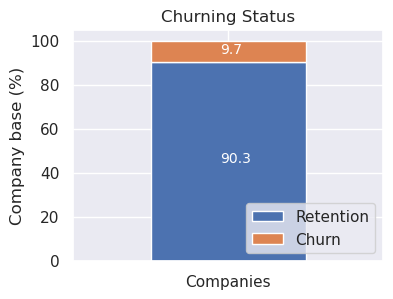

## Histogram

A histogram is a graphical representation that shows the distribution of
a numerical variable. It divides the range of the variable into
intervals (called bins) and displays the number of observations
(frequency) that fall into each bin as bars

``` python
from matplotlib.ticker import MaxNLocator

def df_histogram(df, column: str, hue:Optional[str]=None  ,title: str = "", 
                 nbins:int=20, 
                 xlabel: str = "", ylabel: str = "Frequency", 
                 ax: Optional[Axes] = None, n_xticks:int=5):
    """
    Histogram plot from a DataFrame column.
    -----------------------------------------
    df: DataFrame containing the data to plot
    column: Column name for the histogram
    title: Title of the plot
    nbins: Number of bins for the histogram
    xlabel: Label for the x-axis
    ylabel: Label for the y-axis
    ax: Matplotlib axes object to draw on. If None, a new figure and axes are created.
    n_xticks: Number of x-ticks to display on the x-axis
    """

    # If ax is provided, use it; otherwise, create a new figure       
    new_fig = (ax is None)
    if new_fig:
        fig, ax = plt.subplots(figsize=(8, 6)) # figsize es relevante aquí
    plt.sca(ax)

    # Plot histogram
    if df[column].dtype == pl.Date:
  
        # Convert date to numpy.datetime64 for plotting
        serie = df.select(pl.col(column)).to_numpy().astype('datetime64[D]').flatten()
        hue = df[hue] if hue else None

        sns.histplot(x = serie,
                     hue=hue,
                     multiple="stack",
                     bins=nbins,
                     kde=False, 
                     ax=ax)
        
    else:
        sns.histplot(data=df,
                     x=column,
                     hue=hue,
                     multiple="stack",
                     bins=nbins,
                     kde=False, 
                     ax=ax)

    ax.xaxis.set_major_locator(MaxNLocator(nbins=n_xticks))

    # Set labels and title
    plt.title(title)
    plt.xlabel(xlabel)
    plt.ylabel(ylabel)
    plt.tight_layout()

    # Only if it has created a new figure
    if new_fig:
        plt.show()

fig, ((ax0, ax1), (ax2, ax3)) = plt.subplots(2, 2, figsize=(8, 6))
# Example usage of df_histogram with date column
df_histogram(client_df[0:110], column="date_end", title="End of Contract Dates", xlabel="End Date", ylabel="Frequency", ax=ax0)
# Example usage of df_histogram with hue
df_histogram(client_df[0:110], column="date_end", hue="churn" ,title="End of Contract Dates", xlabel="End Date", ylabel="Frequency", ax=ax1)
# Example usage of df_histogram with hue and reducing xticks
df_histogram(client_df[0:110], column="date_end", hue="churn" ,title="End of Contract Dates", xlabel="End Date", ylabel="Frequency", ax=ax2,
             n_xticks=3)
# Example usage of df_histogram with numerical series
df_histogram(client_df, column="cons_12m", title="Last 12 months consumption", xlabel="Consumption", ylabel="Frequency",
             nbins=8, n_xticks=5, hue="churn", ax=ax3)
plt.tight_layout()

# Helps with overlapping x-axis labels
fig.autofmt_xdate()
```

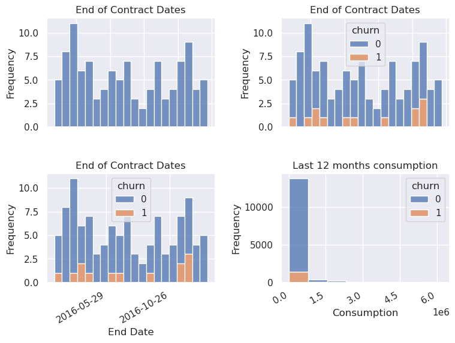

## Time series

``` python
date_price = pl.col("price_date")
years_price = date_price.dt.year().alias("year") # extract year
months_price = date_price.dt.strftime("%b").alias("month") # extract month
i_months_price = date_price.dt.month().alias("imonth") # extract month


result = price_df.select([years_price, months_price, i_months_price]).sort("imonth") 
print(result)
```

    shape: (193_002, 3)
    ┌──────┬───────┬────────┐
    │ year ┆ month ┆ imonth │
    │ ---  ┆ ---   ┆ ---    │
    │ i32  ┆ str   ┆ i8     │
    ╞══════╪═══════╪════════╡
    │ 2015 ┆ Jan   ┆ 1      │
    │ 2015 ┆ Jan   ┆ 1      │
    │ 2015 ┆ Jan   ┆ 1      │
    │ 2015 ┆ Jan   ┆ 1      │
    │ 2015 ┆ Jan   ┆ 1      │
    │ …    ┆ …     ┆ …      │
    │ 2015 ┆ Dec   ┆ 12     │
    │ 2015 ┆ Dec   ┆ 12     │
    │ 2015 ┆ Dec   ┆ 12     │
    │ 2015 ┆ Dec   ┆ 12     │
    │ 2015 ┆ Dec   ┆ 12     │
    └──────┴───────┴────────┘

``` python
def plot_historical_prices(df, x_column:str="price_date"):

    assert isinstance(df, pl.DataFrame)

    # Changes from wide format to long format. 
    df_long = df.unpivot(
        index=x_column,
        variable_name="prices",
        value_name="price_value"
    )

    sns.relplot(data=df_long, 
                    x=x_column, 
                    y="price_value",
                    hue="prices", 
                    kind="line", 
                    aspect=2, 
                    marker="o",
                    )
```

``` python
from matplotlib.dates import MonthLocator, DateFormatter

df_var = price_df[0:1000].select(pl.col(
    "price_date",
    "price_off_peak_var",
    "price_mid_peak_var",
    "price_peak_var"
))

df_fix = price_df[0:1000].select(pl.col(
    "price_date",
    "price_off_peak_fix",
    "price_mid_peak_fix",
    "price_peak_fix"
))

plot_historical_prices(df=df_var, x_column="price_date")

plot_historical_prices(df=df_fix, x_column="price_date")
# Get the current axes
ax = plt.gca()
# Set the major x-axis ticks to show the start of each month
ax.xaxis.set_major_locator(MonthLocator(interval=1))
# Set the format to display the full month name
ax.xaxis.set_major_formatter(DateFormatter('%b')) # Use '%b' for abbreviated names (e.g., Jan, Feb)
```

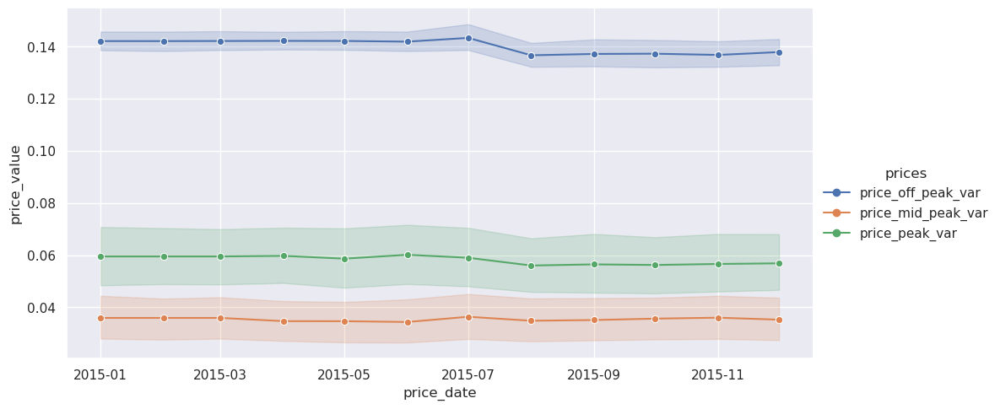

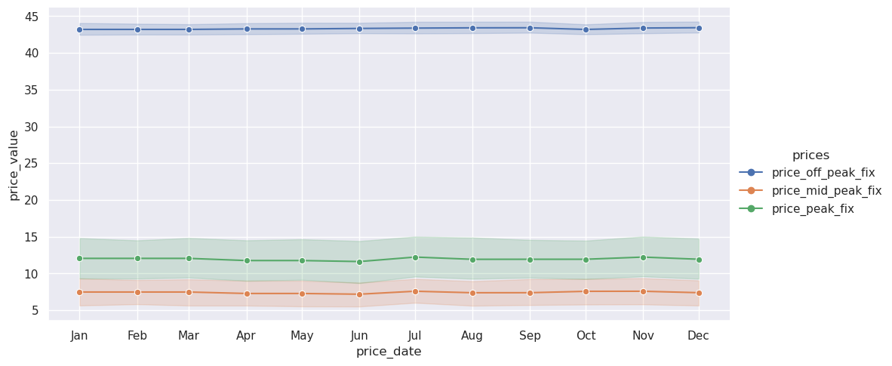

``` python
plotting_vars = pl.col("price_date", "price_off_peak_var", "price_mid_peak_var", "price_peak_var")

df_var = price_df.join(client_df.select(pl.col(["id", "churn"])), how="inner", on="id").select(plotting_vars, "churn")

df_var_churn = df_var.filter(pl.col("churn") == 1)
df_var_nochurn = df_var.filter(pl.col("churn") == 0)

print(price_df.shape)
print(df_var.shape)
print(df_var_churn.shape)
```

    (193002, 8)
    (175149, 5)
    (17003, 5)

``` python
plot_historical_prices(df=df_var_churn.select(plotting_vars), x_column="price_date")

# Get the current axes
ax = plt.gca()
# Set the major x-axis ticks to show the start of each month
ax.xaxis.set_major_locator(MonthLocator(interval=1))
# Set the format to display the full month name
ax.xaxis.set_major_formatter(DateFormatter('%b')) # Use '%b' for abbreviated names (e.g., Jan, Feb)


plot_historical_prices(df=df_var_nochurn.select(plotting_vars), x_column="price_date")
# Get the current axes
ax = plt.gca()
# Set the major x-axis ticks to show the start of each month
ax.xaxis.set_major_locator(MonthLocator(interval=1))
# Set the format to display the full month name
ax.xaxis.set_major_formatter(DateFormatter('%b')) # Use '%b' for abbreviated names (e.g., Jan, Feb)
```

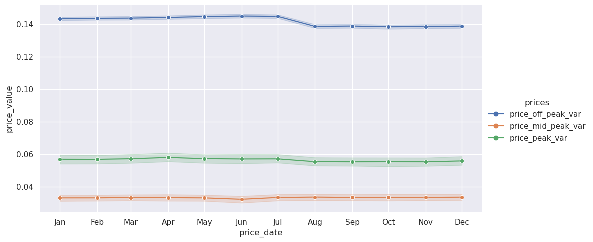

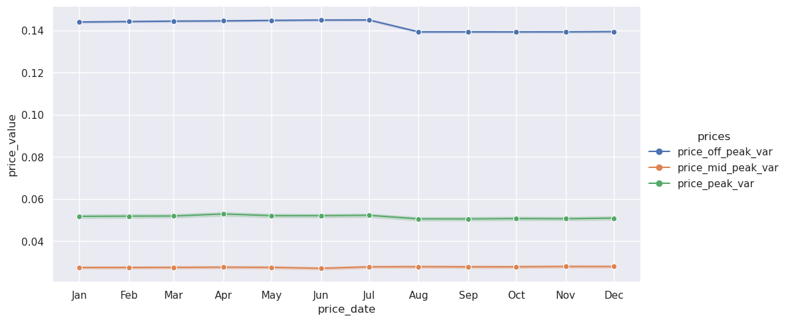

``` python
sns.relplot(data=df_var, x="price_date", y="price_off_peak_var", hue="churn", kind="line", marker="o")
ax = plt.gca()
ax.xaxis.set_major_locator(MonthLocator(interval=1))
ax.xaxis.set_major_formatter(DateFormatter('%b')) # Use '%b' for abbreviated names (e.g., Jan, Feb)

sns.relplot(data=df_var, x="price_date", y="price_mid_peak_var", hue="churn", kind="line", marker="o")
ax = plt.gca()
ax.xaxis.set_major_locator(MonthLocator(interval=1))
ax.xaxis.set_major_formatter(DateFormatter('%b')) # Use '%b' for abbreviated names (e.g., Jan, Feb)

sns.relplot(data=df_var, x="price_date", y="price_peak_var", hue="churn", kind="line", marker="o")
ax = plt.gca()
ax.xaxis.set_major_locator(MonthLocator(interval=1))
ax.xaxis.set_major_formatter(DateFormatter('%b')) # Use '%b' for abbreviated names (e.g., Jan, Feb)
```

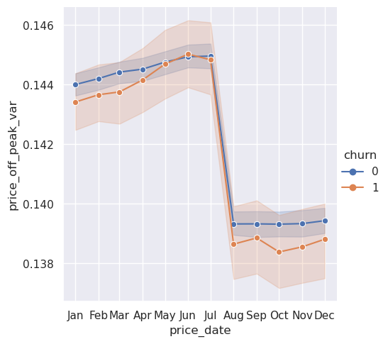

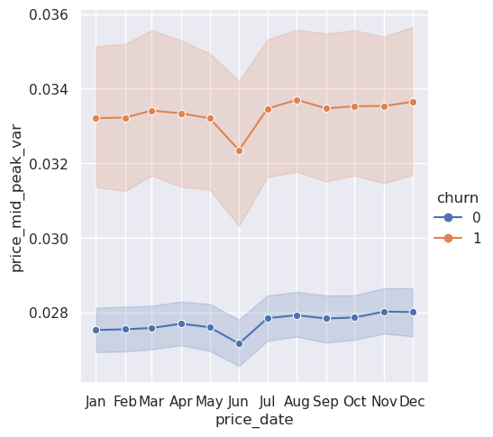

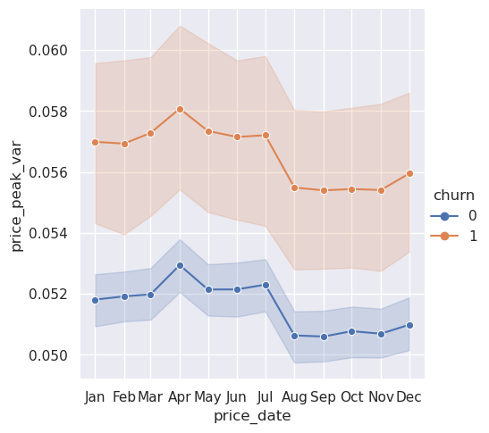

Clients that churned had higher variable prices peak and mid-peak than
those that did not churned along the year.

``` python
var_or_fix = "fix"  # or "fix"
plotting_vars = pl.col("price_date", f"price_off_peak_{var_or_fix}", f"price_mid_peak_{var_or_fix}", f"price_peak_{var_or_fix}")

df_fix = price_df.join(client_df.select(pl.col(["id", "churn"])), how="inner", on="id").select(plotting_vars, "churn")

df_fix_churn = df_fix.filter(pl.col("churn") == 1)
df_fix_nochurn = df_fix.filter(pl.col("churn") == 0)

print(price_df.shape)
print(df_fix.shape)
print(df_fix_churn.shape)
```

    (193002, 8)
    (175149, 5)
    (17003, 5)

``` python
df_fix.columns
```

    ['price_date',
     'price_off_peak_fix',
     'price_mid_peak_fix',
     'price_peak_fix',
     'churn']

``` python
sns.relplot(data=df_fix, x="price_date", y=f"price_off_peak_{var_or_fix}", hue="churn", kind="scatter", marker="o")
ax = plt.gca()
ax.xaxis.set_major_locator(MonthLocator(interval=1))
ax.xaxis.set_major_formatter(DateFormatter('%b')) # Use '%b' for abbreviated names (e.g., Jan, Feb)

sns.relplot(data=df_fix, x="price_date", y=f"price_mid_peak_{var_or_fix}", hue="churn", kind="scatter", marker="o")
ax = plt.gca()
ax.xaxis.set_major_locator(MonthLocator(interval=1))
ax.xaxis.set_major_formatter(DateFormatter('%b')) # Use '%b' for abbreviated names (e.g., Jan, Feb)

sns.relplot(data=df_fix, x="price_date", y=f"price_peak_{var_or_fix}", hue="churn", kind="line", marker="o")
ax = plt.gca()
ax.xaxis.set_major_locator(MonthLocator(interval=1))
ax.xaxis.set_major_formatter(DateFormatter('%b')) # Use '%b' for abbreviated names (e.g., Jan, Feb)
```

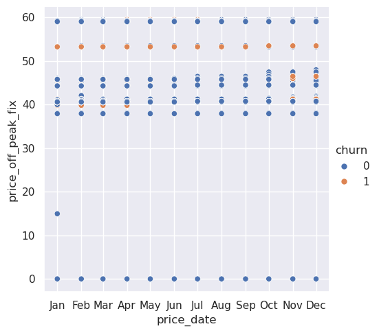

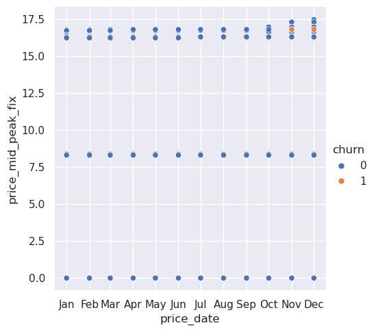

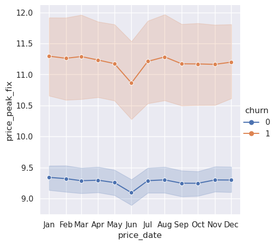

For the Fixed prices, those clients that churned had a larger price than
those that did not churned.

### Prices for the channels that does not have churning

``` python
# Unique values of the channel sales
ch_ids = client_df["channel_sales"].unique().to_list()
# display(ch_ids)
# Step 2: Create mapping
mapping = {val: idx for idx, val in enumerate(ch_ids)}
# display(mapping)

# Step 3: Replace the values. replace will save int as the old type (str), then, use replace_strict
client_df = client_df.with_columns(
    pl.col("channel_sales").replace_strict(mapping).alias("ch_id")
) 

# client_df["ch_id"]
```

``` python
var_or_fix = "fix"  # or "fix"
plotting_vars = pl.col("price_date", f"price_off_peak_{var_or_fix}", f"price_mid_peak_{var_or_fix}", f"price_peak_{var_or_fix}")

df_fix = price_df.join(client_df.select(pl.col(["id", "churn", "ch_id"])), 
                       how="inner", 
                       on="id").select(plotting_vars, "churn", "ch_id", "id")


display(price_df.shape)
display(df_fix.shape)
```

    (193002, 8)

    (175149, 7)

``` python
# client_df.filter(~pl.col("id").is_in(price_df["id"].implode()))
price_df.filter(~pl.col("id").is_in(client_df["id"].implode())).head(2)
id0 = (price_df.filter(~pl.col("id").is_in(client_df["id"].implode())).select(pl.col("id"))[0,0])
print(id0)
```

    36b6352b4656216bfdb96f01e9a94b4e

``` python
df_fix.filter(pl.col("id")==id0)
```

<div><style>
.dataframe > thead > tr,
.dataframe > tbody > tr {
  text-align: right;
  white-space: pre-wrap;
}
</style>
<small>shape: (0, 7)</small>

<table class="dataframe" data-quarto-postprocess="true" data-border="1">
<thead>
<tr>
<th data-quarto-table-cell-role="th">price_date</th>
<th data-quarto-table-cell-role="th">price_off_peak_fix</th>
<th data-quarto-table-cell-role="th">price_mid_peak_fix</th>
<th data-quarto-table-cell-role="th">price_peak_fix</th>
<th data-quarto-table-cell-role="th">churn</th>
<th data-quarto-table-cell-role="th">ch_id</th>
<th data-quarto-table-cell-role="th">id</th>
</tr>
<tr>
<th>date</th>
<th>f64</th>
<th>f64</th>
<th>f64</th>
<th>i64</th>
<th>i64</th>
<th>str</th>
</tr>
</thead>
<tbody>
</tbody>
</table>

</div>

``` python
df_fix
```

<div><style>
.dataframe > thead > tr,
.dataframe > tbody > tr {
  text-align: right;
  white-space: pre-wrap;
}
</style>
<small>shape: (175_149, 7)</small>

<table class="dataframe" data-quarto-postprocess="true" data-border="1">
<thead>
<tr>
<th data-quarto-table-cell-role="th">price_date</th>
<th data-quarto-table-cell-role="th">price_off_peak_fix</th>
<th data-quarto-table-cell-role="th">price_mid_peak_fix</th>
<th data-quarto-table-cell-role="th">price_peak_fix</th>
<th data-quarto-table-cell-role="th">churn</th>
<th data-quarto-table-cell-role="th">ch_id</th>
<th data-quarto-table-cell-role="th">id</th>
</tr>
<tr>
<th>date</th>
<th>f64</th>
<th>f64</th>
<th>f64</th>
<th>i64</th>
<th>i64</th>
<th>str</th>
</tr>
</thead>
<tbody>
<tr>
<td>2015-01-01</td>
<td>44.266931</td>
<td>0.0</td>
<td>0.0</td>
<td>0</td>
<td>4</td>
<td>"038af19179925da21a25619c5a24b7…</td>
</tr>
<tr>
<td>2015-02-01</td>
<td>44.266931</td>
<td>0.0</td>
<td>0.0</td>
<td>0</td>
<td>4</td>
<td>"038af19179925da21a25619c5a24b7…</td>
</tr>
<tr>
<td>2015-03-01</td>
<td>44.266931</td>
<td>0.0</td>
<td>0.0</td>
<td>0</td>
<td>4</td>
<td>"038af19179925da21a25619c5a24b7…</td>
</tr>
<tr>
<td>2015-04-01</td>
<td>44.266931</td>
<td>0.0</td>
<td>0.0</td>
<td>0</td>
<td>4</td>
<td>"038af19179925da21a25619c5a24b7…</td>
</tr>
<tr>
<td>2015-05-01</td>
<td>44.266931</td>
<td>0.0</td>
<td>0.0</td>
<td>0</td>
<td>4</td>
<td>"038af19179925da21a25619c5a24b7…</td>
</tr>
<tr>
<td>…</td>
<td>…</td>
<td>…</td>
<td>…</td>
<td>…</td>
<td>…</td>
<td>…</td>
</tr>
<tr>
<td>2015-08-01</td>
<td>40.728885</td>
<td>16.291555</td>
<td>24.43733</td>
<td>0</td>
<td>4</td>
<td>"16f51cdc2baa19af0b940ee1b3dd17…</td>
</tr>
<tr>
<td>2015-09-01</td>
<td>40.728885</td>
<td>16.291555</td>
<td>24.43733</td>
<td>0</td>
<td>4</td>
<td>"16f51cdc2baa19af0b940ee1b3dd17…</td>
</tr>
<tr>
<td>2015-10-01</td>
<td>40.728885</td>
<td>16.291555</td>
<td>24.43733</td>
<td>0</td>
<td>4</td>
<td>"16f51cdc2baa19af0b940ee1b3dd17…</td>
</tr>
<tr>
<td>2015-11-01</td>
<td>40.728885</td>
<td>16.291555</td>
<td>24.43733</td>
<td>0</td>
<td>4</td>
<td>"16f51cdc2baa19af0b940ee1b3dd17…</td>
</tr>
<tr>
<td>2015-12-01</td>
<td>40.728885</td>
<td>16.291555</td>
<td>24.43733</td>
<td>0</td>
<td>4</td>
<td>"16f51cdc2baa19af0b940ee1b3dd17…</td>
</tr>
</tbody>
</table>

</div>

``` python
# sns.relplot(data=df_fix, x="price_date", y="price_peak_fix", hue="ch_id", kind="line", marker="o",
#             palette="hsv")

# ax = plt.gca()
# ax.xaxis.set_major_locator(MonthLocator(interval=1))
# ax.xaxis.set_major_formatter(DateFormatter('%b')) # Use '%b' for abbreviated names (e.g., Jan, Feb)
```

``` python
a = client_df.select(
    pl.col("ch_id"),
    pl.col("churn")
).group_by("ch_id").agg(pl.col("churn").sum()>1).sort("ch_id")

display(a)
```

<div><style>
.dataframe > thead > tr,
.dataframe > tbody > tr {
  text-align: right;
  white-space: pre-wrap;
}
</style>
<small>shape: (8, 2)</small>

<table class="dataframe" data-quarto-postprocess="true" data-border="1">
<thead>
<tr>
<th data-quarto-table-cell-role="th">ch_id</th>
<th data-quarto-table-cell-role="th">churn</th>
</tr>
<tr>
<th>i64</th>
<th>bool</th>
</tr>
</thead>
<tbody>
<tr>
<td>0</td>
<td>true</td>
</tr>
<tr>
<td>1</td>
<td>true</td>
</tr>
<tr>
<td>2</td>
<td>true</td>
</tr>
<tr>
<td>3</td>
<td>false</td>
</tr>
<tr>
<td>4</td>
<td>true</td>
</tr>
<tr>
<td>5</td>
<td>true</td>
</tr>
<tr>
<td>6</td>
<td>false</td>
</tr>
<tr>
<td>7</td>
<td>false</td>
</tr>
</tbody>
</table>

</div>

``` python
pc = client_df.join(price_df.select(pl.col(["id"])), 
                       how="inner", 
                       on="id").select("id")

display(client_df.shape)
display(price_df.shape)
display(pc["id"].n_unique())
```

    (14606, 27)

    (193002, 8)

    14606

## Extra analysis on prices:

Let’s see from the price dataset, how many have a 0 price, and maybe
make a difference between those that probably beacause of a special
offer they have a price of 0

``` python
df_prices = price_df.join(client_df.select(pl.col(["id", "churn"])), how="inner", on="id")
```

Calculate the averages for each ID, (avg price per year)

``` python
df_avg = df_prices.group_by("id", maintain_order=True).agg(
        pl.all().mean().name.prefix("avg_")
        ).select(
        #     pl.exclude("avg_price_date")
            pl.col("id"),
            pl.col("avg_churn").alias("churn"),
            avg_var_price = pl.col("avg_price_off_peak_var") + pl.col("avg_price_peak_var") + pl.col("avg_price_mid_peak_var"),
            avg_fix_price = pl.col("avg_price_off_peak_fix") + pl.col("avg_price_peak_fix") + pl.col("avg_price_mid_peak_fix"),
            avg_var_peak = pl.col("avg_price_peak_var"),
            avg_var_mid = pl.col("avg_price_mid_peak_var"),
            avg_var_off = pl.col("avg_price_off_peak_var"),
            avg_fix_peak = pl.col("avg_price_peak_fix"),
            avg_fix_mid = pl.col("avg_price_mid_peak_fix"),
            avg_fix_off = pl.col("avg_price_off_peak_fix"),
            )

display(df_avg.head(3))
```

<div><style>
.dataframe > thead > tr,
.dataframe > tbody > tr {
  text-align: right;
  white-space: pre-wrap;
}
</style>
<small>shape: (3, 10)</small>

<table class="dataframe" data-quarto-postprocess="true" data-border="1">
<thead>
<tr>
<th data-quarto-table-cell-role="th">id</th>
<th data-quarto-table-cell-role="th">churn</th>
<th data-quarto-table-cell-role="th">avg_var_price</th>
<th data-quarto-table-cell-role="th">avg_fix_price</th>
<th data-quarto-table-cell-role="th">avg_var_peak</th>
<th data-quarto-table-cell-role="th">avg_var_mid</th>
<th data-quarto-table-cell-role="th">avg_var_off</th>
<th data-quarto-table-cell-role="th">avg_fix_peak</th>
<th data-quarto-table-cell-role="th">avg_fix_mid</th>
<th data-quarto-table-cell-role="th">avg_fix_off</th>
</tr>
<tr>
<th>str</th>
<th>f64</th>
<th>f64</th>
<th>f64</th>
<th>f64</th>
<th>f64</th>
<th>f64</th>
<th>f64</th>
<th>f64</th>
<th>f64</th>
</tr>
</thead>
<tbody>
<tr>
<td>"038af19179925da21a25619c5a24b7…</td>
<td>0.0</td>
<td>0.14855</td>
<td>44.35582</td>
<td>0.0</td>
<td>0.0</td>
<td>0.14855</td>
<td>0.0</td>
<td>0.0</td>
<td>44.35582</td>
</tr>
<tr>
<td>"31f2ce549924679a3cbb2d128ae9ea…</td>
<td>0.0</td>
<td>0.299189</td>
<td>81.322007</td>
<td>0.102637</td>
<td>0.073525</td>
<td>0.123027</td>
<td>24.396601</td>
<td>16.264402</td>
<td>40.661003</td>
</tr>
<tr>
<td>"48f3e6e86f7a8656b2c6b6ce276305…</td>
<td>0.0</td>
<td>0.145552</td>
<td>44.400265</td>
<td>0.0</td>
<td>0.0</td>
<td>0.145552</td>
<td>0.0</td>
<td>0.0</td>
<td>44.400265</td>
</tr>
</tbody>
</table>

</div>

Clients whose average variable price is 0

``` python
df_avg.filter(
    pl.col("avg_var_price")==0.0
    ).select(
        pl.col("id").count().alias("total_clients"),
        pl.col("churn").sum().alias("n_churn_clients"),
        pl.col("avg_var_price").mean(),
        pl.col("avg_fix_price").mean(),
        pl.col("avg_var_peak").mean(),
        pl.col("avg_var_mid").mean(),
        pl.col("avg_var_off").mean(),
        )
```

<div><style>
.dataframe > thead > tr,
.dataframe > tbody > tr {
  text-align: right;
  white-space: pre-wrap;
}
</style>
<small>shape: (1, 7)</small>

<table class="dataframe" data-quarto-postprocess="true" data-border="1">
<thead>
<tr>
<th data-quarto-table-cell-role="th">total_clients</th>
<th data-quarto-table-cell-role="th">n_churn_clients</th>
<th data-quarto-table-cell-role="th">avg_var_price</th>
<th data-quarto-table-cell-role="th">avg_fix_price</th>
<th data-quarto-table-cell-role="th">avg_var_peak</th>
<th data-quarto-table-cell-role="th">avg_var_mid</th>
<th data-quarto-table-cell-role="th">avg_var_off</th>
</tr>
<tr>
<th>u32</th>
<th>f64</th>
<th>f64</th>
<th>f64</th>
<th>f64</th>
<th>f64</th>
<th>f64</th>
</tr>
</thead>
<tbody>
<tr>
<td>20</td>
<td>0.0</td>
<td>0.0</td>
<td>0.0</td>
<td>0.0</td>
<td>0.0</td>
<td>0.0</td>
</tr>
</tbody>
</table>

</div>

Clients whose average fix price is 0

``` python
df_avg.filter(
    pl.col("avg_fix_price")==0.0
    ).select(
        pl.col("id").count().alias("total_clients"),
        pl.col("churn").sum().alias("n_churn_clients"),
        pl.col("avg_var_price").mean(),
        pl.col("avg_fix_price").mean(),
        pl.col("avg_var_peak").mean(),
        pl.col("avg_var_mid").mean(),
        pl.col("avg_var_off").mean(),
        pl.col("avg_fix_peak").mean(),
        pl.col("avg_fix_mid").mean(),
        pl.col("avg_fix_off").mean(),
        )
```

<div><style>
.dataframe > thead > tr,
.dataframe > tbody > tr {
  text-align: right;
  white-space: pre-wrap;
}
</style>
<small>shape: (1, 10)</small>

<table class="dataframe" data-quarto-postprocess="true" data-border="1">
<thead>
<tr>
<th data-quarto-table-cell-role="th">total_clients</th>
<th data-quarto-table-cell-role="th">n_churn_clients</th>
<th data-quarto-table-cell-role="th">avg_var_price</th>
<th data-quarto-table-cell-role="th">avg_fix_price</th>
<th data-quarto-table-cell-role="th">avg_var_peak</th>
<th data-quarto-table-cell-role="th">avg_var_mid</th>
<th data-quarto-table-cell-role="th">avg_var_off</th>
<th data-quarto-table-cell-role="th">avg_fix_peak</th>
<th data-quarto-table-cell-role="th">avg_fix_mid</th>
<th data-quarto-table-cell-role="th">avg_fix_off</th>
</tr>
<tr>
<th>u32</th>
<th>f64</th>
<th>f64</th>
<th>f64</th>
<th>f64</th>
<th>f64</th>
<th>f64</th>
<th>f64</th>
<th>f64</th>
<th>f64</th>
</tr>
</thead>
<tbody>
<tr>
<td>105</td>
<td>0.0</td>
<td>0.002811</td>
<td>0.0</td>
<td>0.0</td>
<td>0.0</td>
<td>0.002811</td>
<td>0.0</td>
<td>0.0</td>
<td>0.0</td>
</tr>
</tbody>
</table>

</div>

Let’s plot the prices once the average prices equal to 0 have been
filtered

``` python
df_filtered = df_avg.filter(
    # (pl.col("avg_var_price")>0.0) & (pl.col("avg_fix_price")>0.0) 
    (pl.col("avg_var_peak")>0.0) & (pl.col("avg_var_mid")>0.0) & (pl.col("avg_var_off")>0.0) 
    ).select(
        pl.col("avg_var_price"),
        pl.col("avg_fix_price"),
        pl.col("churn"),
        pl.col("avg_var_peak"),
        pl.col("avg_var_mid"),
        pl.col("avg_var_off"),
        pl.col("avg_fix_peak"),
        pl.col("avg_fix_mid"),
        pl.col("avg_fix_off"),
        x=1        
        )

display(df_filtered)
```

<div><style>
.dataframe > thead > tr,
.dataframe > tbody > tr {
  text-align: right;
  white-space: pre-wrap;
}
</style>
<small>shape: (5_659, 10)</small>

<table class="dataframe" data-quarto-postprocess="true" data-border="1">
<thead>
<tr>
<th data-quarto-table-cell-role="th">avg_var_price</th>
<th data-quarto-table-cell-role="th">avg_fix_price</th>
<th data-quarto-table-cell-role="th">churn</th>
<th data-quarto-table-cell-role="th">avg_var_peak</th>
<th data-quarto-table-cell-role="th">avg_var_mid</th>
<th data-quarto-table-cell-role="th">avg_var_off</th>
<th data-quarto-table-cell-role="th">avg_fix_peak</th>
<th data-quarto-table-cell-role="th">avg_fix_mid</th>
<th data-quarto-table-cell-role="th">avg_fix_off</th>
<th data-quarto-table-cell-role="th">x</th>
</tr>
<tr>
<th>f64</th>
<th>f64</th>
<th>f64</th>
<th>f64</th>
<th>f64</th>
<th>f64</th>
<th>f64</th>
<th>f64</th>
<th>f64</th>
<th>i32</th>
</tr>
</thead>
<tbody>
<tr>
<td>0.299189</td>
<td>81.322007</td>
<td>0.0</td>
<td>0.102637</td>
<td>0.073525</td>
<td>0.123027</td>
<td>24.396601</td>
<td>16.264402</td>
<td>40.661003</td>
<td>1</td>
</tr>
<tr>
<td>0.298645</td>
<td>81.294854</td>
<td>1.0</td>
<td>0.10248</td>
<td>0.07322</td>
<td>0.122945</td>
<td>24.388455</td>
<td>16.258971</td>
<td>40.647427</td>
<td>1</td>
</tr>
<tr>
<td>0.3032895</td>
<td>81.294854</td>
<td>0.0</td>
<td>0.104028</td>
<td>0.074768</td>
<td>0.124493</td>
<td>24.388455</td>
<td>16.258971</td>
<td>40.647427</td>
<td>1</td>
</tr>
<tr>
<td>0.302519</td>
<td>81.322007</td>
<td>0.0</td>
<td>0.103748</td>
<td>0.074635</td>
<td>0.124137</td>
<td>24.396601</td>
<td>16.264402</td>
<td>40.661003</td>
<td>1</td>
</tr>
<tr>
<td>0.3031655</td>
<td>81.45777</td>
<td>1.0</td>
<td>0.103993</td>
<td>0.074669</td>
<td>0.124503</td>
<td>24.43733</td>
<td>16.291555</td>
<td>40.728885</td>
<td>1</td>
</tr>
<tr>
<td>…</td>
<td>…</td>
<td>…</td>
<td>…</td>
<td>…</td>
<td>…</td>
<td>…</td>
<td>…</td>
<td>…</td>
<td>…</td>
</tr>
<tr>
<td>0.301292</td>
<td>81.403465</td>
<td>0.0</td>
<td>0.103794</td>
<td>0.07316</td>
<td>0.124338</td>
<td>24.421038</td>
<td>16.280694</td>
<td>40.701732</td>
<td>1</td>
</tr>
<tr>
<td>0.292682</td>
<td>78.249923</td>
<td>0.0</td>
<td>0.100903</td>
<td>0.067322</td>
<td>0.124457</td>
<td>22.368303</td>
<td>14.912203</td>
<td>40.969417</td>
<td>1</td>
</tr>
<tr>
<td>0.289196</td>
<td>81.376312</td>
<td>0.0</td>
<td>0.099811</td>
<td>0.069038</td>
<td>0.120347</td>
<td>24.412893</td>
<td>16.275263</td>
<td>40.688156</td>
<td>1</td>
</tr>
<tr>
<td>0.302693</td>
<td>81.45777</td>
<td>0.0</td>
<td>0.10424</td>
<td>0.073947</td>
<td>0.124506</td>
<td>24.43733</td>
<td>16.291555</td>
<td>40.728885</td>
<td>1</td>
</tr>
<tr>
<td>0.30589</td>
<td>81.294854</td>
<td>0.0</td>
<td>0.104895</td>
<td>0.075635</td>
<td>0.12536</td>
<td>24.388455</td>
<td>16.258971</td>
<td>40.647428</td>
<td>1</td>
</tr>
</tbody>
</table>

</div>

``` python
fig, axs = plt.subplots(3,1, figsize=(8, 6))
sns.boxplot(df_filtered, x="avg_var_peak", hue="churn", ax=axs[0])
sns.boxplot(df_filtered, x="avg_var_mid", hue="churn", ax=axs[1])
sns.boxplot(df_filtered, x="avg_var_off", hue="churn", ax=axs[2])
plt.show()
```

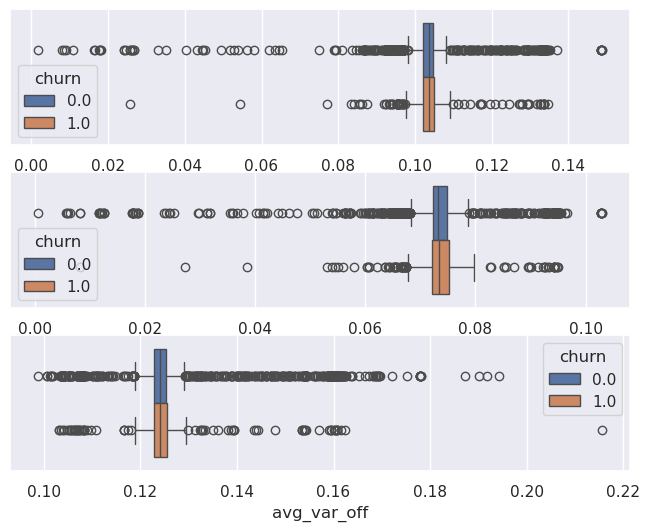

``` python
fig, axs = plt.subplots(3,1, figsize=(8, 6))
sns.boxplot(df_filtered, x="avg_fix_peak", hue="churn", ax=axs[0])
sns.boxplot(df_filtered, x="avg_fix_mid", hue="churn", ax=axs[1])
sns.boxplot(df_filtered, x="avg_fix_off", hue="churn", ax=axs[2])
plt.show()
```

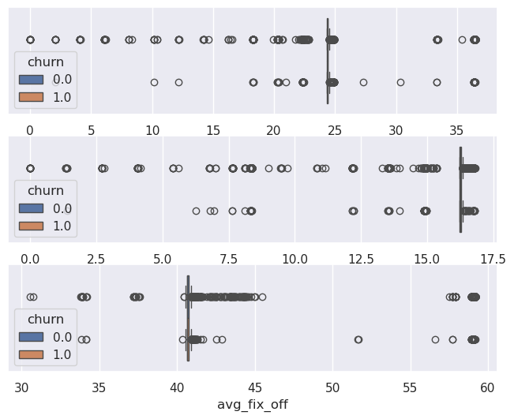

``` python
sns.relplot(x=pl.concat([df_filtered["x"], 1+df_filtered["x"]]), 
            y=pl.concat([df_filtered["avg_var_price"], df_filtered["avg_var_price"]]), 
            hue=pl.concat([df_filtered["churn"], df_filtered["churn"]]),
            kind="line")
plt.show()
```

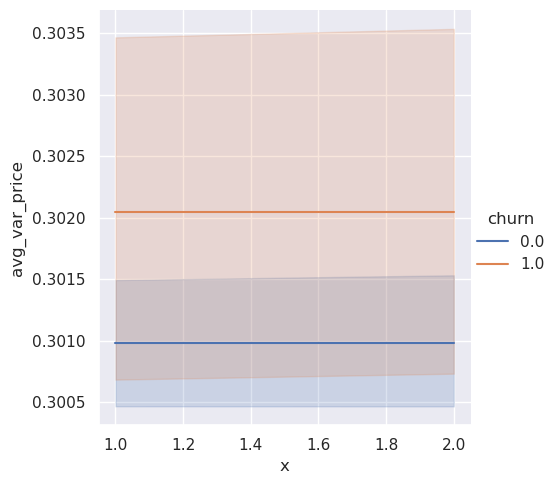

``` python
pl.concat([df_filtered["x"], df_filtered["x"]])
```

<div><style>
.dataframe > thead > tr,
.dataframe > tbody > tr {
  text-align: right;
  white-space: pre-wrap;
}
</style>
<small>shape: (11_318,)</small>

<table class="dataframe" data-quarto-postprocess="true" data-border="1">
<thead>
<tr>
<th data-quarto-table-cell-role="th">x</th>
</tr>
<tr>
<th>i32</th>
</tr>
</thead>
<tbody>
<tr>
<td>1</td>
</tr>
<tr>
<td>1</td>
</tr>
<tr>
<td>1</td>
</tr>
<tr>
<td>1</td>
</tr>
<tr>
<td>1</td>
</tr>
<tr>
<td>…</td>
</tr>
<tr>
<td>1</td>
</tr>
<tr>
<td>1</td>
</tr>
<tr>
<td>1</td>
</tr>
<tr>
<td>1</td>
</tr>
<tr>
<td>1</td>
</tr>
</tbody>
</table>

</div>

``` python
df_histogram(df=df_filtered, column="avg_var_price", hue="churn", nbins=50)
```

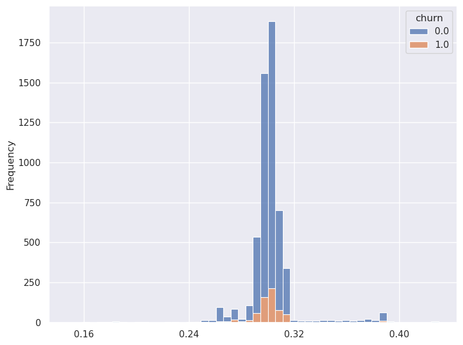
