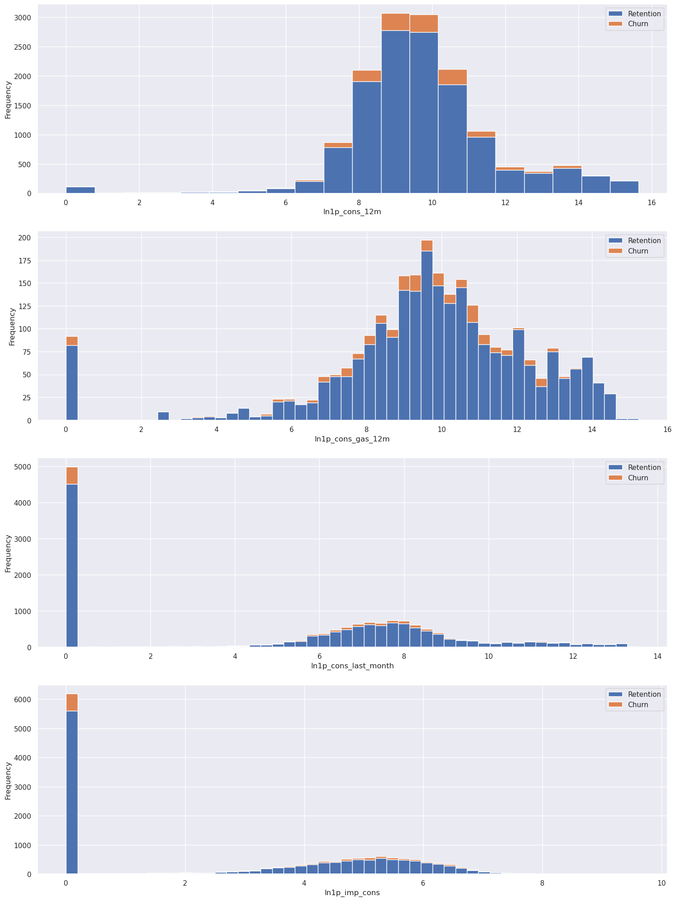
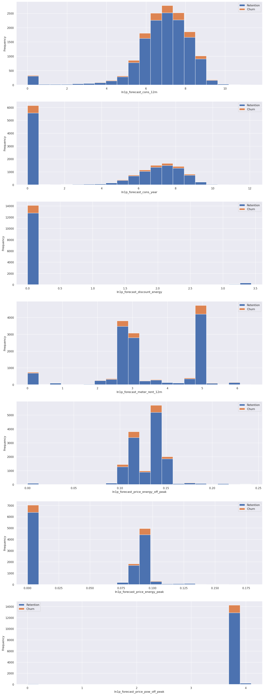
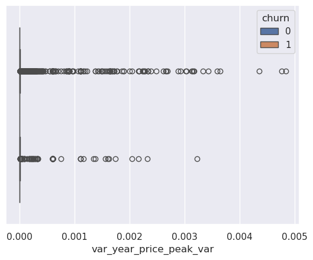

# Feature Engineering


<!-- WARNING: THIS FILE WAS AUTOGENERATED! DO NOT EDIT! -->

``` python
import pandas as pd
import numpy as np
import matplotlib.pyplot as plt
import seaborn as sns
sns.set(color_codes=True)
```

------------------------------------------------------------------------

## 2. Load data

``` python
df = pd.read_csv('../resources/clean_data_after_eda.csv')
df["date_activ"] = pd.to_datetime(df["date_activ"], format='%Y-%m-%d')
df["date_end"] = pd.to_datetime(df["date_end"], format='%Y-%m-%d')
df["date_modif_prod"] = pd.to_datetime(df["date_modif_prod"], format='%Y-%m-%d')
df["date_renewal"] = pd.to_datetime(df["date_renewal"], format='%Y-%m-%d')
```

``` python
df.head(3)
```

<div>
<style scoped>
    .dataframe tbody tr th:only-of-type {
        vertical-align: middle;
    }
&#10;    .dataframe tbody tr th {
        vertical-align: top;
    }
&#10;    .dataframe thead th {
        text-align: right;
    }
</style>

<table class="dataframe" data-quarto-postprocess="true" data-border="1">
<thead>
<tr style="text-align: right;">
<th data-quarto-table-cell-role="th"></th>
<th data-quarto-table-cell-role="th">id</th>
<th data-quarto-table-cell-role="th">channel_sales</th>
<th data-quarto-table-cell-role="th">cons_12m</th>
<th data-quarto-table-cell-role="th">cons_gas_12m</th>
<th data-quarto-table-cell-role="th">cons_last_month</th>
<th data-quarto-table-cell-role="th">date_activ</th>
<th data-quarto-table-cell-role="th">date_end</th>
<th data-quarto-table-cell-role="th">date_modif_prod</th>
<th data-quarto-table-cell-role="th">date_renewal</th>
<th data-quarto-table-cell-role="th">forecast_cons_12m</th>
<th data-quarto-table-cell-role="th">...</th>
<th data-quarto-table-cell-role="th">var_6m_price_off_peak_var</th>
<th data-quarto-table-cell-role="th">var_6m_price_peak_var</th>
<th data-quarto-table-cell-role="th">var_6m_price_mid_peak_var</th>
<th data-quarto-table-cell-role="th">var_6m_price_off_peak_fix</th>
<th data-quarto-table-cell-role="th">var_6m_price_peak_fix</th>
<th data-quarto-table-cell-role="th">var_6m_price_mid_peak_fix</th>
<th data-quarto-table-cell-role="th">var_6m_price_off_peak</th>
<th data-quarto-table-cell-role="th">var_6m_price_peak</th>
<th data-quarto-table-cell-role="th">var_6m_price_mid_peak</th>
<th data-quarto-table-cell-role="th">churn</th>
</tr>
</thead>
<tbody>
<tr>
<td data-quarto-table-cell-role="th">0</td>
<td>24011ae4ebbe3035111d65fa7c15bc57</td>
<td>foosdfpfkusacimwkcsosbicdxkicaua</td>
<td>0</td>
<td>54946</td>
<td>0</td>
<td>2013-06-15</td>
<td>2016-06-15</td>
<td>2015-11-01</td>
<td>2015-06-23</td>
<td>0.00</td>
<td>...</td>
<td>0.000131</td>
<td>4.100838e-05</td>
<td>0.000908</td>
<td>2.086294</td>
<td>99.530517</td>
<td>44.235794</td>
<td>2.086425</td>
<td>9.953056e+01</td>
<td>44.236702</td>
<td>1</td>
</tr>
<tr>
<td data-quarto-table-cell-role="th">1</td>
<td>d29c2c54acc38ff3c0614d0a653813dd</td>
<td>MISSING</td>
<td>4660</td>
<td>0</td>
<td>0</td>
<td>2009-08-21</td>
<td>2016-08-30</td>
<td>2009-08-21</td>
<td>2015-08-31</td>
<td>189.95</td>
<td>...</td>
<td>0.000003</td>
<td>1.217891e-03</td>
<td>0.000000</td>
<td>0.009482</td>
<td>0.000000</td>
<td>0.000000</td>
<td>0.009485</td>
<td>1.217891e-03</td>
<td>0.000000</td>
<td>0</td>
</tr>
<tr>
<td data-quarto-table-cell-role="th">2</td>
<td>764c75f661154dac3a6c254cd082ea7d</td>
<td>foosdfpfkusacimwkcsosbicdxkicaua</td>
<td>544</td>
<td>0</td>
<td>0</td>
<td>2010-04-16</td>
<td>2016-04-16</td>
<td>2010-04-16</td>
<td>2015-04-17</td>
<td>47.96</td>
<td>...</td>
<td>0.000004</td>
<td>9.450150e-08</td>
<td>0.000000</td>
<td>0.000000</td>
<td>0.000000</td>
<td>0.000000</td>
<td>0.000004</td>
<td>9.450150e-08</td>
<td>0.000000</td>
<td>0</td>
</tr>
</tbody>
</table>

<p>3 rows × 44 columns</p>
</div>

``` python
df.info()
```

    <class 'pandas.core.frame.DataFrame'>
    RangeIndex: 14606 entries, 0 to 14605
    Data columns (total 44 columns):
     #   Column                          Non-Null Count  Dtype         
    ---  ------                          --------------  -----         
     0   id                              14606 non-null  object        
     1   channel_sales                   14606 non-null  object        
     2   cons_12m                        14606 non-null  int64         
     3   cons_gas_12m                    14606 non-null  int64         
     4   cons_last_month                 14606 non-null  int64         
     5   date_activ                      14606 non-null  datetime64[ns]
     6   date_end                        14606 non-null  datetime64[ns]
     7   date_modif_prod                 14606 non-null  datetime64[ns]
     8   date_renewal                    14606 non-null  datetime64[ns]
     9   forecast_cons_12m               14606 non-null  float64       
     10  forecast_cons_year              14606 non-null  int64         
     11  forecast_discount_energy        14606 non-null  float64       
     12  forecast_meter_rent_12m         14606 non-null  float64       
     13  forecast_price_energy_off_peak  14606 non-null  float64       
     14  forecast_price_energy_peak      14606 non-null  float64       
     15  forecast_price_pow_off_peak     14606 non-null  float64       
     16  has_gas                         14606 non-null  object        
     17  imp_cons                        14606 non-null  float64       
     18  margin_gross_pow_ele            14606 non-null  float64       
     19  margin_net_pow_ele              14606 non-null  float64       
     20  nb_prod_act                     14606 non-null  int64         
     21  net_margin                      14606 non-null  float64       
     22  num_years_antig                 14606 non-null  int64         
     23  origin_up                       14606 non-null  object        
     24  pow_max                         14606 non-null  float64       
     25  var_year_price_off_peak_var     14606 non-null  float64       
     26  var_year_price_peak_var         14606 non-null  float64       
     27  var_year_price_mid_peak_var     14606 non-null  float64       
     28  var_year_price_off_peak_fix     14606 non-null  float64       
     29  var_year_price_peak_fix         14606 non-null  float64       
     30  var_year_price_mid_peak_fix     14606 non-null  float64       
     31  var_year_price_off_peak         14606 non-null  float64       
     32  var_year_price_peak             14606 non-null  float64       
     33  var_year_price_mid_peak         14606 non-null  float64       
     34  var_6m_price_off_peak_var       14606 non-null  float64       
     35  var_6m_price_peak_var           14606 non-null  float64       
     36  var_6m_price_mid_peak_var       14606 non-null  float64       
     37  var_6m_price_off_peak_fix       14606 non-null  float64       
     38  var_6m_price_peak_fix           14606 non-null  float64       
     39  var_6m_price_mid_peak_fix       14606 non-null  float64       
     40  var_6m_price_off_peak           14606 non-null  float64       
     41  var_6m_price_peak               14606 non-null  float64       
     42  var_6m_price_mid_peak           14606 non-null  float64       
     43  churn                           14606 non-null  int64         
    dtypes: datetime64[ns](4), float64(29), int64(7), object(4)
    memory usage: 4.9+ MB

------------------------------------------------------------------------

## 3. Feature engineering

### Difference between off-peak prices in December and preceding January

Below is the code created by your colleague to calculate the feature
described above. Use this code to re-create this feature and then think
about ways to build on this feature to create features with a higher
predictive power.

``` python
price_df = pd.read_csv('../resources/price_data.csv')
price_df["price_date"] = pd.to_datetime(price_df["price_date"], format='%Y-%m-%d')
price_df.head()
```

<div>
<style scoped>
    .dataframe tbody tr th:only-of-type {
        vertical-align: middle;
    }
&#10;    .dataframe tbody tr th {
        vertical-align: top;
    }
&#10;    .dataframe thead th {
        text-align: right;
    }
</style>

<table class="dataframe" data-quarto-postprocess="true" data-border="1">
<thead>
<tr style="text-align: right;">
<th data-quarto-table-cell-role="th"></th>
<th data-quarto-table-cell-role="th">id</th>
<th data-quarto-table-cell-role="th">price_date</th>
<th data-quarto-table-cell-role="th">price_off_peak_var</th>
<th data-quarto-table-cell-role="th">price_peak_var</th>
<th data-quarto-table-cell-role="th">price_mid_peak_var</th>
<th data-quarto-table-cell-role="th">price_off_peak_fix</th>
<th data-quarto-table-cell-role="th">price_peak_fix</th>
<th data-quarto-table-cell-role="th">price_mid_peak_fix</th>
</tr>
</thead>
<tbody>
<tr>
<td data-quarto-table-cell-role="th">0</td>
<td>038af19179925da21a25619c5a24b745</td>
<td>2015-01-01</td>
<td>0.151367</td>
<td>0.0</td>
<td>0.0</td>
<td>44.266931</td>
<td>0.0</td>
<td>0.0</td>
</tr>
<tr>
<td data-quarto-table-cell-role="th">1</td>
<td>038af19179925da21a25619c5a24b745</td>
<td>2015-02-01</td>
<td>0.151367</td>
<td>0.0</td>
<td>0.0</td>
<td>44.266931</td>
<td>0.0</td>
<td>0.0</td>
</tr>
<tr>
<td data-quarto-table-cell-role="th">2</td>
<td>038af19179925da21a25619c5a24b745</td>
<td>2015-03-01</td>
<td>0.151367</td>
<td>0.0</td>
<td>0.0</td>
<td>44.266931</td>
<td>0.0</td>
<td>0.0</td>
</tr>
<tr>
<td data-quarto-table-cell-role="th">3</td>
<td>038af19179925da21a25619c5a24b745</td>
<td>2015-04-01</td>
<td>0.149626</td>
<td>0.0</td>
<td>0.0</td>
<td>44.266931</td>
<td>0.0</td>
<td>0.0</td>
</tr>
<tr>
<td data-quarto-table-cell-role="th">4</td>
<td>038af19179925da21a25619c5a24b745</td>
<td>2015-05-01</td>
<td>0.149626</td>
<td>0.0</td>
<td>0.0</td>
<td>44.266931</td>
<td>0.0</td>
<td>0.0</td>
</tr>
</tbody>
</table>

</div>

``` python
# Group off-peak prices by companies and month
monthly_price_by_id = price_df.groupby(['id', 'price_date']).agg({'price_off_peak_var': 'mean', 'price_off_peak_fix': 'mean'}).reset_index()
# Here it is not necessary to get the averages since there is only one price per date and company
monthly_price_by_id.sample(2)
```

<div>
<style scoped>
    .dataframe tbody tr th:only-of-type {
        vertical-align: middle;
    }
&#10;    .dataframe tbody tr th {
        vertical-align: top;
    }
&#10;    .dataframe thead th {
        text-align: right;
    }
</style>

<table class="dataframe" data-quarto-postprocess="true" data-border="1">
<thead>
<tr style="text-align: right;">
<th data-quarto-table-cell-role="th"></th>
<th data-quarto-table-cell-role="th">id</th>
<th data-quarto-table-cell-role="th">price_date</th>
<th data-quarto-table-cell-role="th">price_off_peak_var</th>
<th data-quarto-table-cell-role="th">price_off_peak_fix</th>
</tr>
</thead>
<tbody>
<tr>
<td data-quarto-table-cell-role="th">138859</td>
<td>b8bd768b39a85f95b89332ea63a26b6a</td>
<td>2015-10-01</td>
<td>0.146788</td>
<td>44.44471</td>
</tr>
<tr>
<td data-quarto-table-cell-role="th">35275</td>
<td>2d2cb8913436e61567f02f35609ffeef</td>
<td>2015-12-01</td>
<td>0.147678</td>
<td>44.44471</td>
</tr>
</tbody>
</table>

</div>

``` python
# Get january and december prices
jan_prices = monthly_price_by_id.groupby('id').first().reset_index()
dec_prices = monthly_price_by_id.groupby('id').last().reset_index()
display(jan_prices.sample(2))
display(dec_prices.sample(2))
```

<div>
<style scoped>
    .dataframe tbody tr th:only-of-type {
        vertical-align: middle;
    }
&#10;    .dataframe tbody tr th {
        vertical-align: top;
    }
&#10;    .dataframe thead th {
        text-align: right;
    }
</style>

<table class="dataframe" data-quarto-postprocess="true" data-border="1">
<thead>
<tr style="text-align: right;">
<th data-quarto-table-cell-role="th"></th>
<th data-quarto-table-cell-role="th">id</th>
<th data-quarto-table-cell-role="th">price_date</th>
<th data-quarto-table-cell-role="th">price_off_peak_var</th>
<th data-quarto-table-cell-role="th">price_off_peak_fix</th>
</tr>
</thead>
<tbody>
<tr>
<td data-quarto-table-cell-role="th">3086</td>
<td>2fc445f99c487f06a7c936229407fa59</td>
<td>2015-01-01</td>
<td>0.19190</td>
<td>45.760931</td>
</tr>
<tr>
<td data-quarto-table-cell-role="th">11348</td>
<td>b51fcced5ef7605a11cc736d916acc90</td>
<td>2015-01-01</td>
<td>0.15524</td>
<td>44.444710</td>
</tr>
</tbody>
</table>

</div>

<div>
<style scoped>
    .dataframe tbody tr th:only-of-type {
        vertical-align: middle;
    }
&#10;    .dataframe tbody tr th {
        vertical-align: top;
    }
&#10;    .dataframe thead th {
        text-align: right;
    }
</style>

<table class="dataframe" data-quarto-postprocess="true" data-border="1">
<thead>
<tr style="text-align: right;">
<th data-quarto-table-cell-role="th"></th>
<th data-quarto-table-cell-role="th">id</th>
<th data-quarto-table-cell-role="th">price_date</th>
<th data-quarto-table-cell-role="th">price_off_peak_var</th>
<th data-quarto-table-cell-role="th">price_off_peak_fix</th>
</tr>
</thead>
<tbody>
<tr>
<td data-quarto-table-cell-role="th">7741</td>
<td>7b027a3b4fe4d8e09c51a6f718287582</td>
<td>2015-12-01</td>
<td>0.166056</td>
<td>44.44471</td>
</tr>
<tr>
<td data-quarto-table-cell-role="th">14089</td>
<td>dfa0c97e0da76db2d14454bbbd42c60f</td>
<td>2015-12-01</td>
<td>0.146208</td>
<td>44.44471</td>
</tr>
</tbody>
</table>

</div>

``` python
# Calculate the difference
diff = pd.merge(dec_prices.rename(columns={'price_off_peak_var': 'dec_1', 'price_off_peak_fix': 'dec_2'}), jan_prices.drop(columns='price_date'), on='id')
display(diff.head(2))
```

<div>
<style scoped>
    .dataframe tbody tr th:only-of-type {
        vertical-align: middle;
    }
&#10;    .dataframe tbody tr th {
        vertical-align: top;
    }
&#10;    .dataframe thead th {
        text-align: right;
    }
</style>

<table class="dataframe" data-quarto-postprocess="true" data-border="1">
<thead>
<tr style="text-align: right;">
<th data-quarto-table-cell-role="th"></th>
<th data-quarto-table-cell-role="th">id</th>
<th data-quarto-table-cell-role="th">price_date</th>
<th data-quarto-table-cell-role="th">dec_1</th>
<th data-quarto-table-cell-role="th">dec_2</th>
<th data-quarto-table-cell-role="th">price_off_peak_var</th>
<th data-quarto-table-cell-role="th">price_off_peak_fix</th>
</tr>
</thead>
<tbody>
<tr>
<td data-quarto-table-cell-role="th">0</td>
<td>0002203ffbb812588b632b9e628cc38d</td>
<td>2015-12-01</td>
<td>0.119906</td>
<td>40.728885</td>
<td>0.126098</td>
<td>40.565969</td>
</tr>
<tr>
<td data-quarto-table-cell-role="th">1</td>
<td>0004351ebdd665e6ee664792efc4fd13</td>
<td>2015-12-01</td>
<td>0.143943</td>
<td>44.444710</td>
<td>0.148047</td>
<td>44.266931</td>
</tr>
</tbody>
</table>

</div>

``` python
diff['offpeak_diff_dec_january_energy'] = diff['dec_1'] - diff['price_off_peak_var']
diff['offpeak_diff_dec_january_power'] = diff['dec_2'] - diff['price_off_peak_fix']
diff = diff[['id', 'offpeak_diff_dec_january_energy','offpeak_diff_dec_january_power']]
diff.sample(2)
```

<div>
<style scoped>
    .dataframe tbody tr th:only-of-type {
        vertical-align: middle;
    }
&#10;    .dataframe tbody tr th {
        vertical-align: top;
    }
&#10;    .dataframe thead th {
        text-align: right;
    }
</style>

<table class="dataframe" data-quarto-postprocess="true" data-border="1">
<thead>
<tr style="text-align: right;">
<th data-quarto-table-cell-role="th"></th>
<th data-quarto-table-cell-role="th">id</th>
<th
data-quarto-table-cell-role="th">offpeak_diff_dec_january_energy</th>
<th data-quarto-table-cell-role="th">offpeak_diff_dec_january_power</th>
</tr>
</thead>
<tbody>
<tr>
<td data-quarto-table-cell-role="th">8893</td>
<td>8da555fd7fb1ad45a5485ca1d9f1e84b</td>
<td>-0.006192</td>
<td>0.162916</td>
</tr>
<tr>
<td data-quarto-table-cell-role="th">7489</td>
<td>7723047a47d503b16382c3f33d6d3fb8</td>
<td>-0.005508</td>
<td>0.177779</td>
</tr>
</tbody>
</table>

</div>

Now it is time to get creative and to conduct some of your own feature
engineering! Have fun with it, explore different ideas and try to create
as many as you can!

``` python
df.shape
```

    (14606, 44)

# Notes on the current data

## A. On the clients in the clean dataset, client and price datasets

The clean database have the same number of unique clients as
client_data.csv and less than the number of clients in the database
price_data.csv. **All the clients in df** are in price_df.

``` python
display(df["id"].unique().shape)
display(price_df["id"].unique().shape)
display(len( 
    np.intersect1d(
        df["id"].unique(), price_df["id"].unique()
    )))
```

    (14606,)

    (16096,)

    14606

## B. Channel sales

The channels_sales showed that some channels did not have churning
clients. It could be due to a low number of samples for those channels.

``` python
df.groupby(["channel_sales", "churn"])['id'].count()
```

    channel_sales                     churn
    MISSING                           0        3442
                                      1         283
    epumfxlbckeskwekxbiuasklxalciiuu  0           3
    ewpakwlliwisiwduibdlfmalxowmwpci  0         818
                                      1          75
    fixdbufsefwooaasfcxdxadsiekoceaa  0           2
    foosdfpfkusacimwkcsosbicdxkicaua  0        5934
                                      1         820
    lmkebamcaaclubfxadlmueccxoimlema  0        1740
                                      1         103
    sddiedcslfslkckwlfkdpoeeailfpeds  0          11
    usilxuppasemubllopkaafesmlibmsdf  0        1237
                                      1         138
    Name: id, dtype: int64

## C. Fields of interest from Task 2

1.  There are 5 sales channels “**channel_sales**” with churn and 3
    without any churning clients.  
2.  Consumption fields show a highly skewed data.  
3.  Forecast shows highly positively skewed data.  
4.  Has gas or not shows a very similar percentage of churning (maybe
    not an interesting column)  
5.  Margins show highly positively skewed data.  
6.  Subscribed power shows also long right tails of skewed data.  
7.  Number of products “**nb_prod_act**” (Similar churning perc for 1 to
    5 products, 6 to 32 products shows no churning)  
8.  Number of years of antiquity. If it is 1 year, no churning.  
9.  There are some campains “**origin_up**” that has no churning.  
10. The **variable prices peak and mid-peak** are higher for those
    clients that churned than for those that didn’t.

# Tasks for Feature Engineering:

1.  Remove “non-relevant” columns from datasets.
2.  Expand datasets with new columns or create new features
    (dates-\>year, month, day) (one-hot encoding…)
3.  Combine columns to get a field that can achieve better predictions
    in a model  
4.  Merge datasets that expands the information. Both dataframes should
    share a common column.

# Simplify data

After the Exploratory Data Analysis (Task 2), I will try to keep the
analysis simple with a low number of parameters that seem to give a
clear distinction of clients that churned and those that did not.

``` python
# Save the id and unique sales channel identifier in the output dataframe
df_out = pd.DataFrame()
df_out["id"] = df["id"]
df_out["churn"] = df["churn"]
```

### Channel sales

``` python
# Unique values of the channel sales
ch_ids = df["channel_sales"].unique()
# Make a dict assigning a unique integer identifier to each channel_sales 
channels_map = {k:v for (k, v) in zip(ch_ids, range(len(ch_ids))) }
channels_map
```

    {'foosdfpfkusacimwkcsosbicdxkicaua': 0,
     'MISSING': 1,
     'lmkebamcaaclubfxadlmueccxoimlema': 2,
     'usilxuppasemubllopkaafesmlibmsdf': 3,
     'ewpakwlliwisiwduibdlfmalxowmwpci': 4,
     'epumfxlbckeskwekxbiuasklxalciiuu': 5,
     'sddiedcslfslkckwlfkdpoeeailfpeds': 6,
     'fixdbufsefwooaasfcxdxadsiekoceaa': 7}

Add the channel sales unique integer identifier to the output df

``` python
df_out["ch_sales_id"] = df["channel_sales"].map(channels_map)
```

``` python
y1 = df_out.groupby("ch_sales_id").agg({'id':'count', 'churn':'sum'})
y1["churn_perc"] = (y1["churn"]/y1["id"]*100).round(decimals=1)
display(y1)
```

<div>
<style scoped>
    .dataframe tbody tr th:only-of-type {
        vertical-align: middle;
    }
&#10;    .dataframe tbody tr th {
        vertical-align: top;
    }
&#10;    .dataframe thead th {
        text-align: right;
    }
</style>

<table class="dataframe" data-quarto-postprocess="true" data-border="1">
<thead>
<tr style="text-align: right;">
<th data-quarto-table-cell-role="th"></th>
<th data-quarto-table-cell-role="th">id</th>
<th data-quarto-table-cell-role="th">churn</th>
<th data-quarto-table-cell-role="th">churn_perc</th>
</tr>
<tr>
<th data-quarto-table-cell-role="th">ch_sales_id</th>
<th data-quarto-table-cell-role="th"></th>
<th data-quarto-table-cell-role="th"></th>
<th data-quarto-table-cell-role="th"></th>
</tr>
</thead>
<tbody>
<tr>
<td data-quarto-table-cell-role="th">0</td>
<td>6754</td>
<td>820</td>
<td>12.1</td>
</tr>
<tr>
<td data-quarto-table-cell-role="th">1</td>
<td>3725</td>
<td>283</td>
<td>7.6</td>
</tr>
<tr>
<td data-quarto-table-cell-role="th">2</td>
<td>1843</td>
<td>103</td>
<td>5.6</td>
</tr>
<tr>
<td data-quarto-table-cell-role="th">3</td>
<td>1375</td>
<td>138</td>
<td>10.0</td>
</tr>
<tr>
<td data-quarto-table-cell-role="th">4</td>
<td>893</td>
<td>75</td>
<td>8.4</td>
</tr>
<tr>
<td data-quarto-table-cell-role="th">5</td>
<td>3</td>
<td>0</td>
<td>0.0</td>
</tr>
<tr>
<td data-quarto-table-cell-role="th">6</td>
<td>11</td>
<td>0</td>
<td>0.0</td>
</tr>
<tr>
<td data-quarto-table-cell-role="th">7</td>
<td>2</td>
<td>0</td>
<td>0.0</td>
</tr>
</tbody>
</table>

</div>

## Consumption

The consumption data shows a large number of clients that consumed 0:

``` python
# Consumption 0 for all clients
cons12m_0 = (df["cons_12m"] == 0.0).sum()

# Consumption 0 for those that has gas
cond_cons_gas = (df["has_gas"]=='t') & (df["cons_gas_12m"]==0.0)
cons_gas_0 = cond_cons_gas.sum()

# Consumption of last month = 0
cons_lastm_0 = (df["cons_last_month"] == 0.0).sum()

# Current paid consumption
imp_cons_0 = (df["imp_cons"] == 0.0).sum()

results = {
    "Consumption 0 for all clients": cons12m_0,
    "Consumption 0 for clients with gas": cons_gas_0,
    "Consumption last month = 0": cons_lastm_0,
    "Current paid consumption = 0": imp_cons_0
}

display(
    pd.DataFrame.from_dict(results, orient="index", columns=["Count"])
    )
```

<div>
<style scoped>
    .dataframe tbody tr th:only-of-type {
        vertical-align: middle;
    }
&#10;    .dataframe tbody tr th {
        vertical-align: top;
    }
&#10;    .dataframe thead th {
        text-align: right;
    }
</style>

<table class="dataframe" data-quarto-postprocess="true" data-border="1">
<thead>
<tr style="text-align: right;">
<th data-quarto-table-cell-role="th"></th>
<th data-quarto-table-cell-role="th">Count</th>
</tr>
</thead>
<tbody>
<tr>
<td data-quarto-table-cell-role="th">Consumption 0 for all clients</td>
<td>117</td>
</tr>
<tr>
<td data-quarto-table-cell-role="th">Consumption 0 for clients with
gas</td>
<td>92</td>
</tr>
<tr>
<td data-quarto-table-cell-role="th">Consumption last month = 0</td>
<td>4983</td>
</tr>
<tr>
<td data-quarto-table-cell-role="th">Current paid consumption = 0</td>
<td>6169</td>
</tr>
</tbody>
</table>

</div>

It may be interesting to add a column to filter if the consumption
values are 0 so it can be used in a decision tree

``` python
df_out["cons12m_is_zero"] = (df["cons_12m"] == 0.0).astype(int)
df_out["cons_gas_12m_is_zero"] = (df["cons_gas_12m"] == 0.0).astype(int)
df_out["cons_last_month_is_zero"] = (df["cons_last_month"] == 0.0).astype(int)
df_out["imp_cons_is_zero"] = (df["imp_cons"] == 0.0).astype(int)
df_out.sample(3)
```

<div>
<style scoped>
    .dataframe tbody tr th:only-of-type {
        vertical-align: middle;
    }
&#10;    .dataframe tbody tr th {
        vertical-align: top;
    }
&#10;    .dataframe thead th {
        text-align: right;
    }
</style>

<table class="dataframe" data-quarto-postprocess="true" data-border="1">
<thead>
<tr style="text-align: right;">
<th data-quarto-table-cell-role="th"></th>
<th data-quarto-table-cell-role="th">id</th>
<th data-quarto-table-cell-role="th">churn</th>
<th data-quarto-table-cell-role="th">ch_sales_id</th>
<th data-quarto-table-cell-role="th">cons12m_is_zero</th>
<th data-quarto-table-cell-role="th">cons_gas_12m_is_zero</th>
<th data-quarto-table-cell-role="th">cons_last_month_is_zero</th>
<th data-quarto-table-cell-role="th">imp_cons_is_zero</th>
</tr>
</thead>
<tbody>
<tr>
<td data-quarto-table-cell-role="th">12695</td>
<td>38849c0404d66292fe177c09b179a225</td>
<td>0</td>
<td>4</td>
<td>0</td>
<td>0</td>
<td>0</td>
<td>0</td>
</tr>
<tr>
<td data-quarto-table-cell-role="th">11740</td>
<td>74ee25a056aa668b3e8eee92673c7ba8</td>
<td>0</td>
<td>0</td>
<td>0</td>
<td>1</td>
<td>0</td>
<td>0</td>
</tr>
<tr>
<td data-quarto-table-cell-role="th">9153</td>
<td>24c8cbb6aa7eac94400b3917e765c2b6</td>
<td>0</td>
<td>3</td>
<td>0</td>
<td>1</td>
<td>0</td>
<td>0</td>
</tr>
</tbody>
</table>

</div>

And to deal with 0 values and long tail distributions we can apply
techniques to reduce the high skewness of the data, such as applying
sqrt, logarithms…

``` python
def ln_xplus1(df, cols, inplace=True, suffix="ln1p"):
    """
    Apply log1p transformation (ln(1+x)) to one or more DataFrame columns.

    Parameters
    ----------
    df : pd.DataFrame
        Input DataFrame.
    cols : str or list of str
        Column name(s) to transform. 
        - If str → single column
        - If list of str → multiple columns
    inplace : bool, default=True
        If True, modify DataFrame in place.
        If False, return a new DataFrame.
    suffix : str, default="ln1p"
        Prefix for new column names.

    Returns
    -------
    pd.DataFrame
        DataFrame with new transformed columns.
    """
    if isinstance(cols, str):
        cols = [cols]
    elif not isinstance(cols, (list, tuple)):
        raise TypeError("`cols` must be a string or list/tuple of strings.")

    missing = set(cols) - set(df.columns)
    if missing:
        raise ValueError(f"Columns not found in DataFrame: {missing}")

    target = df if inplace else df.copy()

    for col in cols:
        target[f"{suffix}_{col}"] = np.log1p(target[col])

    return target

# a = ln_xplus1(df, cols="cons_12m", inplace=False)
# a.head(2)
```

``` python
cons_list = ['cons_12m', 'cons_gas_12m', 'cons_last_month', 'imp_cons']
consumption = ln_xplus1(df[cons_list], cols=cons_list, inplace=False)
consumption[['id', 'has_gas', 'churn']] = df[['id', 'has_gas', 'churn']]
```

``` python
consumption.columns
```

    Index(['cons_12m', 'cons_gas_12m', 'cons_last_month', 'imp_cons',
           'ln1p_cons_12m', 'ln1p_cons_gas_12m', 'ln1p_cons_last_month',
           'ln1p_imp_cons', 'id', 'has_gas', 'churn'],
          dtype='object')

``` python
def plot_distribution(dataframe, column, ax, bins_=50):
    """
    Plot variable distribution in a stacked histogram of churned or retained company
    """
    # Create a temporal dataframe with the data to be plot
    temp = pd.DataFrame({"Retention": dataframe[dataframe["churn"]==0][column],
    "Churn":dataframe[dataframe["churn"]==1][column]})
    # Plot the histogram
    temp[["Retention","Churn"]].plot(kind='hist', bins=bins_, ax=ax, stacked=True)
    # X-axis label
    ax.set_xlabel(column)
    # Change the x-axis to plain style
    ax.ticklabel_format(style='plain', axis='x')
```

``` python
fig, axs = plt.subplots(nrows=4, figsize=(18, 25))

# plot_distribution(consumption, 'cons_12m', axs[0], bins_=50)
plot_distribution(consumption, 'ln1p_cons_12m', axs[0], bins_=20)
plot_distribution(consumption[consumption['has_gas'] == 't'], 'ln1p_cons_gas_12m', axs[1])
plot_distribution(consumption, 'ln1p_cons_last_month', axs[2])
plot_distribution(consumption, 'ln1p_imp_cons', axs[3])
```



Add this data to df_out

``` python
# New fields
transformed_consumption = list(map(lambda x: f"ln1p_{x}", cons_list))
print(transformed_consumption)
```

    ['ln1p_cons_12m', 'ln1p_cons_gas_12m', 'ln1p_cons_last_month', 'ln1p_imp_cons']

``` python
# New transformed columns and has_gas column if they are not in df_out
missing_cols = (set(transformed_consumption) | {"has_gas"}) - set(df_out.columns)
# Convert to list so I can use it in the dataframe
missing_cols = list(missing_cols)
# Add the missing columns to the output dataframe
df_out[missing_cols] = consumption[missing_cols]

print(df_out.columns)
```

    Index(['id', 'churn', 'ch_sales_id', 'cons12m_is_zero', 'cons_gas_12m_is_zero',
           'cons_last_month_is_zero', 'imp_cons_is_zero', 'ln1p_cons_last_month',
           'ln1p_cons_12m', 'ln1p_imp_cons', 'has_gas', 'ln1p_cons_gas_12m'],
          dtype='object')

## Forecast

The forecast fields also shows positive long tail distributions and
outliers. We can apply the logaritmic transformations:

``` python
forecast_list = ["forecast_cons_12m",
    "forecast_cons_year","forecast_discount_energy","forecast_meter_rent_12m",
    "forecast_price_energy_off_peak","forecast_price_energy_peak",
    "forecast_price_pow_off_peak"
    ]

# Transform the forecast fields
transf_forecast = ln_xplus1(df[forecast_list], cols=forecast_list, inplace=False)
list_transf_forecast = list(map(lambda x: f"ln1p_{x}", forecast_list))
transf_forecast["churn"] = df["churn"]
```

``` python
fig, axs = plt.subplots(nrows=len(list_transf_forecast), figsize=(18,50))

for i, dfcol in enumerate(list_transf_forecast):
    plot_distribution(transf_forecast, dfcol, axs[i], bins_=20)
```



We can keep the forecasts for the consumption in the next 12 months and
calendar year

``` python
# New transformed columns and has_gas column if they are not in df_out
missing_cols = set(list_transf_forecast[:2]) - set(df_out.columns)
# Convert to list so I can use it in the dataframe
missing_cols = list(missing_cols)
# Add the missing columns to the output dataframe
df_out[missing_cols] = transf_forecast[missing_cols]

print(df_out.columns)
```

    Index(['id', 'churn', 'ch_sales_id', 'cons12m_is_zero', 'cons_gas_12m_is_zero',
           'cons_last_month_is_zero', 'imp_cons_is_zero', 'ln1p_cons_last_month',
           'ln1p_cons_12m', 'ln1p_imp_cons', 'has_gas', 'ln1p_cons_gas_12m',
           'ln1p_forecast_cons_year', 'ln1p_forecast_cons_12m'],
          dtype='object')

And columns indicating where the forecast for consumption are 0

``` python
df_out["forecast_cons_12m_is_zero"] = (df["forecast_cons_12m"] == 0.0).astype(int)
df_out["forecast_cons_year_is_zero"] = (df["forecast_cons_year"] == 0.0).astype(int)
```

## Number of products

``` python
df_out["nb_prod_act"] = df["nb_prod_act"]
```

## Number of antiquity years as a client

``` python
df_out["num_years_antig"] = df["num_years_antig"]
```

## Extra features from the prices datasets

Original price variation in a year and 6 months

``` python
cols_var_year = df.filter(like="var_year").columns
df_out[cols_var_year] = df[cols_var_year]

cols_var_6m = df.filter(like="var_6m").columns
df_out[cols_var_6m] = df[cols_var_6m]
```

The prices along the year for companies that has churn is larger than
for those that did not churned.  
Some of the variable and fixed prices shows a more contant price along
the year and a clearer separation of the prices for churn and retained
companies. We can obtain the average price along the year for:
{“price_mid_peak_var”, “price_mid_peak_fix”, “price_peak_fix”}.

``` python
# Filter prices by the clients that are in the clean df
# And calculate averages per id and month
monthly_price_by_id = price_df[ 
    price_df["id"].isin(df["id"]) 
    ].groupby(
        ['id', 'price_date']
              ).agg(
                  {'price_mid_peak_var': 'mean', 
                   'price_mid_peak_fix': 'mean', 
                   'price_peak_fix': 'mean'}
                   ).reset_index()

# Average price per year
# Group by id
# Calculate mean in the selected price fields
# And rename the columns as avg_***
# Finally, get back "id" as a column, because it was by default, set as the index of the dataframe.
avg_year_price_by_id = (
    monthly_price_by_id.groupby("id")[["price_mid_peak_var", "price_mid_peak_fix", "price_peak_fix"]]
      .mean()
      .add_prefix("avg_")
).reset_index()

display(avg_year_price_by_id)
```

<div>
<style scoped>
    .dataframe tbody tr th:only-of-type {
        vertical-align: middle;
    }
&#10;    .dataframe tbody tr th {
        vertical-align: top;
    }
&#10;    .dataframe thead th {
        text-align: right;
    }
</style>

<table class="dataframe" data-quarto-postprocess="true" data-border="1">
<thead>
<tr style="text-align: right;">
<th data-quarto-table-cell-role="th"></th>
<th data-quarto-table-cell-role="th">id</th>
<th data-quarto-table-cell-role="th">avg_price_mid_peak_var</th>
<th data-quarto-table-cell-role="th">avg_price_mid_peak_fix</th>
<th data-quarto-table-cell-role="th">avg_price_peak_fix</th>
</tr>
</thead>
<tbody>
<tr>
<td data-quarto-table-cell-role="th">0</td>
<td>0002203ffbb812588b632b9e628cc38d</td>
<td>0.073160</td>
<td>16.280694</td>
<td>24.421038</td>
</tr>
<tr>
<td data-quarto-table-cell-role="th">1</td>
<td>0004351ebdd665e6ee664792efc4fd13</td>
<td>0.000000</td>
<td>0.000000</td>
<td>0.000000</td>
</tr>
<tr>
<td data-quarto-table-cell-role="th">2</td>
<td>0010bcc39e42b3c2131ed2ce55246e3c</td>
<td>0.000000</td>
<td>0.000000</td>
<td>0.000000</td>
</tr>
<tr>
<td data-quarto-table-cell-role="th">3</td>
<td>00114d74e963e47177db89bc70108537</td>
<td>0.000000</td>
<td>0.000000</td>
<td>0.000000</td>
</tr>
<tr>
<td data-quarto-table-cell-role="th">4</td>
<td>0013f326a839a2f6ad87a1859952d227</td>
<td>0.074921</td>
<td>16.291555</td>
<td>24.437330</td>
</tr>
<tr>
<td data-quarto-table-cell-role="th">...</td>
<td>...</td>
<td>...</td>
<td>...</td>
<td>...</td>
</tr>
<tr>
<td data-quarto-table-cell-role="th">14601</td>
<td>ffebf6a979dd0b17a41076df1057e733</td>
<td>0.072210</td>
<td>16.242678</td>
<td>24.364017</td>
</tr>
<tr>
<td data-quarto-table-cell-role="th">14602</td>
<td>fffac626da707b1b5ab11e8431a4d0a2</td>
<td>0.000000</td>
<td>0.000000</td>
<td>0.000000</td>
</tr>
<tr>
<td data-quarto-table-cell-role="th">14603</td>
<td>fffc0cacd305dd51f316424bbb08d1bd</td>
<td>0.094842</td>
<td>16.763569</td>
<td>24.895768</td>
</tr>
<tr>
<td data-quarto-table-cell-role="th">14604</td>
<td>fffe4f5646aa39c7f97f95ae2679ce64</td>
<td>0.073735</td>
<td>16.242678</td>
<td>24.364017</td>
</tr>
<tr>
<td data-quarto-table-cell-role="th">14605</td>
<td>ffff7fa066f1fb305ae285bb03bf325a</td>
<td>0.075635</td>
<td>16.258971</td>
<td>24.388455</td>
</tr>
</tbody>
</table>

<p>14606 rows × 4 columns</p>
</div>

Add the yearly avg prices to the df

``` python
df_out = pd.merge(left=df_out, right=avg_year_price_by_id, on="id")
df_out.columns
```

    Index(['id', 'churn', 'ch_sales_id', 'cons12m_is_zero', 'cons_gas_12m_is_zero',
           'cons_last_month_is_zero', 'imp_cons_is_zero', 'ln1p_cons_last_month',
           'ln1p_cons_12m', 'ln1p_imp_cons', 'has_gas', 'ln1p_cons_gas_12m',
           'ln1p_forecast_cons_year', 'ln1p_forecast_cons_12m',
           'forecast_cons_12m_is_zero', 'forecast_cons_year_is_zero',
           'nb_prod_act', 'num_years_antig', 'var_year_price_off_peak_var',
           'var_year_price_peak_var', 'var_year_price_mid_peak_var',
           'var_year_price_off_peak_fix', 'var_year_price_peak_fix',
           'var_year_price_mid_peak_fix', 'var_year_price_off_peak',
           'var_year_price_peak', 'var_year_price_mid_peak',
           'var_6m_price_off_peak_var', 'var_6m_price_peak_var',
           'var_6m_price_mid_peak_var', 'var_6m_price_off_peak_fix',
           'var_6m_price_peak_fix', 'var_6m_price_mid_peak_fix',
           'var_6m_price_off_peak', 'var_6m_price_peak', 'var_6m_price_mid_peak',
           'avg_price_mid_peak_var', 'avg_price_mid_peak_fix',
           'avg_price_peak_fix'],
          dtype='object')

``` python
df_out[["var_6m_price_mid_peak", "churn"]]
```

<div>
<style scoped>
    .dataframe tbody tr th:only-of-type {
        vertical-align: middle;
    }
&#10;    .dataframe tbody tr th {
        vertical-align: top;
    }
&#10;    .dataframe thead th {
        text-align: right;
    }
</style>

<table class="dataframe" data-quarto-postprocess="true" data-border="1">
<thead>
<tr style="text-align: right;">
<th data-quarto-table-cell-role="th"></th>
<th data-quarto-table-cell-role="th">var_6m_price_mid_peak</th>
<th data-quarto-table-cell-role="th">churn</th>
</tr>
</thead>
<tbody>
<tr>
<td data-quarto-table-cell-role="th">0</td>
<td>4.423670e+01</td>
<td>1</td>
</tr>
<tr>
<td data-quarto-table-cell-role="th">1</td>
<td>0.000000e+00</td>
<td>0</td>
</tr>
<tr>
<td data-quarto-table-cell-role="th">2</td>
<td>0.000000e+00</td>
<td>0</td>
</tr>
<tr>
<td data-quarto-table-cell-role="th">3</td>
<td>0.000000e+00</td>
<td>0</td>
</tr>
<tr>
<td data-quarto-table-cell-role="th">4</td>
<td>4.860000e-10</td>
<td>0</td>
</tr>
<tr>
<td data-quarto-table-cell-role="th">...</td>
<td>...</td>
<td>...</td>
</tr>
<tr>
<td data-quarto-table-cell-role="th">14601</td>
<td>0.000000e+00</td>
<td>0</td>
</tr>
<tr>
<td data-quarto-table-cell-role="th">14602</td>
<td>2.987132e-04</td>
<td>1</td>
</tr>
<tr>
<td data-quarto-table-cell-role="th">14603</td>
<td>4.860000e-10</td>
<td>1</td>
</tr>
<tr>
<td data-quarto-table-cell-role="th">14604</td>
<td>0.000000e+00</td>
<td>0</td>
</tr>
<tr>
<td data-quarto-table-cell-role="th">14605</td>
<td>0.000000e+00</td>
<td>0</td>
</tr>
</tbody>
</table>

<p>14606 rows × 2 columns</p>
</div>

### Plot

``` python
# avg prices from churning companies vs Retained companies
# col_= "avg_price_mid_peak_fix"
# col_= "var_year_price_peak"
col_= "var_year_price_peak_var"


condition_ = (df_out[col_]>0.0)
sns.boxplot(df_out[condition_], x=col_, hue="churn")
ax = plt.gca()
# ax.set_xlim(0. , 1e-1)
plt.show()
```


