# Feature Engineering and Modelling


<!-- WARNING: THIS FILE WAS AUTOGENERATED! DO NOT EDIT! -->

``` python
import warnings
warnings.filterwarnings("ignore", category=FutureWarning)
```

``` python
import pandas as pd
import numpy as np
import seaborn as sns
from datetime import datetime
import matplotlib.pyplot as plt

# Shows plots in jupyter notebook


# Set plot style
# sns.set(color_codes=True)
```

------------------------------------------------------------------------

## 2. Load data

``` python
df = pd.read_csv('../resources/data_for_predictions.csv')
df.drop(columns=["Unnamed: 0"], inplace=True)
df.head()
```

<div>
<style scoped>
    .dataframe tbody tr th:only-of-type {
        vertical-align: middle;
    }
&#10;    .dataframe tbody tr th {
        vertical-align: top;
    }
&#10;    .dataframe thead th {
        text-align: right;
    }
</style>

<table class="dataframe" data-quarto-postprocess="true" data-border="1">
<thead>
<tr style="text-align: right;">
<th data-quarto-table-cell-role="th"></th>
<th data-quarto-table-cell-role="th">id</th>
<th data-quarto-table-cell-role="th">cons_12m</th>
<th data-quarto-table-cell-role="th">cons_gas_12m</th>
<th data-quarto-table-cell-role="th">cons_last_month</th>
<th data-quarto-table-cell-role="th">forecast_cons_12m</th>
<th data-quarto-table-cell-role="th">forecast_discount_energy</th>
<th data-quarto-table-cell-role="th">forecast_meter_rent_12m</th>
<th data-quarto-table-cell-role="th">forecast_price_energy_off_peak</th>
<th data-quarto-table-cell-role="th">forecast_price_energy_peak</th>
<th data-quarto-table-cell-role="th">forecast_price_pow_off_peak</th>
<th data-quarto-table-cell-role="th">...</th>
<th data-quarto-table-cell-role="th">months_modif_prod</th>
<th data-quarto-table-cell-role="th">months_renewal</th>
<th data-quarto-table-cell-role="th">channel_MISSING</th>
<th
data-quarto-table-cell-role="th">channel_ewpakwlliwisiwduibdlfmalxowmwpci</th>
<th
data-quarto-table-cell-role="th">channel_foosdfpfkusacimwkcsosbicdxkicaua</th>
<th
data-quarto-table-cell-role="th">channel_lmkebamcaaclubfxadlmueccxoimlema</th>
<th
data-quarto-table-cell-role="th">channel_usilxuppasemubllopkaafesmlibmsdf</th>
<th
data-quarto-table-cell-role="th">origin_up_kamkkxfxxuwbdslkwifmmcsiusiuosws</th>
<th
data-quarto-table-cell-role="th">origin_up_ldkssxwpmemidmecebumciepifcamkci</th>
<th
data-quarto-table-cell-role="th">origin_up_lxidpiddsbxsbosboudacockeimpuepw</th>
</tr>
</thead>
<tbody>
<tr>
<td data-quarto-table-cell-role="th">0</td>
<td>24011ae4ebbe3035111d65fa7c15bc57</td>
<td>0.000000</td>
<td>4.739944</td>
<td>0.000000</td>
<td>0.000000</td>
<td>0.0</td>
<td>0.444045</td>
<td>0.114481</td>
<td>0.098142</td>
<td>40.606701</td>
<td>...</td>
<td>2</td>
<td>6</td>
<td>0</td>
<td>0</td>
<td>1</td>
<td>0</td>
<td>0</td>
<td>0</td>
<td>0</td>
<td>1</td>
</tr>
<tr>
<td data-quarto-table-cell-role="th">1</td>
<td>d29c2c54acc38ff3c0614d0a653813dd</td>
<td>3.668479</td>
<td>0.000000</td>
<td>0.000000</td>
<td>2.280920</td>
<td>0.0</td>
<td>1.237292</td>
<td>0.145711</td>
<td>0.000000</td>
<td>44.311378</td>
<td>...</td>
<td>76</td>
<td>4</td>
<td>1</td>
<td>0</td>
<td>0</td>
<td>0</td>
<td>0</td>
<td>1</td>
<td>0</td>
<td>0</td>
</tr>
<tr>
<td data-quarto-table-cell-role="th">2</td>
<td>764c75f661154dac3a6c254cd082ea7d</td>
<td>2.736397</td>
<td>0.000000</td>
<td>0.000000</td>
<td>1.689841</td>
<td>0.0</td>
<td>1.599009</td>
<td>0.165794</td>
<td>0.087899</td>
<td>44.311378</td>
<td>...</td>
<td>68</td>
<td>8</td>
<td>0</td>
<td>0</td>
<td>1</td>
<td>0</td>
<td>0</td>
<td>1</td>
<td>0</td>
<td>0</td>
</tr>
<tr>
<td data-quarto-table-cell-role="th">3</td>
<td>bba03439a292a1e166f80264c16191cb</td>
<td>3.200029</td>
<td>0.000000</td>
<td>0.000000</td>
<td>2.382089</td>
<td>0.0</td>
<td>1.318689</td>
<td>0.146694</td>
<td>0.000000</td>
<td>44.311378</td>
<td>...</td>
<td>69</td>
<td>9</td>
<td>0</td>
<td>0</td>
<td>0</td>
<td>1</td>
<td>0</td>
<td>1</td>
<td>0</td>
<td>0</td>
</tr>
<tr>
<td data-quarto-table-cell-role="th">4</td>
<td>149d57cf92fc41cf94415803a877cb4b</td>
<td>3.646011</td>
<td>0.000000</td>
<td>2.721811</td>
<td>2.650065</td>
<td>0.0</td>
<td>2.122969</td>
<td>0.116900</td>
<td>0.100015</td>
<td>40.606701</td>
<td>...</td>
<td>71</td>
<td>9</td>
<td>1</td>
<td>0</td>
<td>0</td>
<td>0</td>
<td>0</td>
<td>1</td>
<td>0</td>
<td>0</td>
</tr>
</tbody>
</table>

<p>5 rows × 63 columns</p>
</div>

------------------------------------------------------------------------

## 3. Modelling

We now have a dataset containing features that we have engineered and we
are ready to start training a predictive model. Remember, we only need
to focus on training a `Random Forest` classifier.

``` python
from sklearn import metrics
from sklearn.model_selection import train_test_split
from sklearn.ensemble import RandomForestClassifier
```

### Data sampling

The first thing we want to do is split our dataset into training and
test samples. The reason why we do this, is so that we can simulate a
real life situation by generating predictions for our test sample,
without showing the predictive model these data points. This gives us
the ability to see how well our model is able to generalise to new data,
which is critical.

A typical % to dedicate to testing is between 20-30, for this example we
will use a 75-25% split between train and test respectively.

``` python
# Make a copy of our data
train_df = df.copy()

# Separate target variable from independent variables
y = df['churn']
X = df.drop(columns=['id', 'churn'])
print(X.shape)
print(y.shape)
```

    (14606, 61)
    (14606,)

``` python
X_train, X_test, y_train, y_test = train_test_split(X, y, test_size=0.25, random_state=42)
print(X_train.shape)
print(y_train.shape)
print(X_test.shape)
print(y_test.shape)
```

    (10954, 61)
    (10954,)
    (3652, 61)
    (3652,)

### Model training

Once again, we are using a `Random Forest` classifier in this example. A
Random Forest sits within the category of `ensemble` algorithms because
internally the `Forest` refers to a collection of `Decision Trees` which
are tree-based learning algorithms. As the data scientist, you can
control how large the forest is (that is, how many decision trees you
want to include).

The reason why an `ensemble` algorithm is powerful is because of the
laws of averaging, weak learners and the central limit theorem. If we
take a single decision tree and give it a sample of data and some
parameters, it will learn patterns from the data. It may be overfit or
it may be underfit, but that is now our only hope, that single
algorithm.

With `ensemble` methods, instead of banking on 1 single trained model,
we can train 1000’s of decision trees, all using different splits of the
data and learning different patterns. It would be like asking 1000
people to all learn how to code. You would end up with 1000 people with
different answers, methods and styles! The weak learner notion applies
here too, it has been found that if you train your learners not to
overfit, but to learn weak patterns within the data and you have a lot
of these weak learners, together they come together to form a highly
predictive pool of knowledge! This is a real life application of many
brains are better than 1.

Now instead of relying on 1 single decision tree for prediction, the
random forest puts it to the overall views of the entire collection of
decision trees. Some ensemble algorithms using a voting approach to
decide which prediction is best, others using averaging.

As we increase the number of learners, the idea is that the random
forest’s performance should converge to its best possible solution.

Some additional advantages of the random forest classifier include:

- The random forest uses a rule-based approach instead of a distance
  calculation and so features do not need to be scaled
- It is able to handle non-linear parameters better than linear based
  models

On the flip side, some disadvantages of the random forest classifier
include:

- The computational power needed to train a random forest on a large
  dataset is high, since we need to build a whole ensemble of
  estimators.
- Training time can be longer due to the increased complexity and size
  of thee ensemble

``` python
# Add model training in here!
model = RandomForestClassifier(random_state=42) # Add parameters to the model!
model.fit(X=X_train, y=y_train) # Complete this method call!
```

<style>#sk-container-id-1 {
  /* Definition of color scheme common for light and dark mode */
  --sklearn-color-text: #000;
  --sklearn-color-text-muted: #666;
  --sklearn-color-line: gray;
  /* Definition of color scheme for unfitted estimators */
  --sklearn-color-unfitted-level-0: #fff5e6;
  --sklearn-color-unfitted-level-1: #f6e4d2;
  --sklearn-color-unfitted-level-2: #ffe0b3;
  --sklearn-color-unfitted-level-3: chocolate;
  /* Definition of color scheme for fitted estimators */
  --sklearn-color-fitted-level-0: #f0f8ff;
  --sklearn-color-fitted-level-1: #d4ebff;
  --sklearn-color-fitted-level-2: #b3dbfd;
  --sklearn-color-fitted-level-3: cornflowerblue;
&#10;  /* Specific color for light theme */
  --sklearn-color-text-on-default-background: var(--sg-text-color, var(--theme-code-foreground, var(--jp-content-font-color1, black)));
  --sklearn-color-background: var(--sg-background-color, var(--theme-background, var(--jp-layout-color0, white)));
  --sklearn-color-border-box: var(--sg-text-color, var(--theme-code-foreground, var(--jp-content-font-color1, black)));
  --sklearn-color-icon: #696969;
&#10;  @media (prefers-color-scheme: dark) {
    /* Redefinition of color scheme for dark theme */
    --sklearn-color-text-on-default-background: var(--sg-text-color, var(--theme-code-foreground, var(--jp-content-font-color1, white)));
    --sklearn-color-background: var(--sg-background-color, var(--theme-background, var(--jp-layout-color0, #111)));
    --sklearn-color-border-box: var(--sg-text-color, var(--theme-code-foreground, var(--jp-content-font-color1, white)));
    --sklearn-color-icon: #878787;
  }
}
&#10;#sk-container-id-1 {
  color: var(--sklearn-color-text);
}
&#10;#sk-container-id-1 pre {
  padding: 0;
}
&#10;#sk-container-id-1 input.sk-hidden--visually {
  border: 0;
  clip: rect(1px 1px 1px 1px);
  clip: rect(1px, 1px, 1px, 1px);
  height: 1px;
  margin: -1px;
  overflow: hidden;
  padding: 0;
  position: absolute;
  width: 1px;
}
&#10;#sk-container-id-1 div.sk-dashed-wrapped {
  border: 1px dashed var(--sklearn-color-line);
  margin: 0 0.4em 0.5em 0.4em;
  box-sizing: border-box;
  padding-bottom: 0.4em;
  background-color: var(--sklearn-color-background);
}
&#10;#sk-container-id-1 div.sk-container {
  /* jupyter's `normalize.less` sets `[hidden] { display: none; }`
     but bootstrap.min.css set `[hidden] { display: none !important; }`
     so we also need the `!important` here to be able to override the
     default hidden behavior on the sphinx rendered scikit-learn.org.
     See: https://github.com/scikit-learn/scikit-learn/issues/21755 */
  display: inline-block !important;
  position: relative;
}
&#10;#sk-container-id-1 div.sk-text-repr-fallback {
  display: none;
}
&#10;div.sk-parallel-item,
div.sk-serial,
div.sk-item {
  /* draw centered vertical line to link estimators */
  background-image: linear-gradient(var(--sklearn-color-text-on-default-background), var(--sklearn-color-text-on-default-background));
  background-size: 2px 100%;
  background-repeat: no-repeat;
  background-position: center center;
}
&#10;/* Parallel-specific style estimator block */
&#10;#sk-container-id-1 div.sk-parallel-item::after {
  content: "";
  width: 100%;
  border-bottom: 2px solid var(--sklearn-color-text-on-default-background);
  flex-grow: 1;
}
&#10;#sk-container-id-1 div.sk-parallel {
  display: flex;
  align-items: stretch;
  justify-content: center;
  background-color: var(--sklearn-color-background);
  position: relative;
}
&#10;#sk-container-id-1 div.sk-parallel-item {
  display: flex;
  flex-direction: column;
}
&#10;#sk-container-id-1 div.sk-parallel-item:first-child::after {
  align-self: flex-end;
  width: 50%;
}
&#10;#sk-container-id-1 div.sk-parallel-item:last-child::after {
  align-self: flex-start;
  width: 50%;
}
&#10;#sk-container-id-1 div.sk-parallel-item:only-child::after {
  width: 0;
}
&#10;/* Serial-specific style estimator block */
&#10;#sk-container-id-1 div.sk-serial {
  display: flex;
  flex-direction: column;
  align-items: center;
  background-color: var(--sklearn-color-background);
  padding-right: 1em;
  padding-left: 1em;
}
&#10;
/* Toggleable style: style used for estimator/Pipeline/ColumnTransformer box that is
clickable and can be expanded/collapsed.
- Pipeline and ColumnTransformer use this feature and define the default style
- Estimators will overwrite some part of the style using the `sk-estimator` class
*/
&#10;/* Pipeline and ColumnTransformer style (default) */
&#10;#sk-container-id-1 div.sk-toggleable {
  /* Default theme specific background. It is overwritten whether we have a
  specific estimator or a Pipeline/ColumnTransformer */
  background-color: var(--sklearn-color-background);
}
&#10;/* Toggleable label */
#sk-container-id-1 label.sk-toggleable__label {
  cursor: pointer;
  display: flex;
  width: 100%;
  margin-bottom: 0;
  padding: 0.5em;
  box-sizing: border-box;
  text-align: center;
  align-items: start;
  justify-content: space-between;
  gap: 0.5em;
}
&#10;#sk-container-id-1 label.sk-toggleable__label .caption {
  font-size: 0.6rem;
  font-weight: lighter;
  color: var(--sklearn-color-text-muted);
}
&#10;#sk-container-id-1 label.sk-toggleable__label-arrow:before {
  /* Arrow on the left of the label */
  content: "▸";
  float: left;
  margin-right: 0.25em;
  color: var(--sklearn-color-icon);
}
&#10;#sk-container-id-1 label.sk-toggleable__label-arrow:hover:before {
  color: var(--sklearn-color-text);
}
&#10;/* Toggleable content - dropdown */
&#10;#sk-container-id-1 div.sk-toggleable__content {
  display: none;
  text-align: left;
  /* unfitted */
  background-color: var(--sklearn-color-unfitted-level-0);
}
&#10;#sk-container-id-1 div.sk-toggleable__content.fitted {
  /* fitted */
  background-color: var(--sklearn-color-fitted-level-0);
}
&#10;#sk-container-id-1 div.sk-toggleable__content pre {
  margin: 0.2em;
  border-radius: 0.25em;
  color: var(--sklearn-color-text);
  /* unfitted */
  background-color: var(--sklearn-color-unfitted-level-0);
}
&#10;#sk-container-id-1 div.sk-toggleable__content.fitted pre {
  /* unfitted */
  background-color: var(--sklearn-color-fitted-level-0);
}
&#10;#sk-container-id-1 input.sk-toggleable__control:checked~div.sk-toggleable__content {
  /* Expand drop-down */
  display: block;
  width: 100%;
  overflow: visible;
}
&#10;#sk-container-id-1 input.sk-toggleable__control:checked~label.sk-toggleable__label-arrow:before {
  content: "▾";
}
&#10;/* Pipeline/ColumnTransformer-specific style */
&#10;#sk-container-id-1 div.sk-label input.sk-toggleable__control:checked~label.sk-toggleable__label {
  color: var(--sklearn-color-text);
  background-color: var(--sklearn-color-unfitted-level-2);
}
&#10;#sk-container-id-1 div.sk-label.fitted input.sk-toggleable__control:checked~label.sk-toggleable__label {
  background-color: var(--sklearn-color-fitted-level-2);
}
&#10;/* Estimator-specific style */
&#10;/* Colorize estimator box */
#sk-container-id-1 div.sk-estimator input.sk-toggleable__control:checked~label.sk-toggleable__label {
  /* unfitted */
  background-color: var(--sklearn-color-unfitted-level-2);
}
&#10;#sk-container-id-1 div.sk-estimator.fitted input.sk-toggleable__control:checked~label.sk-toggleable__label {
  /* fitted */
  background-color: var(--sklearn-color-fitted-level-2);
}
&#10;#sk-container-id-1 div.sk-label label.sk-toggleable__label,
#sk-container-id-1 div.sk-label label {
  /* The background is the default theme color */
  color: var(--sklearn-color-text-on-default-background);
}
&#10;/* On hover, darken the color of the background */
#sk-container-id-1 div.sk-label:hover label.sk-toggleable__label {
  color: var(--sklearn-color-text);
  background-color: var(--sklearn-color-unfitted-level-2);
}
&#10;/* Label box, darken color on hover, fitted */
#sk-container-id-1 div.sk-label.fitted:hover label.sk-toggleable__label.fitted {
  color: var(--sklearn-color-text);
  background-color: var(--sklearn-color-fitted-level-2);
}
&#10;/* Estimator label */
&#10;#sk-container-id-1 div.sk-label label {
  font-family: monospace;
  font-weight: bold;
  display: inline-block;
  line-height: 1.2em;
}
&#10;#sk-container-id-1 div.sk-label-container {
  text-align: center;
}
&#10;/* Estimator-specific */
#sk-container-id-1 div.sk-estimator {
  font-family: monospace;
  border: 1px dotted var(--sklearn-color-border-box);
  border-radius: 0.25em;
  box-sizing: border-box;
  margin-bottom: 0.5em;
  /* unfitted */
  background-color: var(--sklearn-color-unfitted-level-0);
}
&#10;#sk-container-id-1 div.sk-estimator.fitted {
  /* fitted */
  background-color: var(--sklearn-color-fitted-level-0);
}
&#10;/* on hover */
#sk-container-id-1 div.sk-estimator:hover {
  /* unfitted */
  background-color: var(--sklearn-color-unfitted-level-2);
}
&#10;#sk-container-id-1 div.sk-estimator.fitted:hover {
  /* fitted */
  background-color: var(--sklearn-color-fitted-level-2);
}
&#10;/* Specification for estimator info (e.g. "i" and "?") */
&#10;/* Common style for "i" and "?" */
&#10;.sk-estimator-doc-link,
a:link.sk-estimator-doc-link,
a:visited.sk-estimator-doc-link {
  float: right;
  font-size: smaller;
  line-height: 1em;
  font-family: monospace;
  background-color: var(--sklearn-color-background);
  border-radius: 1em;
  height: 1em;
  width: 1em;
  text-decoration: none !important;
  margin-left: 0.5em;
  text-align: center;
  /* unfitted */
  border: var(--sklearn-color-unfitted-level-1) 1pt solid;
  color: var(--sklearn-color-unfitted-level-1);
}
&#10;.sk-estimator-doc-link.fitted,
a:link.sk-estimator-doc-link.fitted,
a:visited.sk-estimator-doc-link.fitted {
  /* fitted */
  border: var(--sklearn-color-fitted-level-1) 1pt solid;
  color: var(--sklearn-color-fitted-level-1);
}
&#10;/* On hover */
div.sk-estimator:hover .sk-estimator-doc-link:hover,
.sk-estimator-doc-link:hover,
div.sk-label-container:hover .sk-estimator-doc-link:hover,
.sk-estimator-doc-link:hover {
  /* unfitted */
  background-color: var(--sklearn-color-unfitted-level-3);
  color: var(--sklearn-color-background);
  text-decoration: none;
}
&#10;div.sk-estimator.fitted:hover .sk-estimator-doc-link.fitted:hover,
.sk-estimator-doc-link.fitted:hover,
div.sk-label-container:hover .sk-estimator-doc-link.fitted:hover,
.sk-estimator-doc-link.fitted:hover {
  /* fitted */
  background-color: var(--sklearn-color-fitted-level-3);
  color: var(--sklearn-color-background);
  text-decoration: none;
}
&#10;/* Span, style for the box shown on hovering the info icon */
.sk-estimator-doc-link span {
  display: none;
  z-index: 9999;
  position: relative;
  font-weight: normal;
  right: .2ex;
  padding: .5ex;
  margin: .5ex;
  width: min-content;
  min-width: 20ex;
  max-width: 50ex;
  color: var(--sklearn-color-text);
  box-shadow: 2pt 2pt 4pt #999;
  /* unfitted */
  background: var(--sklearn-color-unfitted-level-0);
  border: .5pt solid var(--sklearn-color-unfitted-level-3);
}
&#10;.sk-estimator-doc-link.fitted span {
  /* fitted */
  background: var(--sklearn-color-fitted-level-0);
  border: var(--sklearn-color-fitted-level-3);
}
&#10;.sk-estimator-doc-link:hover span {
  display: block;
}
&#10;/* "?"-specific style due to the `<a>` HTML tag */
&#10;#sk-container-id-1 a.estimator_doc_link {
  float: right;
  font-size: 1rem;
  line-height: 1em;
  font-family: monospace;
  background-color: var(--sklearn-color-background);
  border-radius: 1rem;
  height: 1rem;
  width: 1rem;
  text-decoration: none;
  /* unfitted */
  color: var(--sklearn-color-unfitted-level-1);
  border: var(--sklearn-color-unfitted-level-1) 1pt solid;
}
&#10;#sk-container-id-1 a.estimator_doc_link.fitted {
  /* fitted */
  border: var(--sklearn-color-fitted-level-1) 1pt solid;
  color: var(--sklearn-color-fitted-level-1);
}
&#10;/* On hover */
#sk-container-id-1 a.estimator_doc_link:hover {
  /* unfitted */
  background-color: var(--sklearn-color-unfitted-level-3);
  color: var(--sklearn-color-background);
  text-decoration: none;
}
&#10;#sk-container-id-1 a.estimator_doc_link.fitted:hover {
  /* fitted */
  background-color: var(--sklearn-color-fitted-level-3);
}
&#10;.estimator-table summary {
    padding: .5rem;
    font-family: monospace;
    cursor: pointer;
}
&#10;.estimator-table details[open] {
    padding-left: 0.1rem;
    padding-right: 0.1rem;
    padding-bottom: 0.3rem;
}
&#10;.estimator-table .parameters-table {
    margin-left: auto !important;
    margin-right: auto !important;
}
&#10;.estimator-table .parameters-table tr:nth-child(odd) {
    background-color: #fff;
}
&#10;.estimator-table .parameters-table tr:nth-child(even) {
    background-color: #f6f6f6;
}
&#10;.estimator-table .parameters-table tr:hover {
    background-color: #e0e0e0;
}
&#10;.estimator-table table td {
    border: 1px solid rgba(106, 105, 104, 0.232);
}
&#10;.user-set td {
    color:rgb(255, 94, 0);
    text-align: left;
}
&#10;.user-set td.value pre {
    color:rgb(255, 94, 0) !important;
    background-color: transparent !important;
}
&#10;.default td {
    color: black;
    text-align: left;
}
&#10;.user-set td i,
.default td i {
    color: black;
}
&#10;.copy-paste-icon {
    background-image: url(data:image/svg+xml;base64,PHN2ZyB4bWxucz0iaHR0cDovL3d3dy53My5vcmcvMjAwMC9zdmciIHZpZXdCb3g9IjAgMCA0NDggNTEyIj48IS0tIUZvbnQgQXdlc29tZSBGcmVlIDYuNy4yIGJ5IEBmb250YXdlc29tZSAtIGh0dHBzOi8vZm9udGF3ZXNvbWUuY29tIExpY2Vuc2UgLSBodHRwczovL2ZvbnRhd2Vzb21lLmNvbS9saWNlbnNlL2ZyZWUgQ29weXJpZ2h0IDIwMjUgRm9udGljb25zLCBJbmMuLS0+PHBhdGggZD0iTTIwOCAwTDMzMi4xIDBjMTIuNyAwIDI0LjkgNS4xIDMzLjkgMTQuMWw2Ny45IDY3LjljOSA5IDE0LjEgMjEuMiAxNC4xIDMzLjlMNDQ4IDMzNmMwIDI2LjUtMjEuNSA0OC00OCA0OGwtMTkyIDBjLTI2LjUgMC00OC0yMS41LTQ4LTQ4bDAtMjg4YzAtMjYuNSAyMS41LTQ4IDQ4LTQ4ek00OCAxMjhsODAgMCAwIDY0LTY0IDAgMCAyNTYgMTkyIDAgMC0zMiA2NCAwIDAgNDhjMCAyNi41LTIxLjUgNDgtNDggNDhMNDggNTEyYy0yNi41IDAtNDgtMjEuNS00OC00OEwwIDE3NmMwLTI2LjUgMjEuNS00OCA0OC00OHoiLz48L3N2Zz4=);
    background-repeat: no-repeat;
    background-size: 14px 14px;
    background-position: 0;
    display: inline-block;
    width: 14px;
    height: 14px;
    cursor: pointer;
}
</style><body><div id="sk-container-id-1" class="sk-top-container"><div class="sk-text-repr-fallback"><pre>RandomForestClassifier(random_state=42)</pre><b>In a Jupyter environment, please rerun this cell to show the HTML representation or trust the notebook. <br />On GitHub, the HTML representation is unable to render, please try loading this page with nbviewer.org.</b></div><div class="sk-container" hidden><div class="sk-item"><div class="sk-estimator fitted sk-toggleable"><input class="sk-toggleable__control sk-hidden--visually" id="sk-estimator-id-1" type="checkbox" checked><label for="sk-estimator-id-1" class="sk-toggleable__label fitted sk-toggleable__label-arrow"><div><div>RandomForestClassifier</div></div><div><a class="sk-estimator-doc-link fitted" rel="noreferrer" target="_blank" href="https://scikit-learn.org/1.7/modules/generated/sklearn.ensemble.RandomForestClassifier.html">?<span>Documentation for RandomForestClassifier</span></a><span class="sk-estimator-doc-link fitted">i<span>Fitted</span></span></div></label><div class="sk-toggleable__content fitted" data-param-prefix="">
        <div class="estimator-table">
            <details>
                <summary>Parameters</summary>
                &#10;

<table class="parameters-table" data-quarto-postprocess="true">
<tbody>
<tr class="default">
<td><em></em></td>
<td class="param">n_estimators </td>
<td class="value">100</td>
</tr>
<tr class="default">
<td><em></em></td>
<td class="param">criterion </td>
<td class="value">'gini'</td>
</tr>
<tr class="default">
<td><em></em></td>
<td class="param">max_depth </td>
<td class="value">None</td>
</tr>
<tr class="default">
<td><em></em></td>
<td class="param">min_samples_split </td>
<td class="value">2</td>
</tr>
<tr class="default">
<td><em></em></td>
<td class="param">min_samples_leaf </td>
<td class="value">1</td>
</tr>
<tr class="default">
<td><em></em></td>
<td class="param">min_weight_fraction_leaf </td>
<td class="value">0.0</td>
</tr>
<tr class="default">
<td><em></em></td>
<td class="param">max_features </td>
<td class="value">'sqrt'</td>
</tr>
<tr class="default">
<td><em></em></td>
<td class="param">max_leaf_nodes </td>
<td class="value">None</td>
</tr>
<tr class="default">
<td><em></em></td>
<td class="param">min_impurity_decrease </td>
<td class="value">0.0</td>
</tr>
<tr class="default">
<td><em></em></td>
<td class="param">bootstrap </td>
<td class="value">True</td>
</tr>
<tr class="default">
<td><em></em></td>
<td class="param">oob_score </td>
<td class="value">False</td>
</tr>
<tr class="default">
<td><em></em></td>
<td class="param">n_jobs </td>
<td class="value">None</td>
</tr>
<tr class="user-set">
<td><em></em></td>
<td class="param">random_state </td>
<td class="value">42</td>
</tr>
<tr class="default">
<td><em></em></td>
<td class="param">verbose </td>
<td class="value">0</td>
</tr>
<tr class="default">
<td><em></em></td>
<td class="param">warm_start </td>
<td class="value">False</td>
</tr>
<tr class="default">
<td><em></em></td>
<td class="param">class_weight </td>
<td class="value">None</td>
</tr>
<tr class="default">
<td><em></em></td>
<td class="param">ccp_alpha </td>
<td class="value">0.0</td>
</tr>
<tr class="default">
<td><em></em></td>
<td class="param">max_samples </td>
<td class="value">None</td>
</tr>
<tr class="default">
<td><em></em></td>
<td class="param">monotonic_cst </td>
<td class="value">None</td>
</tr>
</tbody>
</table>

            </details>
        </div>
    </div></div></div></div></div><script>function copyToClipboard(text, element) {
    // Get the parameter prefix from the closest toggleable content
    const toggleableContent = element.closest('.sk-toggleable__content');
    const paramPrefix = toggleableContent ? toggleableContent.dataset.paramPrefix : '';
    const fullParamName = paramPrefix ? `${paramPrefix}${text}` : text;
&#10;    const originalStyle = element.style;
    const computedStyle = window.getComputedStyle(element);
    const originalWidth = computedStyle.width;
    const originalHTML = element.innerHTML.replace('Copied!', '');
&#10;    navigator.clipboard.writeText(fullParamName)
        .then(() => {
            element.style.width = originalWidth;
            element.style.color = 'green';
            element.innerHTML = "Copied!";
&#10;            setTimeout(() => {
                element.innerHTML = originalHTML;
                element.style = originalStyle;
            }, 2000);
        })
        .catch(err => {
            console.error('Failed to copy:', err);
            element.style.color = 'red';
            element.innerHTML = "Failed!";
            setTimeout(() => {
                element.innerHTML = originalHTML;
                element.style = originalStyle;
            }, 2000);
        });
    return false;
}
&#10;document.querySelectorAll('.fa-regular.fa-copy').forEach(function(element) {
    const toggleableContent = element.closest('.sk-toggleable__content');
    const paramPrefix = toggleableContent ? toggleableContent.dataset.paramPrefix : '';
    const paramName = element.parentElement.nextElementSibling.textContent.trim();
    const fullParamName = paramPrefix ? `${paramPrefix}${paramName}` : paramName;
&#10;    element.setAttribute('title', fullParamName);
});
</script></body>

### Evaluation

Now let’s evaluate how well this trained model is able to predict the
values of the test dataset.

``` python
# Generate predictions here!
y_pred = model.predict(X=X_test)
```

``` python
# Calculate performance metrics here!
model.score(X_test, y_test)
```

    0.9030668127053669

## Metrics

``` python
from sklearn.metrics import classification_report, confusion_matrix, ConfusionMatrixDisplay
```

We would like our model to be as precise as possible, thinking that if
we can predict what clients will churn, it is possible to offer them
better conditions so they decide not to churn. + The true positives (TP)
for churn=1, will give the clients to contact with a better offer.  
+ The false positives (FP) for churn=1 are clients that may not think to
churn, but offering them a better offer is not a bad outcome.  
+ The false negatives (FN) for churn=1 are those clients that will churn
and we could not predict, therefore, the company will lose a client.

The ideal model should have a low number of FN, and additionally low
number of FP, so the ratio Recall = (TP /(TP + FN)) should be as close
as 1 as we can.

``` python
print(classification_report(y_test, y_pred))
```

                  precision    recall  f1-score   support

               0       0.90      1.00      0.95      3286
               1       0.71      0.05      0.10       366

        accuracy                           0.90      3652
       macro avg       0.81      0.53      0.53      3652
    weighted avg       0.89      0.90      0.86      3652

Confusion Matrix

``` python
# confusion_matrix(y_test, y_pred)
class_names=["Retained", "Churn"]

disp = ConfusionMatrixDisplay.from_estimator(
        model,
        X_test,
        y_test,
        display_labels=class_names,
        cmap="Blues",
        # normalize="true",
    )
plt.title("Confusion matrix on the test dataset")
plt.show()
```

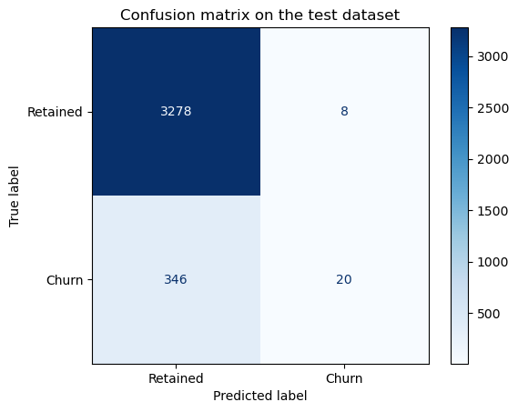

On the test dataset, the current model has a good precision and recall
for the Retained clients.  
The metrics that matter to us is the **recall** for the **churning
clients**, which is not good **(5%)**. There are many clients that churn
that are predicted as retained.

Let’s check how are these metrics for the training dataset:

``` python
disp = ConfusionMatrixDisplay.from_estimator(
        model,
        X_train,
        y_train,
        display_labels=class_names,
        cmap="Blues",
        # normalize="true",
    )
plt.title("Confusion matrix on the training dataset")
plt.show()
```

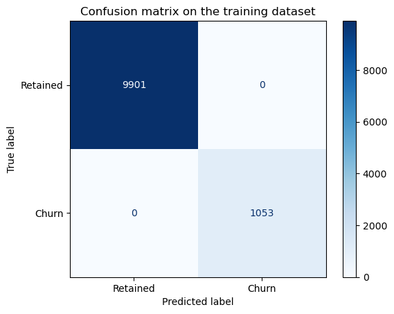

Using the confusion matrix on the training dataset we can see that the
model suffers from overfit

# Dealing with overfit

Different parameters that we can modify are:  
+ The number of estimators: “n_estimators”  
+ The maximum depth of the decision trees: “max_depth”  
+ The minimum samples that we allow per split: “min_samples_split” + The
maximum number of features that can be considered in each node:
“max_features”

Another analysis we can perform is the **feature importance** of the
dataset, to see what features are used the most to make splits of the
dataset. With this approach we can try to reduce the number of features
in our dataset that are not relevant.

We have also observed that the Retained clients are better predicted
than those that churn. Let’s see the proportion of labels:

``` python
df["churn"].value_counts() / len(df) * 100
```

    churn
    0    90.284814
    1     9.715186
    Name: count, dtype: float64

This problem is known as:  
**“Overfitting caused by class imbalance in a binary classification
problem.”**

### Testing imbalances in the dataset

Let’s try first with the parameter **class_weight** of the Random Forest
Classifier:

``` python
# Baseline model
model_0 = RandomForestClassifier(random_state=42, n_estimators=100) 
model_0.fit(X=X_train, y=y_train)

# New model with class_weight parameter to handle imbalanced data
model_1 = RandomForestClassifier(random_state=42, n_estimators=100, class_weight="balanced") 
model_1.fit(X=X_train, y=y_train)

# New model with class_weight parameter to handle imbalanced data and limit to depth of trees
model_2 = RandomForestClassifier(random_state=42, n_estimators=100, max_depth=10, class_weight="balanced") 
model_2.fit(X=X_train, y=y_train)
```

<style>#sk-container-id-2 {
  /* Definition of color scheme common for light and dark mode */
  --sklearn-color-text: #000;
  --sklearn-color-text-muted: #666;
  --sklearn-color-line: gray;
  /* Definition of color scheme for unfitted estimators */
  --sklearn-color-unfitted-level-0: #fff5e6;
  --sklearn-color-unfitted-level-1: #f6e4d2;
  --sklearn-color-unfitted-level-2: #ffe0b3;
  --sklearn-color-unfitted-level-3: chocolate;
  /* Definition of color scheme for fitted estimators */
  --sklearn-color-fitted-level-0: #f0f8ff;
  --sklearn-color-fitted-level-1: #d4ebff;
  --sklearn-color-fitted-level-2: #b3dbfd;
  --sklearn-color-fitted-level-3: cornflowerblue;
&#10;  /* Specific color for light theme */
  --sklearn-color-text-on-default-background: var(--sg-text-color, var(--theme-code-foreground, var(--jp-content-font-color1, black)));
  --sklearn-color-background: var(--sg-background-color, var(--theme-background, var(--jp-layout-color0, white)));
  --sklearn-color-border-box: var(--sg-text-color, var(--theme-code-foreground, var(--jp-content-font-color1, black)));
  --sklearn-color-icon: #696969;
&#10;  @media (prefers-color-scheme: dark) {
    /* Redefinition of color scheme for dark theme */
    --sklearn-color-text-on-default-background: var(--sg-text-color, var(--theme-code-foreground, var(--jp-content-font-color1, white)));
    --sklearn-color-background: var(--sg-background-color, var(--theme-background, var(--jp-layout-color0, #111)));
    --sklearn-color-border-box: var(--sg-text-color, var(--theme-code-foreground, var(--jp-content-font-color1, white)));
    --sklearn-color-icon: #878787;
  }
}
&#10;#sk-container-id-2 {
  color: var(--sklearn-color-text);
}
&#10;#sk-container-id-2 pre {
  padding: 0;
}
&#10;#sk-container-id-2 input.sk-hidden--visually {
  border: 0;
  clip: rect(1px 1px 1px 1px);
  clip: rect(1px, 1px, 1px, 1px);
  height: 1px;
  margin: -1px;
  overflow: hidden;
  padding: 0;
  position: absolute;
  width: 1px;
}
&#10;#sk-container-id-2 div.sk-dashed-wrapped {
  border: 1px dashed var(--sklearn-color-line);
  margin: 0 0.4em 0.5em 0.4em;
  box-sizing: border-box;
  padding-bottom: 0.4em;
  background-color: var(--sklearn-color-background);
}
&#10;#sk-container-id-2 div.sk-container {
  /* jupyter's `normalize.less` sets `[hidden] { display: none; }`
     but bootstrap.min.css set `[hidden] { display: none !important; }`
     so we also need the `!important` here to be able to override the
     default hidden behavior on the sphinx rendered scikit-learn.org.
     See: https://github.com/scikit-learn/scikit-learn/issues/21755 */
  display: inline-block !important;
  position: relative;
}
&#10;#sk-container-id-2 div.sk-text-repr-fallback {
  display: none;
}
&#10;div.sk-parallel-item,
div.sk-serial,
div.sk-item {
  /* draw centered vertical line to link estimators */
  background-image: linear-gradient(var(--sklearn-color-text-on-default-background), var(--sklearn-color-text-on-default-background));
  background-size: 2px 100%;
  background-repeat: no-repeat;
  background-position: center center;
}
&#10;/* Parallel-specific style estimator block */
&#10;#sk-container-id-2 div.sk-parallel-item::after {
  content: "";
  width: 100%;
  border-bottom: 2px solid var(--sklearn-color-text-on-default-background);
  flex-grow: 1;
}
&#10;#sk-container-id-2 div.sk-parallel {
  display: flex;
  align-items: stretch;
  justify-content: center;
  background-color: var(--sklearn-color-background);
  position: relative;
}
&#10;#sk-container-id-2 div.sk-parallel-item {
  display: flex;
  flex-direction: column;
}
&#10;#sk-container-id-2 div.sk-parallel-item:first-child::after {
  align-self: flex-end;
  width: 50%;
}
&#10;#sk-container-id-2 div.sk-parallel-item:last-child::after {
  align-self: flex-start;
  width: 50%;
}
&#10;#sk-container-id-2 div.sk-parallel-item:only-child::after {
  width: 0;
}
&#10;/* Serial-specific style estimator block */
&#10;#sk-container-id-2 div.sk-serial {
  display: flex;
  flex-direction: column;
  align-items: center;
  background-color: var(--sklearn-color-background);
  padding-right: 1em;
  padding-left: 1em;
}
&#10;
/* Toggleable style: style used for estimator/Pipeline/ColumnTransformer box that is
clickable and can be expanded/collapsed.
- Pipeline and ColumnTransformer use this feature and define the default style
- Estimators will overwrite some part of the style using the `sk-estimator` class
*/
&#10;/* Pipeline and ColumnTransformer style (default) */
&#10;#sk-container-id-2 div.sk-toggleable {
  /* Default theme specific background. It is overwritten whether we have a
  specific estimator or a Pipeline/ColumnTransformer */
  background-color: var(--sklearn-color-background);
}
&#10;/* Toggleable label */
#sk-container-id-2 label.sk-toggleable__label {
  cursor: pointer;
  display: flex;
  width: 100%;
  margin-bottom: 0;
  padding: 0.5em;
  box-sizing: border-box;
  text-align: center;
  align-items: start;
  justify-content: space-between;
  gap: 0.5em;
}
&#10;#sk-container-id-2 label.sk-toggleable__label .caption {
  font-size: 0.6rem;
  font-weight: lighter;
  color: var(--sklearn-color-text-muted);
}
&#10;#sk-container-id-2 label.sk-toggleable__label-arrow:before {
  /* Arrow on the left of the label */
  content: "▸";
  float: left;
  margin-right: 0.25em;
  color: var(--sklearn-color-icon);
}
&#10;#sk-container-id-2 label.sk-toggleable__label-arrow:hover:before {
  color: var(--sklearn-color-text);
}
&#10;/* Toggleable content - dropdown */
&#10;#sk-container-id-2 div.sk-toggleable__content {
  display: none;
  text-align: left;
  /* unfitted */
  background-color: var(--sklearn-color-unfitted-level-0);
}
&#10;#sk-container-id-2 div.sk-toggleable__content.fitted {
  /* fitted */
  background-color: var(--sklearn-color-fitted-level-0);
}
&#10;#sk-container-id-2 div.sk-toggleable__content pre {
  margin: 0.2em;
  border-radius: 0.25em;
  color: var(--sklearn-color-text);
  /* unfitted */
  background-color: var(--sklearn-color-unfitted-level-0);
}
&#10;#sk-container-id-2 div.sk-toggleable__content.fitted pre {
  /* unfitted */
  background-color: var(--sklearn-color-fitted-level-0);
}
&#10;#sk-container-id-2 input.sk-toggleable__control:checked~div.sk-toggleable__content {
  /* Expand drop-down */
  display: block;
  width: 100%;
  overflow: visible;
}
&#10;#sk-container-id-2 input.sk-toggleable__control:checked~label.sk-toggleable__label-arrow:before {
  content: "▾";
}
&#10;/* Pipeline/ColumnTransformer-specific style */
&#10;#sk-container-id-2 div.sk-label input.sk-toggleable__control:checked~label.sk-toggleable__label {
  color: var(--sklearn-color-text);
  background-color: var(--sklearn-color-unfitted-level-2);
}
&#10;#sk-container-id-2 div.sk-label.fitted input.sk-toggleable__control:checked~label.sk-toggleable__label {
  background-color: var(--sklearn-color-fitted-level-2);
}
&#10;/* Estimator-specific style */
&#10;/* Colorize estimator box */
#sk-container-id-2 div.sk-estimator input.sk-toggleable__control:checked~label.sk-toggleable__label {
  /* unfitted */
  background-color: var(--sklearn-color-unfitted-level-2);
}
&#10;#sk-container-id-2 div.sk-estimator.fitted input.sk-toggleable__control:checked~label.sk-toggleable__label {
  /* fitted */
  background-color: var(--sklearn-color-fitted-level-2);
}
&#10;#sk-container-id-2 div.sk-label label.sk-toggleable__label,
#sk-container-id-2 div.sk-label label {
  /* The background is the default theme color */
  color: var(--sklearn-color-text-on-default-background);
}
&#10;/* On hover, darken the color of the background */
#sk-container-id-2 div.sk-label:hover label.sk-toggleable__label {
  color: var(--sklearn-color-text);
  background-color: var(--sklearn-color-unfitted-level-2);
}
&#10;/* Label box, darken color on hover, fitted */
#sk-container-id-2 div.sk-label.fitted:hover label.sk-toggleable__label.fitted {
  color: var(--sklearn-color-text);
  background-color: var(--sklearn-color-fitted-level-2);
}
&#10;/* Estimator label */
&#10;#sk-container-id-2 div.sk-label label {
  font-family: monospace;
  font-weight: bold;
  display: inline-block;
  line-height: 1.2em;
}
&#10;#sk-container-id-2 div.sk-label-container {
  text-align: center;
}
&#10;/* Estimator-specific */
#sk-container-id-2 div.sk-estimator {
  font-family: monospace;
  border: 1px dotted var(--sklearn-color-border-box);
  border-radius: 0.25em;
  box-sizing: border-box;
  margin-bottom: 0.5em;
  /* unfitted */
  background-color: var(--sklearn-color-unfitted-level-0);
}
&#10;#sk-container-id-2 div.sk-estimator.fitted {
  /* fitted */
  background-color: var(--sklearn-color-fitted-level-0);
}
&#10;/* on hover */
#sk-container-id-2 div.sk-estimator:hover {
  /* unfitted */
  background-color: var(--sklearn-color-unfitted-level-2);
}
&#10;#sk-container-id-2 div.sk-estimator.fitted:hover {
  /* fitted */
  background-color: var(--sklearn-color-fitted-level-2);
}
&#10;/* Specification for estimator info (e.g. "i" and "?") */
&#10;/* Common style for "i" and "?" */
&#10;.sk-estimator-doc-link,
a:link.sk-estimator-doc-link,
a:visited.sk-estimator-doc-link {
  float: right;
  font-size: smaller;
  line-height: 1em;
  font-family: monospace;
  background-color: var(--sklearn-color-background);
  border-radius: 1em;
  height: 1em;
  width: 1em;
  text-decoration: none !important;
  margin-left: 0.5em;
  text-align: center;
  /* unfitted */
  border: var(--sklearn-color-unfitted-level-1) 1pt solid;
  color: var(--sklearn-color-unfitted-level-1);
}
&#10;.sk-estimator-doc-link.fitted,
a:link.sk-estimator-doc-link.fitted,
a:visited.sk-estimator-doc-link.fitted {
  /* fitted */
  border: var(--sklearn-color-fitted-level-1) 1pt solid;
  color: var(--sklearn-color-fitted-level-1);
}
&#10;/* On hover */
div.sk-estimator:hover .sk-estimator-doc-link:hover,
.sk-estimator-doc-link:hover,
div.sk-label-container:hover .sk-estimator-doc-link:hover,
.sk-estimator-doc-link:hover {
  /* unfitted */
  background-color: var(--sklearn-color-unfitted-level-3);
  color: var(--sklearn-color-background);
  text-decoration: none;
}
&#10;div.sk-estimator.fitted:hover .sk-estimator-doc-link.fitted:hover,
.sk-estimator-doc-link.fitted:hover,
div.sk-label-container:hover .sk-estimator-doc-link.fitted:hover,
.sk-estimator-doc-link.fitted:hover {
  /* fitted */
  background-color: var(--sklearn-color-fitted-level-3);
  color: var(--sklearn-color-background);
  text-decoration: none;
}
&#10;/* Span, style for the box shown on hovering the info icon */
.sk-estimator-doc-link span {
  display: none;
  z-index: 9999;
  position: relative;
  font-weight: normal;
  right: .2ex;
  padding: .5ex;
  margin: .5ex;
  width: min-content;
  min-width: 20ex;
  max-width: 50ex;
  color: var(--sklearn-color-text);
  box-shadow: 2pt 2pt 4pt #999;
  /* unfitted */
  background: var(--sklearn-color-unfitted-level-0);
  border: .5pt solid var(--sklearn-color-unfitted-level-3);
}
&#10;.sk-estimator-doc-link.fitted span {
  /* fitted */
  background: var(--sklearn-color-fitted-level-0);
  border: var(--sklearn-color-fitted-level-3);
}
&#10;.sk-estimator-doc-link:hover span {
  display: block;
}
&#10;/* "?"-specific style due to the `<a>` HTML tag */
&#10;#sk-container-id-2 a.estimator_doc_link {
  float: right;
  font-size: 1rem;
  line-height: 1em;
  font-family: monospace;
  background-color: var(--sklearn-color-background);
  border-radius: 1rem;
  height: 1rem;
  width: 1rem;
  text-decoration: none;
  /* unfitted */
  color: var(--sklearn-color-unfitted-level-1);
  border: var(--sklearn-color-unfitted-level-1) 1pt solid;
}
&#10;#sk-container-id-2 a.estimator_doc_link.fitted {
  /* fitted */
  border: var(--sklearn-color-fitted-level-1) 1pt solid;
  color: var(--sklearn-color-fitted-level-1);
}
&#10;/* On hover */
#sk-container-id-2 a.estimator_doc_link:hover {
  /* unfitted */
  background-color: var(--sklearn-color-unfitted-level-3);
  color: var(--sklearn-color-background);
  text-decoration: none;
}
&#10;#sk-container-id-2 a.estimator_doc_link.fitted:hover {
  /* fitted */
  background-color: var(--sklearn-color-fitted-level-3);
}
&#10;.estimator-table summary {
    padding: .5rem;
    font-family: monospace;
    cursor: pointer;
}
&#10;.estimator-table details[open] {
    padding-left: 0.1rem;
    padding-right: 0.1rem;
    padding-bottom: 0.3rem;
}
&#10;.estimator-table .parameters-table {
    margin-left: auto !important;
    margin-right: auto !important;
}
&#10;.estimator-table .parameters-table tr:nth-child(odd) {
    background-color: #fff;
}
&#10;.estimator-table .parameters-table tr:nth-child(even) {
    background-color: #f6f6f6;
}
&#10;.estimator-table .parameters-table tr:hover {
    background-color: #e0e0e0;
}
&#10;.estimator-table table td {
    border: 1px solid rgba(106, 105, 104, 0.232);
}
&#10;.user-set td {
    color:rgb(255, 94, 0);
    text-align: left;
}
&#10;.user-set td.value pre {
    color:rgb(255, 94, 0) !important;
    background-color: transparent !important;
}
&#10;.default td {
    color: black;
    text-align: left;
}
&#10;.user-set td i,
.default td i {
    color: black;
}
&#10;.copy-paste-icon {
    background-image: url(data:image/svg+xml;base64,PHN2ZyB4bWxucz0iaHR0cDovL3d3dy53My5vcmcvMjAwMC9zdmciIHZpZXdCb3g9IjAgMCA0NDggNTEyIj48IS0tIUZvbnQgQXdlc29tZSBGcmVlIDYuNy4yIGJ5IEBmb250YXdlc29tZSAtIGh0dHBzOi8vZm9udGF3ZXNvbWUuY29tIExpY2Vuc2UgLSBodHRwczovL2ZvbnRhd2Vzb21lLmNvbS9saWNlbnNlL2ZyZWUgQ29weXJpZ2h0IDIwMjUgRm9udGljb25zLCBJbmMuLS0+PHBhdGggZD0iTTIwOCAwTDMzMi4xIDBjMTIuNyAwIDI0LjkgNS4xIDMzLjkgMTQuMWw2Ny45IDY3LjljOSA5IDE0LjEgMjEuMiAxNC4xIDMzLjlMNDQ4IDMzNmMwIDI2LjUtMjEuNSA0OC00OCA0OGwtMTkyIDBjLTI2LjUgMC00OC0yMS41LTQ4LTQ4bDAtMjg4YzAtMjYuNSAyMS41LTQ4IDQ4LTQ4ek00OCAxMjhsODAgMCAwIDY0LTY0IDAgMCAyNTYgMTkyIDAgMC0zMiA2NCAwIDAgNDhjMCAyNi41LTIxLjUgNDgtNDggNDhMNDggNTEyYy0yNi41IDAtNDgtMjEuNS00OC00OEwwIDE3NmMwLTI2LjUgMjEuNS00OCA0OC00OHoiLz48L3N2Zz4=);
    background-repeat: no-repeat;
    background-size: 14px 14px;
    background-position: 0;
    display: inline-block;
    width: 14px;
    height: 14px;
    cursor: pointer;
}
</style><body><div id="sk-container-id-2" class="sk-top-container"><div class="sk-text-repr-fallback"><pre>RandomForestClassifier(class_weight=&#x27;balanced&#x27;, max_depth=10, random_state=42)</pre><b>In a Jupyter environment, please rerun this cell to show the HTML representation or trust the notebook. <br />On GitHub, the HTML representation is unable to render, please try loading this page with nbviewer.org.</b></div><div class="sk-container" hidden><div class="sk-item"><div class="sk-estimator fitted sk-toggleable"><input class="sk-toggleable__control sk-hidden--visually" id="sk-estimator-id-2" type="checkbox" checked><label for="sk-estimator-id-2" class="sk-toggleable__label fitted sk-toggleable__label-arrow"><div><div>RandomForestClassifier</div></div><div><a class="sk-estimator-doc-link fitted" rel="noreferrer" target="_blank" href="https://scikit-learn.org/1.7/modules/generated/sklearn.ensemble.RandomForestClassifier.html">?<span>Documentation for RandomForestClassifier</span></a><span class="sk-estimator-doc-link fitted">i<span>Fitted</span></span></div></label><div class="sk-toggleable__content fitted" data-param-prefix="">
        <div class="estimator-table">
            <details>
                <summary>Parameters</summary>
                &#10;

<table class="parameters-table" data-quarto-postprocess="true">
<tbody>
<tr class="default">
<td><em></em></td>
<td class="param">n_estimators </td>
<td class="value">100</td>
</tr>
<tr class="default">
<td><em></em></td>
<td class="param">criterion </td>
<td class="value">'gini'</td>
</tr>
<tr class="user-set">
<td><em></em></td>
<td class="param">max_depth </td>
<td class="value">10</td>
</tr>
<tr class="default">
<td><em></em></td>
<td class="param">min_samples_split </td>
<td class="value">2</td>
</tr>
<tr class="default">
<td><em></em></td>
<td class="param">min_samples_leaf </td>
<td class="value">1</td>
</tr>
<tr class="default">
<td><em></em></td>
<td class="param">min_weight_fraction_leaf </td>
<td class="value">0.0</td>
</tr>
<tr class="default">
<td><em></em></td>
<td class="param">max_features </td>
<td class="value">'sqrt'</td>
</tr>
<tr class="default">
<td><em></em></td>
<td class="param">max_leaf_nodes </td>
<td class="value">None</td>
</tr>
<tr class="default">
<td><em></em></td>
<td class="param">min_impurity_decrease </td>
<td class="value">0.0</td>
</tr>
<tr class="default">
<td><em></em></td>
<td class="param">bootstrap </td>
<td class="value">True</td>
</tr>
<tr class="default">
<td><em></em></td>
<td class="param">oob_score </td>
<td class="value">False</td>
</tr>
<tr class="default">
<td><em></em></td>
<td class="param">n_jobs </td>
<td class="value">None</td>
</tr>
<tr class="user-set">
<td><em></em></td>
<td class="param">random_state </td>
<td class="value">42</td>
</tr>
<tr class="default">
<td><em></em></td>
<td class="param">verbose </td>
<td class="value">0</td>
</tr>
<tr class="default">
<td><em></em></td>
<td class="param">warm_start </td>
<td class="value">False</td>
</tr>
<tr class="user-set">
<td><em></em></td>
<td class="param">class_weight </td>
<td class="value">'balanced'</td>
</tr>
<tr class="default">
<td><em></em></td>
<td class="param">ccp_alpha </td>
<td class="value">0.0</td>
</tr>
<tr class="default">
<td><em></em></td>
<td class="param">max_samples </td>
<td class="value">None</td>
</tr>
<tr class="default">
<td><em></em></td>
<td class="param">monotonic_cst </td>
<td class="value">None</td>
</tr>
</tbody>
</table>

            </details>
        </div>
    </div></div></div></div></div><script>function copyToClipboard(text, element) {
    // Get the parameter prefix from the closest toggleable content
    const toggleableContent = element.closest('.sk-toggleable__content');
    const paramPrefix = toggleableContent ? toggleableContent.dataset.paramPrefix : '';
    const fullParamName = paramPrefix ? `${paramPrefix}${text}` : text;
&#10;    const originalStyle = element.style;
    const computedStyle = window.getComputedStyle(element);
    const originalWidth = computedStyle.width;
    const originalHTML = element.innerHTML.replace('Copied!', '');
&#10;    navigator.clipboard.writeText(fullParamName)
        .then(() => {
            element.style.width = originalWidth;
            element.style.color = 'green';
            element.innerHTML = "Copied!";
&#10;            setTimeout(() => {
                element.innerHTML = originalHTML;
                element.style = originalStyle;
            }, 2000);
        })
        .catch(err => {
            console.error('Failed to copy:', err);
            element.style.color = 'red';
            element.innerHTML = "Failed!";
            setTimeout(() => {
                element.innerHTML = originalHTML;
                element.style = originalStyle;
            }, 2000);
        });
    return false;
}
&#10;document.querySelectorAll('.fa-regular.fa-copy').forEach(function(element) {
    const toggleableContent = element.closest('.sk-toggleable__content');
    const paramPrefix = toggleableContent ? toggleableContent.dataset.paramPrefix : '';
    const paramName = element.parentElement.nextElementSibling.textContent.trim();
    const fullParamName = paramPrefix ? `${paramPrefix}${paramName}` : paramName;
&#10;    element.setAttribute('title', fullParamName);
});
</script></body>

``` python
# Check recall of the 3 models
recall_0 = metrics.recall_score(y_test, model_0.predict(X=X_test))
recall_1 = metrics.recall_score(y_test, model_1.predict(X=X_test))
recall_2 = metrics.recall_score(y_test, model_2.predict(X=X_test))

print(f"Recall without balancing: {recall_0}")
print(f"Recall with balancing: {recall_1}")
print(f"Recall with balancing and more trees: {recall_2}")
print(classification_report(y_test, model_0.predict(X=X_test)))
print(classification_report(y_test, model_1.predict(X=X_test)))
print(classification_report(y_test, model_2.predict(X=X_test)))
```

    Recall without balancing: 0.0546448087431694
    Recall with balancing: 0.0546448087431694
    Recall with balancing and more trees: 0.26229508196721313
                  precision    recall  f1-score   support

               0       0.90      1.00      0.95      3286
               1       0.71      0.05      0.10       366

        accuracy                           0.90      3652
       macro avg       0.81      0.53      0.53      3652
    weighted avg       0.89      0.90      0.86      3652

                  precision    recall  f1-score   support

               0       0.90      1.00      0.95      3286
               1       0.83      0.05      0.10       366

        accuracy                           0.90      3652
       macro avg       0.87      0.53      0.53      3652
    weighted avg       0.90      0.90      0.86      3652

                  precision    recall  f1-score   support

               0       0.92      0.89      0.90      3286
               1       0.21      0.26      0.24       366

        accuracy                           0.83      3652
       macro avg       0.56      0.58      0.57      3652
    weighted avg       0.85      0.83      0.84      3652

Let’s check the depth of the trees of the baseline model:

``` python
# Get the depth of each tree
tree_depths = [estimator.tree_.max_depth for estimator in model_0.estimators_]

print("Average tree depth:", sum(tree_depths)/len(tree_depths))
print("Max tree depth:", max(tree_depths))
print("Min tree depth:", min(tree_depths))
```

    Average tree depth: 32.49
    Max tree depth: 43
    Min tree depth: 25

We can see at least two effects in the recall for class 1:  
1. The baseline Random Forest allows the trees to grow too much,
overfitting the training dataset.  
2. The **class_weight** parameter of the Random Forest does not have any
influence in the results as long as we don’t solve the overfitting due
to the max depth of the decision trees.  
3. Once we limit the depth of the decision trees in our random forest,
the **class_weight** improves the recall from a **5%** to a **26%**

### Trees max depth

``` python
def rf_train_and_metric(X_train, y_train, X_test, y_test, ax=None, **kwargs):
    model = RandomForestClassifier(
        **kwargs 
        ) 

    model.fit(X=X_train, y=y_train) # Complete this method call!

    class_names=["Retained", "Churn"]

    disp = ConfusionMatrixDisplay.from_estimator(
            model,
            X_test,
            y_test,
            display_labels=class_names,
            cmap="Blues",
            # normalize="true",
            ax=ax if ax is not None else None
        )
    # plt.title("Confusion matrix on the test dataset")
    # plt.show()
```

``` python
params = dict(
    random_state=42,
    n_estimators=100,
    class_weight='balanced',
)


fig, axs = plt.subplots(2, 2, figsize=(15, 5))

for i, depth in enumerate([20, 15, 10, 5]):
    ax = axs.flatten()[i]
    ax.set_title(f"max_depth={depth}")

    params['max_depth'] = depth
    print(f"Testing max_depth={depth}")
    rf_train_and_metric(X_train, y_train, X_test, y_test, ax, **params)

plt.tight_layout()
plt.show()
```

    Testing max_depth=20
    Testing max_depth=15
    Testing max_depth=10
    Testing max_depth=5

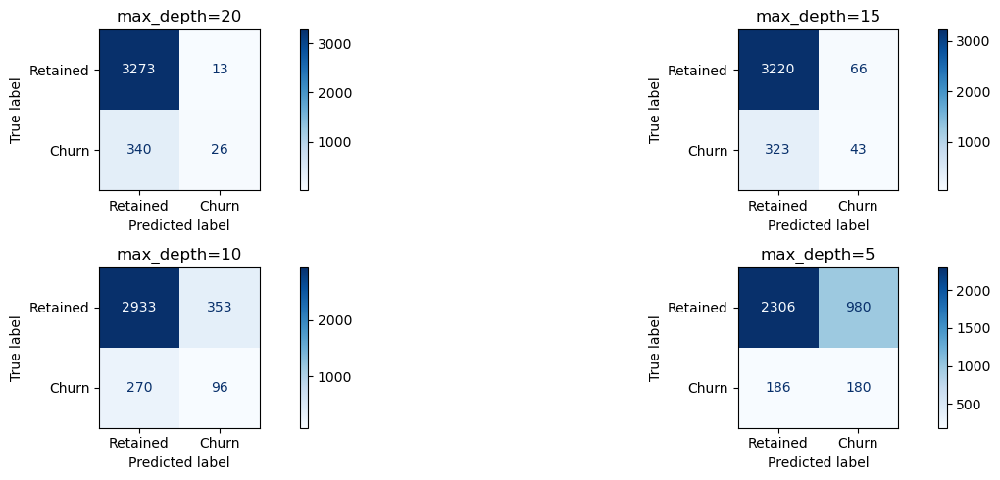

### Number of trees

Let’s see if we can improve by selecting a bigger Random Forest

``` python
params = dict(
    random_state=42,
    n_estimators=1000,
    class_weight='balanced',
    max_depth=5
)

fig,ax = plt.subplots(1, 1, figsize=(5, 5))
rf_train_and_metric(X_train, y_train, X_test, y_test, ax, **params)
plt.tight_layout()
plt.show()
```

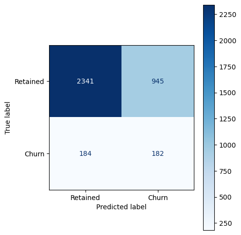

Increasing the number of decision trees did not affect the results after
adjusting the max depth of the decision trees in the forest.

### Minimum samples in a split

``` python
params = dict(
    random_state=42,
    n_estimators=100,
    class_weight='balanced',
    # max_depth=5
)

fig, axs = plt.subplots(2, 2, figsize=(15, 5))

for i, min_samples_split in enumerate([200, 100, 10, 5]):
    ax = axs.flatten()[i]
    ax.set_title(f"min_samples_split={min_samples_split}")

    params['min_samples_split'] = min_samples_split
    print(f"Testing min_samples_split={min_samples_split}")
    rf_train_and_metric(X_train, y_train, X_test, y_test, ax, **params)

plt.tight_layout()
plt.show()
```

    Testing min_samples_split=200
    Testing min_samples_split=100
    Testing min_samples_split=10
    Testing min_samples_split=5

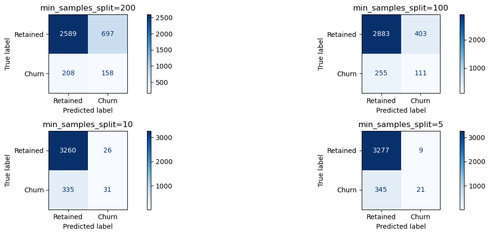

There are better results by setting the max depth of the trees

### Min samples leaf

``` python
params = dict(
    random_state=42,
    n_estimators=100,
    class_weight='balanced',
    # max_depth=5
)

fig, axs = plt.subplots(2, 2, figsize=(15, 5))

for i, min_samples_leaf in enumerate([200, 100, 10, 5]):
    ax = axs.flatten()[i]
    ax.set_title(f"min_samples_leaf={min_samples_leaf}")

    params['min_samples_leaf'] = min_samples_leaf
    print(f"Testing min_samples_leaf={min_samples_leaf}")
    rf_train_and_metric(X_train, y_train, X_test, y_test, ax, **params)

plt.tight_layout()
plt.show()
```

    Testing min_samples_leaf=200
    Testing min_samples_leaf=100
    Testing min_samples_leaf=10
    Testing min_samples_leaf=5

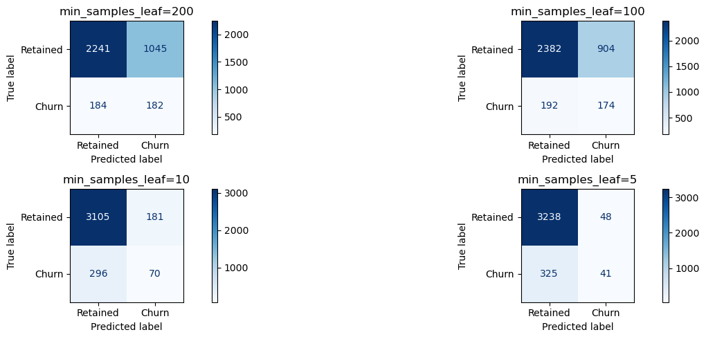

Still the best parameter is to set the maximum depth of the trees.

### Max features

``` python
params = dict(
    random_state=42,
    n_estimators=100,
    class_weight='balanced',
    max_depth=5
)

fig, axs = plt.subplots(2, 2, figsize=(15, 5))

for i, max_features in enumerate(['sqrt', 'log2', 10, 2]):
    ax = axs.flatten()[i]
    ax.set_title(f"max_features={max_features}")

    params['max_features'] = max_features
    print(f"Testing max_features={max_features}")
    rf_train_and_metric(X_train, y_train, X_test, y_test, ax, **params)

plt.tight_layout()
plt.show()
```

    Testing max_features=sqrt
    Testing max_features=log2
    Testing max_features=10
    Testing max_features=2

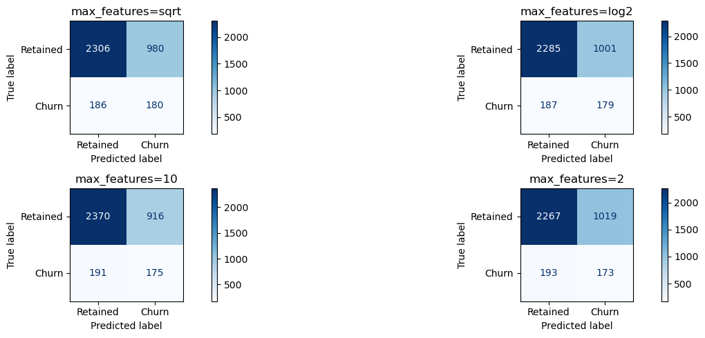

It does not alter significantly the results.

# Remove fields

It seems that removing fields does not improve the predictions for the
churning clients

``` python
params = dict(
    random_state=42,
    n_estimators=100,
    class_weight='balanced',
    max_depth=5
)

model_b = RandomForestClassifier(**params) 

model_b.fit(X=X_train, y=y_train) # Complete this method call!
disp = ConfusionMatrixDisplay.from_estimator(
        model_b,
        X_test,
        y_test,
        display_labels=class_names,
        cmap="Blues",
        # normalize="true",
    )
```

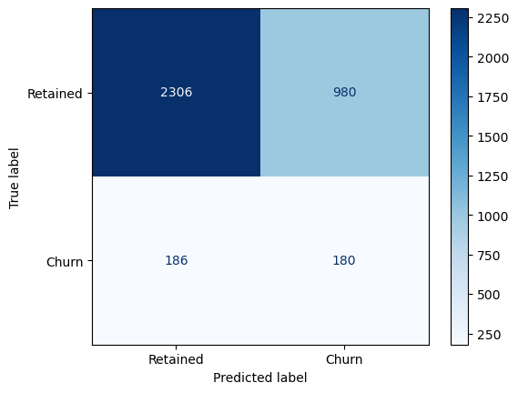

``` python
imp_df = pd.DataFrame({
    "Varname": X_train.columns,
    "Imp": model_b.feature_importances_
})

imp_df.sort_values(by="Imp", ascending=False)
```

<div>
<style scoped>
    .dataframe tbody tr th:only-of-type {
        vertical-align: middle;
    }
&#10;    .dataframe tbody tr th {
        vertical-align: top;
    }
&#10;    .dataframe thead th {
        text-align: right;
    }
</style>

<table class="dataframe" data-quarto-postprocess="true" data-border="1">
<thead>
<tr style="text-align: right;">
<th data-quarto-table-cell-role="th"></th>
<th data-quarto-table-cell-role="th">Varname</th>
<th data-quarto-table-cell-role="th">Imp</th>
</tr>
</thead>
<tbody>
<tr>
<td data-quarto-table-cell-role="th">11</td>
<td>margin_gross_pow_ele</td>
<td>0.102918</td>
</tr>
<tr>
<td data-quarto-table-cell-role="th">12</td>
<td>margin_net_pow_ele</td>
<td>0.100517</td>
</tr>
<tr>
<td data-quarto-table-cell-role="th">49</td>
<td>months_activ</td>
<td>0.065321</td>
</tr>
<tr>
<td data-quarto-table-cell-role="th">60</td>
<td>origin_up_lxidpiddsbxsbosboudacockeimpuepw</td>
<td>0.052714</td>
</tr>
<tr>
<td data-quarto-table-cell-role="th">0</td>
<td>cons_12m</td>
<td>0.050827</td>
</tr>
<tr>
<td data-quarto-table-cell-role="th">...</td>
<td>...</td>
<td>...</td>
</tr>
<tr>
<td data-quarto-table-cell-role="th">33</td>
<td>var_6m_price_mid_peak</td>
<td>0.001791</td>
</tr>
<tr>
<td data-quarto-table-cell-role="th">57</td>
<td>channel_usilxuppasemubllopkaafesmlibmsdf</td>
<td>0.001620</td>
</tr>
<tr>
<td data-quarto-table-cell-role="th">30</td>
<td>var_6m_price_mid_peak_fix</td>
<td>0.001446</td>
</tr>
<tr>
<td data-quarto-table-cell-role="th">4</td>
<td>forecast_discount_energy</td>
<td>0.001276</td>
</tr>
<tr>
<td data-quarto-table-cell-role="th">29</td>
<td>var_6m_price_peak_fix</td>
<td>0.001026</td>
</tr>
</tbody>
</table>

<p>61 rows × 2 columns</p>
</div>

``` python
perc_feat = 0.5
imp_df.sort_values(by="Imp", ascending=False, inplace=True)

# Number of features to keep in dataset
n_features = int(perc_feat*len(imp_df))
best_features = imp_df[:n_features]["Varname"]

Xf_train = X_train[best_features]
Xf_test = X_test[best_features]

params = dict(
    random_state=42,
    n_estimators=100,
    class_weight='balanced',
    max_depth=5
)

# Refit with less features
model_b.fit(X=Xf_train, y=y_train) # Complete this method call!

disp = ConfusionMatrixDisplay.from_estimator(
        model_b,
        Xf_test,
        y_test,
        display_labels=class_names,
        cmap="Blues",
        # normalize="true",
    )
plt.show()

impf_df = pd.DataFrame({
    "Varname": Xf_train.columns,
    "Imp": model_b.feature_importances_
})
impf_df
```

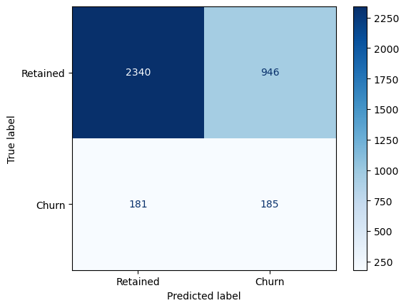

<div>
<style scoped>
    .dataframe tbody tr th:only-of-type {
        vertical-align: middle;
    }
&#10;    .dataframe tbody tr th {
        vertical-align: top;
    }
&#10;    .dataframe thead th {
        text-align: right;
    }
</style>

<table class="dataframe" data-quarto-postprocess="true" data-border="1">
<thead>
<tr style="text-align: right;">
<th data-quarto-table-cell-role="th"></th>
<th data-quarto-table-cell-role="th">Varname</th>
<th data-quarto-table-cell-role="th">Imp</th>
</tr>
</thead>
<tbody>
<tr>
<td data-quarto-table-cell-role="th">0</td>
<td>margin_gross_pow_ele</td>
<td>0.148411</td>
</tr>
<tr>
<td data-quarto-table-cell-role="th">1</td>
<td>margin_net_pow_ele</td>
<td>0.128503</td>
</tr>
<tr>
<td data-quarto-table-cell-role="th">2</td>
<td>months_activ</td>
<td>0.061668</td>
</tr>
<tr>
<td data-quarto-table-cell-role="th">3</td>
<td>origin_up_lxidpiddsbxsbosboudacockeimpuepw</td>
<td>0.058457</td>
</tr>
<tr>
<td data-quarto-table-cell-role="th">4</td>
<td>cons_12m</td>
<td>0.054984</td>
</tr>
<tr>
<td data-quarto-table-cell-role="th">5</td>
<td>origin_up_kamkkxfxxuwbdslkwifmmcsiusiuosws</td>
<td>0.046476</td>
</tr>
<tr>
<td data-quarto-table-cell-role="th">6</td>
<td>forecast_meter_rent_12m</td>
<td>0.030946</td>
</tr>
<tr>
<td data-quarto-table-cell-role="th">7</td>
<td>months_modif_prod</td>
<td>0.030923</td>
</tr>
<tr>
<td data-quarto-table-cell-role="th">8</td>
<td>tenure</td>
<td>0.046165</td>
</tr>
<tr>
<td data-quarto-table-cell-role="th">9</td>
<td>cons_last_month</td>
<td>0.038057</td>
</tr>
<tr>
<td data-quarto-table-cell-role="th">10</td>
<td>var_year_price_off_peak_var</td>
<td>0.020018</td>
</tr>
<tr>
<td data-quarto-table-cell-role="th">11</td>
<td>var_6m_price_off_peak_var</td>
<td>0.014672</td>
</tr>
<tr>
<td data-quarto-table-cell-role="th">12</td>
<td>off_peak_peak_var_mean_diff</td>
<td>0.026359</td>
</tr>
<tr>
<td data-quarto-table-cell-role="th">13</td>
<td>channel_foosdfpfkusacimwkcsosbicdxkicaua</td>
<td>0.024022</td>
</tr>
<tr>
<td data-quarto-table-cell-role="th">14</td>
<td>net_margin</td>
<td>0.024085</td>
</tr>
<tr>
<td data-quarto-table-cell-role="th">15</td>
<td>cons_gas_12m</td>
<td>0.022814</td>
</tr>
<tr>
<td data-quarto-table-cell-role="th">16</td>
<td>off_peak_mid_peak_var_mean_diff</td>
<td>0.022785</td>
</tr>
<tr>
<td data-quarto-table-cell-role="th">17</td>
<td>forecast_cons_12m</td>
<td>0.022452</td>
</tr>
<tr>
<td data-quarto-table-cell-role="th">18</td>
<td>pow_max</td>
<td>0.017772</td>
</tr>
<tr>
<td data-quarto-table-cell-role="th">19</td>
<td>var_year_price_peak</td>
<td>0.011879</td>
</tr>
<tr>
<td data-quarto-table-cell-role="th">20</td>
<td>off_peak_peak_var_max_monthly_diff</td>
<td>0.015406</td>
</tr>
<tr>
<td data-quarto-table-cell-role="th">21</td>
<td>var_year_price_off_peak</td>
<td>0.022272</td>
</tr>
<tr>
<td data-quarto-table-cell-role="th">22</td>
<td>var_year_price_peak_var</td>
<td>0.010305</td>
</tr>
<tr>
<td data-quarto-table-cell-role="th">23</td>
<td>offpeak_diff_dec_january_energy</td>
<td>0.022179</td>
</tr>
<tr>
<td data-quarto-table-cell-role="th">24</td>
<td>var_6m_price_off_peak</td>
<td>0.014623</td>
</tr>
<tr>
<td data-quarto-table-cell-role="th">25</td>
<td>forecast_price_energy_off_peak</td>
<td>0.017649</td>
</tr>
<tr>
<td data-quarto-table-cell-role="th">26</td>
<td>var_year_price_mid_peak_var</td>
<td>0.012083</td>
</tr>
<tr>
<td data-quarto-table-cell-role="th">27</td>
<td>off_peak_mid_peak_fix_mean_diff</td>
<td>0.012359</td>
</tr>
<tr>
<td data-quarto-table-cell-role="th">28</td>
<td>channel_lmkebamcaaclubfxadlmueccxoimlema</td>
<td>0.010649</td>
</tr>
<tr>
<td data-quarto-table-cell-role="th">29</td>
<td>off_peak_mid_peak_var_max_monthly_diff</td>
<td>0.011027</td>
</tr>
</tbody>
</table>

</div>

``` python
imp_df[:10]
```

<div>
<style scoped>
    .dataframe tbody tr th:only-of-type {
        vertical-align: middle;
    }
&#10;    .dataframe tbody tr th {
        vertical-align: top;
    }
&#10;    .dataframe thead th {
        text-align: right;
    }
</style>

<table class="dataframe" data-quarto-postprocess="true" data-border="1">
<thead>
<tr style="text-align: right;">
<th data-quarto-table-cell-role="th"></th>
<th data-quarto-table-cell-role="th">Varname</th>
<th data-quarto-table-cell-role="th">Imp</th>
</tr>
</thead>
<tbody>
<tr>
<td data-quarto-table-cell-role="th">11</td>
<td>margin_gross_pow_ele</td>
<td>0.102918</td>
</tr>
<tr>
<td data-quarto-table-cell-role="th">12</td>
<td>margin_net_pow_ele</td>
<td>0.100517</td>
</tr>
<tr>
<td data-quarto-table-cell-role="th">49</td>
<td>months_activ</td>
<td>0.065321</td>
</tr>
<tr>
<td data-quarto-table-cell-role="th">60</td>
<td>origin_up_lxidpiddsbxsbosboudacockeimpuepw</td>
<td>0.052714</td>
</tr>
<tr>
<td data-quarto-table-cell-role="th">0</td>
<td>cons_12m</td>
<td>0.050827</td>
</tr>
<tr>
<td data-quarto-table-cell-role="th">58</td>
<td>origin_up_kamkkxfxxuwbdslkwifmmcsiusiuosws</td>
<td>0.046333</td>
</tr>
<tr>
<td data-quarto-table-cell-role="th">5</td>
<td>forecast_meter_rent_12m</td>
<td>0.035954</td>
</tr>
<tr>
<td data-quarto-table-cell-role="th">51</td>
<td>months_modif_prod</td>
<td>0.033384</td>
</tr>
<tr>
<td data-quarto-table-cell-role="th">48</td>
<td>tenure</td>
<td>0.033266</td>
</tr>
<tr>
<td data-quarto-table-cell-role="th">2</td>
<td>cons_last_month</td>
<td>0.033152</td>
</tr>
</tbody>
</table>

</div>

# Hyperparameter Tuning

``` python
from sklearn.model_selection import GridSearchCV
from sklearn.metrics import make_scorer, recall_score
```

Check max depth of the trees in the default Random Forest

``` python
# Get the depth of each tree
tree_depths = [estimator.tree_.max_depth for estimator in model.estimators_]

print("Average tree depth:", sum(tree_depths)/len(tree_depths))
print("Max tree depth:", max(tree_depths))
print("Min tree depth:", min(tree_depths))
```

    Average tree depth: 32.49
    Max tree depth: 43
    Min tree depth: 25

Let’s define the score that we are looking to optimize in our grid
search

``` python
import matplotlib.pyplot as plt
import seaborn as sns
import pandas as pd
from sklearn.ensemble import RandomForestClassifier
from sklearn.metrics import recall_score
from itertools import product

# Define hyperparameter grid
param_grid = {
    "n_estimators": [50, 100, 200],
    "max_depth": [None, 20, 10, 5],
    "max_features": ["sqrt", "log2"],
    "min_samples_split": [2, 10, 20],
}

results = []

# Train models with all combinations
for n, d, f, m in product(param_grid["n_estimators"],
                          param_grid["max_depth"],
                          param_grid["max_features"],
                          param_grid["min_samples_split"]):
    model = RandomForestClassifier(
        n_estimators=n,
        max_depth=d,
        max_features=f,
        min_samples_split=m,
        random_state=42,
        class_weight='balanced',
    )
    model.fit(X_train, y_train)
    y_pred = model.predict(X_test)
    recall = recall_score(y_test, y_pred, pos_label=1)
    results.append({
        "n_estimators": n,
        "max_depth": "None" if d is None else d,
        "max_features": f,
        "min_samples_split": m,
        "recall_class1": recall
    })

df_results = pd.DataFrame(results)

# Melt dataframe for easier plotting
df_melted = df_results.melt(
    id_vars="recall_class1",
    value_vars=["n_estimators", "max_depth", "max_features", "min_samples_split"],
    var_name="Parameter",
    value_name="Value"
)

# Plot influence of all parameters
plt.figure(figsize=(12, 6))
sns.boxplot(x="Parameter", y="recall_class1", hue="Value", data=df_melted)
plt.title("Influence of Random Forest Hyperparameters on Recall (Class 1)")
plt.ylabel("Recall (Class 1)")
plt.legend(title="Parameter Value", bbox_to_anchor=(1.05, 1), loc="upper left")
plt.show()
```

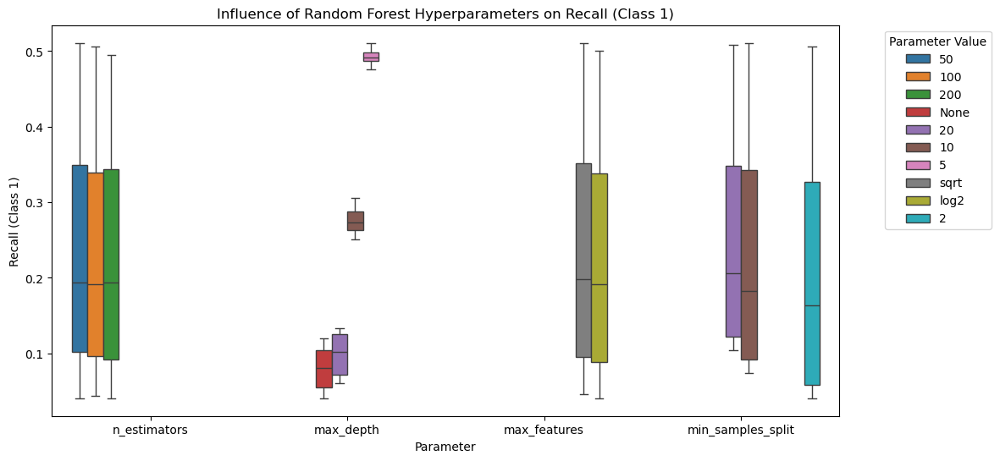

``` python
rf = RandomForestClassifier(random_state=42, n_jobs=-1, class_weight='balanced')

params = {
    'max_depth': [20, 10, 5],
    'min_samples_leaf': [1, 2, 5, 10],
    'n_estimators': [100, 500]
}

# recall_for_one=recall_score(y_test, y_pred, pos_label=1)
recall_for_one = make_scorer(recall_score, pos_label=1)

# Instantiate the grid search model
grid_search = GridSearchCV(estimator=rf,
                           param_grid=params,
                           cv = 5,
                           n_jobs=-1, verbose=1, 
                           scoring=recall_for_one)
```

``` python
grid_search.fit(X_train, y_train)
```

    Fitting 5 folds for each of 24 candidates, totalling 120 fits
    CPU times: user 2.96 s, sys: 518 ms, total: 3.48 s
    Wall time: 1min 47s

<style>#sk-container-id-3 {
  /* Definition of color scheme common for light and dark mode */
  --sklearn-color-text: #000;
  --sklearn-color-text-muted: #666;
  --sklearn-color-line: gray;
  /* Definition of color scheme for unfitted estimators */
  --sklearn-color-unfitted-level-0: #fff5e6;
  --sklearn-color-unfitted-level-1: #f6e4d2;
  --sklearn-color-unfitted-level-2: #ffe0b3;
  --sklearn-color-unfitted-level-3: chocolate;
  /* Definition of color scheme for fitted estimators */
  --sklearn-color-fitted-level-0: #f0f8ff;
  --sklearn-color-fitted-level-1: #d4ebff;
  --sklearn-color-fitted-level-2: #b3dbfd;
  --sklearn-color-fitted-level-3: cornflowerblue;
&#10;  /* Specific color for light theme */
  --sklearn-color-text-on-default-background: var(--sg-text-color, var(--theme-code-foreground, var(--jp-content-font-color1, black)));
  --sklearn-color-background: var(--sg-background-color, var(--theme-background, var(--jp-layout-color0, white)));
  --sklearn-color-border-box: var(--sg-text-color, var(--theme-code-foreground, var(--jp-content-font-color1, black)));
  --sklearn-color-icon: #696969;
&#10;  @media (prefers-color-scheme: dark) {
    /* Redefinition of color scheme for dark theme */
    --sklearn-color-text-on-default-background: var(--sg-text-color, var(--theme-code-foreground, var(--jp-content-font-color1, white)));
    --sklearn-color-background: var(--sg-background-color, var(--theme-background, var(--jp-layout-color0, #111)));
    --sklearn-color-border-box: var(--sg-text-color, var(--theme-code-foreground, var(--jp-content-font-color1, white)));
    --sklearn-color-icon: #878787;
  }
}
&#10;#sk-container-id-3 {
  color: var(--sklearn-color-text);
}
&#10;#sk-container-id-3 pre {
  padding: 0;
}
&#10;#sk-container-id-3 input.sk-hidden--visually {
  border: 0;
  clip: rect(1px 1px 1px 1px);
  clip: rect(1px, 1px, 1px, 1px);
  height: 1px;
  margin: -1px;
  overflow: hidden;
  padding: 0;
  position: absolute;
  width: 1px;
}
&#10;#sk-container-id-3 div.sk-dashed-wrapped {
  border: 1px dashed var(--sklearn-color-line);
  margin: 0 0.4em 0.5em 0.4em;
  box-sizing: border-box;
  padding-bottom: 0.4em;
  background-color: var(--sklearn-color-background);
}
&#10;#sk-container-id-3 div.sk-container {
  /* jupyter's `normalize.less` sets `[hidden] { display: none; }`
     but bootstrap.min.css set `[hidden] { display: none !important; }`
     so we also need the `!important` here to be able to override the
     default hidden behavior on the sphinx rendered scikit-learn.org.
     See: https://github.com/scikit-learn/scikit-learn/issues/21755 */
  display: inline-block !important;
  position: relative;
}
&#10;#sk-container-id-3 div.sk-text-repr-fallback {
  display: none;
}
&#10;div.sk-parallel-item,
div.sk-serial,
div.sk-item {
  /* draw centered vertical line to link estimators */
  background-image: linear-gradient(var(--sklearn-color-text-on-default-background), var(--sklearn-color-text-on-default-background));
  background-size: 2px 100%;
  background-repeat: no-repeat;
  background-position: center center;
}
&#10;/* Parallel-specific style estimator block */
&#10;#sk-container-id-3 div.sk-parallel-item::after {
  content: "";
  width: 100%;
  border-bottom: 2px solid var(--sklearn-color-text-on-default-background);
  flex-grow: 1;
}
&#10;#sk-container-id-3 div.sk-parallel {
  display: flex;
  align-items: stretch;
  justify-content: center;
  background-color: var(--sklearn-color-background);
  position: relative;
}
&#10;#sk-container-id-3 div.sk-parallel-item {
  display: flex;
  flex-direction: column;
}
&#10;#sk-container-id-3 div.sk-parallel-item:first-child::after {
  align-self: flex-end;
  width: 50%;
}
&#10;#sk-container-id-3 div.sk-parallel-item:last-child::after {
  align-self: flex-start;
  width: 50%;
}
&#10;#sk-container-id-3 div.sk-parallel-item:only-child::after {
  width: 0;
}
&#10;/* Serial-specific style estimator block */
&#10;#sk-container-id-3 div.sk-serial {
  display: flex;
  flex-direction: column;
  align-items: center;
  background-color: var(--sklearn-color-background);
  padding-right: 1em;
  padding-left: 1em;
}
&#10;
/* Toggleable style: style used for estimator/Pipeline/ColumnTransformer box that is
clickable and can be expanded/collapsed.
- Pipeline and ColumnTransformer use this feature and define the default style
- Estimators will overwrite some part of the style using the `sk-estimator` class
*/
&#10;/* Pipeline and ColumnTransformer style (default) */
&#10;#sk-container-id-3 div.sk-toggleable {
  /* Default theme specific background. It is overwritten whether we have a
  specific estimator or a Pipeline/ColumnTransformer */
  background-color: var(--sklearn-color-background);
}
&#10;/* Toggleable label */
#sk-container-id-3 label.sk-toggleable__label {
  cursor: pointer;
  display: flex;
  width: 100%;
  margin-bottom: 0;
  padding: 0.5em;
  box-sizing: border-box;
  text-align: center;
  align-items: start;
  justify-content: space-between;
  gap: 0.5em;
}
&#10;#sk-container-id-3 label.sk-toggleable__label .caption {
  font-size: 0.6rem;
  font-weight: lighter;
  color: var(--sklearn-color-text-muted);
}
&#10;#sk-container-id-3 label.sk-toggleable__label-arrow:before {
  /* Arrow on the left of the label */
  content: "▸";
  float: left;
  margin-right: 0.25em;
  color: var(--sklearn-color-icon);
}
&#10;#sk-container-id-3 label.sk-toggleable__label-arrow:hover:before {
  color: var(--sklearn-color-text);
}
&#10;/* Toggleable content - dropdown */
&#10;#sk-container-id-3 div.sk-toggleable__content {
  display: none;
  text-align: left;
  /* unfitted */
  background-color: var(--sklearn-color-unfitted-level-0);
}
&#10;#sk-container-id-3 div.sk-toggleable__content.fitted {
  /* fitted */
  background-color: var(--sklearn-color-fitted-level-0);
}
&#10;#sk-container-id-3 div.sk-toggleable__content pre {
  margin: 0.2em;
  border-radius: 0.25em;
  color: var(--sklearn-color-text);
  /* unfitted */
  background-color: var(--sklearn-color-unfitted-level-0);
}
&#10;#sk-container-id-3 div.sk-toggleable__content.fitted pre {
  /* unfitted */
  background-color: var(--sklearn-color-fitted-level-0);
}
&#10;#sk-container-id-3 input.sk-toggleable__control:checked~div.sk-toggleable__content {
  /* Expand drop-down */
  display: block;
  width: 100%;
  overflow: visible;
}
&#10;#sk-container-id-3 input.sk-toggleable__control:checked~label.sk-toggleable__label-arrow:before {
  content: "▾";
}
&#10;/* Pipeline/ColumnTransformer-specific style */
&#10;#sk-container-id-3 div.sk-label input.sk-toggleable__control:checked~label.sk-toggleable__label {
  color: var(--sklearn-color-text);
  background-color: var(--sklearn-color-unfitted-level-2);
}
&#10;#sk-container-id-3 div.sk-label.fitted input.sk-toggleable__control:checked~label.sk-toggleable__label {
  background-color: var(--sklearn-color-fitted-level-2);
}
&#10;/* Estimator-specific style */
&#10;/* Colorize estimator box */
#sk-container-id-3 div.sk-estimator input.sk-toggleable__control:checked~label.sk-toggleable__label {
  /* unfitted */
  background-color: var(--sklearn-color-unfitted-level-2);
}
&#10;#sk-container-id-3 div.sk-estimator.fitted input.sk-toggleable__control:checked~label.sk-toggleable__label {
  /* fitted */
  background-color: var(--sklearn-color-fitted-level-2);
}
&#10;#sk-container-id-3 div.sk-label label.sk-toggleable__label,
#sk-container-id-3 div.sk-label label {
  /* The background is the default theme color */
  color: var(--sklearn-color-text-on-default-background);
}
&#10;/* On hover, darken the color of the background */
#sk-container-id-3 div.sk-label:hover label.sk-toggleable__label {
  color: var(--sklearn-color-text);
  background-color: var(--sklearn-color-unfitted-level-2);
}
&#10;/* Label box, darken color on hover, fitted */
#sk-container-id-3 div.sk-label.fitted:hover label.sk-toggleable__label.fitted {
  color: var(--sklearn-color-text);
  background-color: var(--sklearn-color-fitted-level-2);
}
&#10;/* Estimator label */
&#10;#sk-container-id-3 div.sk-label label {
  font-family: monospace;
  font-weight: bold;
  display: inline-block;
  line-height: 1.2em;
}
&#10;#sk-container-id-3 div.sk-label-container {
  text-align: center;
}
&#10;/* Estimator-specific */
#sk-container-id-3 div.sk-estimator {
  font-family: monospace;
  border: 1px dotted var(--sklearn-color-border-box);
  border-radius: 0.25em;
  box-sizing: border-box;
  margin-bottom: 0.5em;
  /* unfitted */
  background-color: var(--sklearn-color-unfitted-level-0);
}
&#10;#sk-container-id-3 div.sk-estimator.fitted {
  /* fitted */
  background-color: var(--sklearn-color-fitted-level-0);
}
&#10;/* on hover */
#sk-container-id-3 div.sk-estimator:hover {
  /* unfitted */
  background-color: var(--sklearn-color-unfitted-level-2);
}
&#10;#sk-container-id-3 div.sk-estimator.fitted:hover {
  /* fitted */
  background-color: var(--sklearn-color-fitted-level-2);
}
&#10;/* Specification for estimator info (e.g. "i" and "?") */
&#10;/* Common style for "i" and "?" */
&#10;.sk-estimator-doc-link,
a:link.sk-estimator-doc-link,
a:visited.sk-estimator-doc-link {
  float: right;
  font-size: smaller;
  line-height: 1em;
  font-family: monospace;
  background-color: var(--sklearn-color-background);
  border-radius: 1em;
  height: 1em;
  width: 1em;
  text-decoration: none !important;
  margin-left: 0.5em;
  text-align: center;
  /* unfitted */
  border: var(--sklearn-color-unfitted-level-1) 1pt solid;
  color: var(--sklearn-color-unfitted-level-1);
}
&#10;.sk-estimator-doc-link.fitted,
a:link.sk-estimator-doc-link.fitted,
a:visited.sk-estimator-doc-link.fitted {
  /* fitted */
  border: var(--sklearn-color-fitted-level-1) 1pt solid;
  color: var(--sklearn-color-fitted-level-1);
}
&#10;/* On hover */
div.sk-estimator:hover .sk-estimator-doc-link:hover,
.sk-estimator-doc-link:hover,
div.sk-label-container:hover .sk-estimator-doc-link:hover,
.sk-estimator-doc-link:hover {
  /* unfitted */
  background-color: var(--sklearn-color-unfitted-level-3);
  color: var(--sklearn-color-background);
  text-decoration: none;
}
&#10;div.sk-estimator.fitted:hover .sk-estimator-doc-link.fitted:hover,
.sk-estimator-doc-link.fitted:hover,
div.sk-label-container:hover .sk-estimator-doc-link.fitted:hover,
.sk-estimator-doc-link.fitted:hover {
  /* fitted */
  background-color: var(--sklearn-color-fitted-level-3);
  color: var(--sklearn-color-background);
  text-decoration: none;
}
&#10;/* Span, style for the box shown on hovering the info icon */
.sk-estimator-doc-link span {
  display: none;
  z-index: 9999;
  position: relative;
  font-weight: normal;
  right: .2ex;
  padding: .5ex;
  margin: .5ex;
  width: min-content;
  min-width: 20ex;
  max-width: 50ex;
  color: var(--sklearn-color-text);
  box-shadow: 2pt 2pt 4pt #999;
  /* unfitted */
  background: var(--sklearn-color-unfitted-level-0);
  border: .5pt solid var(--sklearn-color-unfitted-level-3);
}
&#10;.sk-estimator-doc-link.fitted span {
  /* fitted */
  background: var(--sklearn-color-fitted-level-0);
  border: var(--sklearn-color-fitted-level-3);
}
&#10;.sk-estimator-doc-link:hover span {
  display: block;
}
&#10;/* "?"-specific style due to the `<a>` HTML tag */
&#10;#sk-container-id-3 a.estimator_doc_link {
  float: right;
  font-size: 1rem;
  line-height: 1em;
  font-family: monospace;
  background-color: var(--sklearn-color-background);
  border-radius: 1rem;
  height: 1rem;
  width: 1rem;
  text-decoration: none;
  /* unfitted */
  color: var(--sklearn-color-unfitted-level-1);
  border: var(--sklearn-color-unfitted-level-1) 1pt solid;
}
&#10;#sk-container-id-3 a.estimator_doc_link.fitted {
  /* fitted */
  border: var(--sklearn-color-fitted-level-1) 1pt solid;
  color: var(--sklearn-color-fitted-level-1);
}
&#10;/* On hover */
#sk-container-id-3 a.estimator_doc_link:hover {
  /* unfitted */
  background-color: var(--sklearn-color-unfitted-level-3);
  color: var(--sklearn-color-background);
  text-decoration: none;
}
&#10;#sk-container-id-3 a.estimator_doc_link.fitted:hover {
  /* fitted */
  background-color: var(--sklearn-color-fitted-level-3);
}
&#10;.estimator-table summary {
    padding: .5rem;
    font-family: monospace;
    cursor: pointer;
}
&#10;.estimator-table details[open] {
    padding-left: 0.1rem;
    padding-right: 0.1rem;
    padding-bottom: 0.3rem;
}
&#10;.estimator-table .parameters-table {
    margin-left: auto !important;
    margin-right: auto !important;
}
&#10;.estimator-table .parameters-table tr:nth-child(odd) {
    background-color: #fff;
}
&#10;.estimator-table .parameters-table tr:nth-child(even) {
    background-color: #f6f6f6;
}
&#10;.estimator-table .parameters-table tr:hover {
    background-color: #e0e0e0;
}
&#10;.estimator-table table td {
    border: 1px solid rgba(106, 105, 104, 0.232);
}
&#10;.user-set td {
    color:rgb(255, 94, 0);
    text-align: left;
}
&#10;.user-set td.value pre {
    color:rgb(255, 94, 0) !important;
    background-color: transparent !important;
}
&#10;.default td {
    color: black;
    text-align: left;
}
&#10;.user-set td i,
.default td i {
    color: black;
}
&#10;.copy-paste-icon {
    background-image: url(data:image/svg+xml;base64,PHN2ZyB4bWxucz0iaHR0cDovL3d3dy53My5vcmcvMjAwMC9zdmciIHZpZXdCb3g9IjAgMCA0NDggNTEyIj48IS0tIUZvbnQgQXdlc29tZSBGcmVlIDYuNy4yIGJ5IEBmb250YXdlc29tZSAtIGh0dHBzOi8vZm9udGF3ZXNvbWUuY29tIExpY2Vuc2UgLSBodHRwczovL2ZvbnRhd2Vzb21lLmNvbS9saWNlbnNlL2ZyZWUgQ29weXJpZ2h0IDIwMjUgRm9udGljb25zLCBJbmMuLS0+PHBhdGggZD0iTTIwOCAwTDMzMi4xIDBjMTIuNyAwIDI0LjkgNS4xIDMzLjkgMTQuMWw2Ny45IDY3LjljOSA5IDE0LjEgMjEuMiAxNC4xIDMzLjlMNDQ4IDMzNmMwIDI2LjUtMjEuNSA0OC00OCA0OGwtMTkyIDBjLTI2LjUgMC00OC0yMS41LTQ4LTQ4bDAtMjg4YzAtMjYuNSAyMS41LTQ4IDQ4LTQ4ek00OCAxMjhsODAgMCAwIDY0LTY0IDAgMCAyNTYgMTkyIDAgMC0zMiA2NCAwIDAgNDhjMCAyNi41LTIxLjUgNDgtNDggNDhMNDggNTEyYy0yNi41IDAtNDgtMjEuNS00OC00OEwwIDE3NmMwLTI2LjUgMjEuNS00OCA0OC00OHoiLz48L3N2Zz4=);
    background-repeat: no-repeat;
    background-size: 14px 14px;
    background-position: 0;
    display: inline-block;
    width: 14px;
    height: 14px;
    cursor: pointer;
}
</style><body><div id="sk-container-id-3" class="sk-top-container"><div class="sk-text-repr-fallback"><pre>GridSearchCV(cv=5,
             estimator=RandomForestClassifier(class_weight=&#x27;balanced&#x27;,
                                              n_jobs=-1, random_state=42),
             n_jobs=-1,
             param_grid={&#x27;max_depth&#x27;: [20, 10, 5],
                         &#x27;min_samples_leaf&#x27;: [1, 2, 5, 10],
                         &#x27;n_estimators&#x27;: [100, 500]},
             scoring=make_scorer(recall_score, response_method=&#x27;predict&#x27;, pos_label=1),
             verbose=1)</pre><b>In a Jupyter environment, please rerun this cell to show the HTML representation or trust the notebook. <br />On GitHub, the HTML representation is unable to render, please try loading this page with nbviewer.org.</b></div><div class="sk-container" hidden><div class="sk-item sk-dashed-wrapped"><div class="sk-label-container"><div class="sk-label fitted sk-toggleable"><input class="sk-toggleable__control sk-hidden--visually" id="sk-estimator-id-3" type="checkbox" ><label for="sk-estimator-id-3" class="sk-toggleable__label fitted sk-toggleable__label-arrow"><div><div>GridSearchCV</div></div><div><a class="sk-estimator-doc-link fitted" rel="noreferrer" target="_blank" href="https://scikit-learn.org/1.7/modules/generated/sklearn.model_selection.GridSearchCV.html">?<span>Documentation for GridSearchCV</span></a><span class="sk-estimator-doc-link fitted">i<span>Fitted</span></span></div></label><div class="sk-toggleable__content fitted" data-param-prefix="">
        <div class="estimator-table">
            <details>
                <summary>Parameters</summary>
                &#10;

<table class="parameters-table" data-quarto-postprocess="true">
<tbody>
<tr class="user-set">
<td><em></em></td>
<td class="param">estimator </td>
<td class="value">RandomForestC...ndom_state=42)</td>
</tr>
<tr class="user-set">
<td><em></em></td>
<td class="param">param_grid </td>
<td class="value">{'max_depth': [20, 10, ...], 'min_samples_leaf': [1,
2, ...], 'n_estimators': [100, 500]}</td>
</tr>
<tr class="user-set">
<td><em></em></td>
<td class="param">scoring </td>
<td class="value">make_scorer(r..., pos_label=1)</td>
</tr>
<tr class="user-set">
<td><em></em></td>
<td class="param">n_jobs </td>
<td class="value">-1</td>
</tr>
<tr class="default">
<td><em></em></td>
<td class="param">refit </td>
<td class="value">True</td>
</tr>
<tr class="user-set">
<td><em></em></td>
<td class="param">cv </td>
<td class="value">5</td>
</tr>
<tr class="user-set">
<td><em></em></td>
<td class="param">verbose </td>
<td class="value">1</td>
</tr>
<tr class="default">
<td><em></em></td>
<td class="param">pre_dispatch </td>
<td class="value">'2*n_jobs'</td>
</tr>
<tr class="default">
<td><em></em></td>
<td class="param">error_score </td>
<td class="value">nan</td>
</tr>
<tr class="default">
<td><em></em></td>
<td class="param">return_train_score </td>
<td class="value">False</td>
</tr>
</tbody>
</table>

            </details>
        </div>
    </div></div></div><div class="sk-parallel"><div class="sk-parallel-item"><div class="sk-item"><div class="sk-label-container"><div class="sk-label fitted sk-toggleable"><input class="sk-toggleable__control sk-hidden--visually" id="sk-estimator-id-4" type="checkbox" ><label for="sk-estimator-id-4" class="sk-toggleable__label fitted sk-toggleable__label-arrow"><div><div>best_estimator_: RandomForestClassifier</div></div></label><div class="sk-toggleable__content fitted" data-param-prefix="best_estimator___"><pre>RandomForestClassifier(class_weight=&#x27;balanced&#x27;, max_depth=5,
                       min_samples_leaf=10, n_jobs=-1, random_state=42)</pre></div></div></div><div class="sk-serial"><div class="sk-item"><div class="sk-estimator fitted sk-toggleable"><input class="sk-toggleable__control sk-hidden--visually" id="sk-estimator-id-5" type="checkbox" ><label for="sk-estimator-id-5" class="sk-toggleable__label fitted sk-toggleable__label-arrow"><div><div>RandomForestClassifier</div></div><div><a class="sk-estimator-doc-link fitted" rel="noreferrer" target="_blank" href="https://scikit-learn.org/1.7/modules/generated/sklearn.ensemble.RandomForestClassifier.html">?<span>Documentation for RandomForestClassifier</span></a></div></label><div class="sk-toggleable__content fitted" data-param-prefix="best_estimator___">
        <div class="estimator-table">
            <details>
                <summary>Parameters</summary>
                &#10;

<table class="parameters-table" data-quarto-postprocess="true">
<tbody>
<tr class="default">
<td><em></em></td>
<td class="param">n_estimators </td>
<td class="value">100</td>
</tr>
<tr class="default">
<td><em></em></td>
<td class="param">criterion </td>
<td class="value">'gini'</td>
</tr>
<tr class="user-set">
<td><em></em></td>
<td class="param">max_depth </td>
<td class="value">5</td>
</tr>
<tr class="default">
<td><em></em></td>
<td class="param">min_samples_split </td>
<td class="value">2</td>
</tr>
<tr class="user-set">
<td><em></em></td>
<td class="param">min_samples_leaf </td>
<td class="value">10</td>
</tr>
<tr class="default">
<td><em></em></td>
<td class="param">min_weight_fraction_leaf </td>
<td class="value">0.0</td>
</tr>
<tr class="default">
<td><em></em></td>
<td class="param">max_features </td>
<td class="value">'sqrt'</td>
</tr>
<tr class="default">
<td><em></em></td>
<td class="param">max_leaf_nodes </td>
<td class="value">None</td>
</tr>
<tr class="default">
<td><em></em></td>
<td class="param">min_impurity_decrease </td>
<td class="value">0.0</td>
</tr>
<tr class="default">
<td><em></em></td>
<td class="param">bootstrap </td>
<td class="value">True</td>
</tr>
<tr class="default">
<td><em></em></td>
<td class="param">oob_score </td>
<td class="value">False</td>
</tr>
<tr class="user-set">
<td><em></em></td>
<td class="param">n_jobs </td>
<td class="value">-1</td>
</tr>
<tr class="user-set">
<td><em></em></td>
<td class="param">random_state </td>
<td class="value">42</td>
</tr>
<tr class="default">
<td><em></em></td>
<td class="param">verbose </td>
<td class="value">0</td>
</tr>
<tr class="default">
<td><em></em></td>
<td class="param">warm_start </td>
<td class="value">False</td>
</tr>
<tr class="user-set">
<td><em></em></td>
<td class="param">class_weight </td>
<td class="value">'balanced'</td>
</tr>
<tr class="default">
<td><em></em></td>
<td class="param">ccp_alpha </td>
<td class="value">0.0</td>
</tr>
<tr class="default">
<td><em></em></td>
<td class="param">max_samples </td>
<td class="value">None</td>
</tr>
<tr class="default">
<td><em></em></td>
<td class="param">monotonic_cst </td>
<td class="value">None</td>
</tr>
</tbody>
</table>

            </details>
        </div>
    </div></div></div></div></div></div></div></div></div></div><script>function copyToClipboard(text, element) {
    // Get the parameter prefix from the closest toggleable content
    const toggleableContent = element.closest('.sk-toggleable__content');
    const paramPrefix = toggleableContent ? toggleableContent.dataset.paramPrefix : '';
    const fullParamName = paramPrefix ? `${paramPrefix}${text}` : text;
&#10;    const originalStyle = element.style;
    const computedStyle = window.getComputedStyle(element);
    const originalWidth = computedStyle.width;
    const originalHTML = element.innerHTML.replace('Copied!', '');
&#10;    navigator.clipboard.writeText(fullParamName)
        .then(() => {
            element.style.width = originalWidth;
            element.style.color = 'green';
            element.innerHTML = "Copied!";
&#10;            setTimeout(() => {
                element.innerHTML = originalHTML;
                element.style = originalStyle;
            }, 2000);
        })
        .catch(err => {
            console.error('Failed to copy:', err);
            element.style.color = 'red';
            element.innerHTML = "Failed!";
            setTimeout(() => {
                element.innerHTML = originalHTML;
                element.style = originalStyle;
            }, 2000);
        });
    return false;
}
&#10;document.querySelectorAll('.fa-regular.fa-copy').forEach(function(element) {
    const toggleableContent = element.closest('.sk-toggleable__content');
    const paramPrefix = toggleableContent ? toggleableContent.dataset.paramPrefix : '';
    const paramName = element.parentElement.nextElementSibling.textContent.trim();
    const fullParamName = paramPrefix ? `${paramPrefix}${paramName}` : paramName;
&#10;    element.setAttribute('title', fullParamName);
});
</script></body>

``` python
grid_search.best_score_
```

    np.float64(0.5318573685398329)

``` python
rf_best = grid_search.best_estimator_
rf_best
```

<style>#sk-container-id-4 {
  /* Definition of color scheme common for light and dark mode */
  --sklearn-color-text: #000;
  --sklearn-color-text-muted: #666;
  --sklearn-color-line: gray;
  /* Definition of color scheme for unfitted estimators */
  --sklearn-color-unfitted-level-0: #fff5e6;
  --sklearn-color-unfitted-level-1: #f6e4d2;
  --sklearn-color-unfitted-level-2: #ffe0b3;
  --sklearn-color-unfitted-level-3: chocolate;
  /* Definition of color scheme for fitted estimators */
  --sklearn-color-fitted-level-0: #f0f8ff;
  --sklearn-color-fitted-level-1: #d4ebff;
  --sklearn-color-fitted-level-2: #b3dbfd;
  --sklearn-color-fitted-level-3: cornflowerblue;
&#10;  /* Specific color for light theme */
  --sklearn-color-text-on-default-background: var(--sg-text-color, var(--theme-code-foreground, var(--jp-content-font-color1, black)));
  --sklearn-color-background: var(--sg-background-color, var(--theme-background, var(--jp-layout-color0, white)));
  --sklearn-color-border-box: var(--sg-text-color, var(--theme-code-foreground, var(--jp-content-font-color1, black)));
  --sklearn-color-icon: #696969;
&#10;  @media (prefers-color-scheme: dark) {
    /* Redefinition of color scheme for dark theme */
    --sklearn-color-text-on-default-background: var(--sg-text-color, var(--theme-code-foreground, var(--jp-content-font-color1, white)));
    --sklearn-color-background: var(--sg-background-color, var(--theme-background, var(--jp-layout-color0, #111)));
    --sklearn-color-border-box: var(--sg-text-color, var(--theme-code-foreground, var(--jp-content-font-color1, white)));
    --sklearn-color-icon: #878787;
  }
}
&#10;#sk-container-id-4 {
  color: var(--sklearn-color-text);
}
&#10;#sk-container-id-4 pre {
  padding: 0;
}
&#10;#sk-container-id-4 input.sk-hidden--visually {
  border: 0;
  clip: rect(1px 1px 1px 1px);
  clip: rect(1px, 1px, 1px, 1px);
  height: 1px;
  margin: -1px;
  overflow: hidden;
  padding: 0;
  position: absolute;
  width: 1px;
}
&#10;#sk-container-id-4 div.sk-dashed-wrapped {
  border: 1px dashed var(--sklearn-color-line);
  margin: 0 0.4em 0.5em 0.4em;
  box-sizing: border-box;
  padding-bottom: 0.4em;
  background-color: var(--sklearn-color-background);
}
&#10;#sk-container-id-4 div.sk-container {
  /* jupyter's `normalize.less` sets `[hidden] { display: none; }`
     but bootstrap.min.css set `[hidden] { display: none !important; }`
     so we also need the `!important` here to be able to override the
     default hidden behavior on the sphinx rendered scikit-learn.org.
     See: https://github.com/scikit-learn/scikit-learn/issues/21755 */
  display: inline-block !important;
  position: relative;
}
&#10;#sk-container-id-4 div.sk-text-repr-fallback {
  display: none;
}
&#10;div.sk-parallel-item,
div.sk-serial,
div.sk-item {
  /* draw centered vertical line to link estimators */
  background-image: linear-gradient(var(--sklearn-color-text-on-default-background), var(--sklearn-color-text-on-default-background));
  background-size: 2px 100%;
  background-repeat: no-repeat;
  background-position: center center;
}
&#10;/* Parallel-specific style estimator block */
&#10;#sk-container-id-4 div.sk-parallel-item::after {
  content: "";
  width: 100%;
  border-bottom: 2px solid var(--sklearn-color-text-on-default-background);
  flex-grow: 1;
}
&#10;#sk-container-id-4 div.sk-parallel {
  display: flex;
  align-items: stretch;
  justify-content: center;
  background-color: var(--sklearn-color-background);
  position: relative;
}
&#10;#sk-container-id-4 div.sk-parallel-item {
  display: flex;
  flex-direction: column;
}
&#10;#sk-container-id-4 div.sk-parallel-item:first-child::after {
  align-self: flex-end;
  width: 50%;
}
&#10;#sk-container-id-4 div.sk-parallel-item:last-child::after {
  align-self: flex-start;
  width: 50%;
}
&#10;#sk-container-id-4 div.sk-parallel-item:only-child::after {
  width: 0;
}
&#10;/* Serial-specific style estimator block */
&#10;#sk-container-id-4 div.sk-serial {
  display: flex;
  flex-direction: column;
  align-items: center;
  background-color: var(--sklearn-color-background);
  padding-right: 1em;
  padding-left: 1em;
}
&#10;
/* Toggleable style: style used for estimator/Pipeline/ColumnTransformer box that is
clickable and can be expanded/collapsed.
- Pipeline and ColumnTransformer use this feature and define the default style
- Estimators will overwrite some part of the style using the `sk-estimator` class
*/
&#10;/* Pipeline and ColumnTransformer style (default) */
&#10;#sk-container-id-4 div.sk-toggleable {
  /* Default theme specific background. It is overwritten whether we have a
  specific estimator or a Pipeline/ColumnTransformer */
  background-color: var(--sklearn-color-background);
}
&#10;/* Toggleable label */
#sk-container-id-4 label.sk-toggleable__label {
  cursor: pointer;
  display: flex;
  width: 100%;
  margin-bottom: 0;
  padding: 0.5em;
  box-sizing: border-box;
  text-align: center;
  align-items: start;
  justify-content: space-between;
  gap: 0.5em;
}
&#10;#sk-container-id-4 label.sk-toggleable__label .caption {
  font-size: 0.6rem;
  font-weight: lighter;
  color: var(--sklearn-color-text-muted);
}
&#10;#sk-container-id-4 label.sk-toggleable__label-arrow:before {
  /* Arrow on the left of the label */
  content: "▸";
  float: left;
  margin-right: 0.25em;
  color: var(--sklearn-color-icon);
}
&#10;#sk-container-id-4 label.sk-toggleable__label-arrow:hover:before {
  color: var(--sklearn-color-text);
}
&#10;/* Toggleable content - dropdown */
&#10;#sk-container-id-4 div.sk-toggleable__content {
  display: none;
  text-align: left;
  /* unfitted */
  background-color: var(--sklearn-color-unfitted-level-0);
}
&#10;#sk-container-id-4 div.sk-toggleable__content.fitted {
  /* fitted */
  background-color: var(--sklearn-color-fitted-level-0);
}
&#10;#sk-container-id-4 div.sk-toggleable__content pre {
  margin: 0.2em;
  border-radius: 0.25em;
  color: var(--sklearn-color-text);
  /* unfitted */
  background-color: var(--sklearn-color-unfitted-level-0);
}
&#10;#sk-container-id-4 div.sk-toggleable__content.fitted pre {
  /* unfitted */
  background-color: var(--sklearn-color-fitted-level-0);
}
&#10;#sk-container-id-4 input.sk-toggleable__control:checked~div.sk-toggleable__content {
  /* Expand drop-down */
  display: block;
  width: 100%;
  overflow: visible;
}
&#10;#sk-container-id-4 input.sk-toggleable__control:checked~label.sk-toggleable__label-arrow:before {
  content: "▾";
}
&#10;/* Pipeline/ColumnTransformer-specific style */
&#10;#sk-container-id-4 div.sk-label input.sk-toggleable__control:checked~label.sk-toggleable__label {
  color: var(--sklearn-color-text);
  background-color: var(--sklearn-color-unfitted-level-2);
}
&#10;#sk-container-id-4 div.sk-label.fitted input.sk-toggleable__control:checked~label.sk-toggleable__label {
  background-color: var(--sklearn-color-fitted-level-2);
}
&#10;/* Estimator-specific style */
&#10;/* Colorize estimator box */
#sk-container-id-4 div.sk-estimator input.sk-toggleable__control:checked~label.sk-toggleable__label {
  /* unfitted */
  background-color: var(--sklearn-color-unfitted-level-2);
}
&#10;#sk-container-id-4 div.sk-estimator.fitted input.sk-toggleable__control:checked~label.sk-toggleable__label {
  /* fitted */
  background-color: var(--sklearn-color-fitted-level-2);
}
&#10;#sk-container-id-4 div.sk-label label.sk-toggleable__label,
#sk-container-id-4 div.sk-label label {
  /* The background is the default theme color */
  color: var(--sklearn-color-text-on-default-background);
}
&#10;/* On hover, darken the color of the background */
#sk-container-id-4 div.sk-label:hover label.sk-toggleable__label {
  color: var(--sklearn-color-text);
  background-color: var(--sklearn-color-unfitted-level-2);
}
&#10;/* Label box, darken color on hover, fitted */
#sk-container-id-4 div.sk-label.fitted:hover label.sk-toggleable__label.fitted {
  color: var(--sklearn-color-text);
  background-color: var(--sklearn-color-fitted-level-2);
}
&#10;/* Estimator label */
&#10;#sk-container-id-4 div.sk-label label {
  font-family: monospace;
  font-weight: bold;
  display: inline-block;
  line-height: 1.2em;
}
&#10;#sk-container-id-4 div.sk-label-container {
  text-align: center;
}
&#10;/* Estimator-specific */
#sk-container-id-4 div.sk-estimator {
  font-family: monospace;
  border: 1px dotted var(--sklearn-color-border-box);
  border-radius: 0.25em;
  box-sizing: border-box;
  margin-bottom: 0.5em;
  /* unfitted */
  background-color: var(--sklearn-color-unfitted-level-0);
}
&#10;#sk-container-id-4 div.sk-estimator.fitted {
  /* fitted */
  background-color: var(--sklearn-color-fitted-level-0);
}
&#10;/* on hover */
#sk-container-id-4 div.sk-estimator:hover {
  /* unfitted */
  background-color: var(--sklearn-color-unfitted-level-2);
}
&#10;#sk-container-id-4 div.sk-estimator.fitted:hover {
  /* fitted */
  background-color: var(--sklearn-color-fitted-level-2);
}
&#10;/* Specification for estimator info (e.g. "i" and "?") */
&#10;/* Common style for "i" and "?" */
&#10;.sk-estimator-doc-link,
a:link.sk-estimator-doc-link,
a:visited.sk-estimator-doc-link {
  float: right;
  font-size: smaller;
  line-height: 1em;
  font-family: monospace;
  background-color: var(--sklearn-color-background);
  border-radius: 1em;
  height: 1em;
  width: 1em;
  text-decoration: none !important;
  margin-left: 0.5em;
  text-align: center;
  /* unfitted */
  border: var(--sklearn-color-unfitted-level-1) 1pt solid;
  color: var(--sklearn-color-unfitted-level-1);
}
&#10;.sk-estimator-doc-link.fitted,
a:link.sk-estimator-doc-link.fitted,
a:visited.sk-estimator-doc-link.fitted {
  /* fitted */
  border: var(--sklearn-color-fitted-level-1) 1pt solid;
  color: var(--sklearn-color-fitted-level-1);
}
&#10;/* On hover */
div.sk-estimator:hover .sk-estimator-doc-link:hover,
.sk-estimator-doc-link:hover,
div.sk-label-container:hover .sk-estimator-doc-link:hover,
.sk-estimator-doc-link:hover {
  /* unfitted */
  background-color: var(--sklearn-color-unfitted-level-3);
  color: var(--sklearn-color-background);
  text-decoration: none;
}
&#10;div.sk-estimator.fitted:hover .sk-estimator-doc-link.fitted:hover,
.sk-estimator-doc-link.fitted:hover,
div.sk-label-container:hover .sk-estimator-doc-link.fitted:hover,
.sk-estimator-doc-link.fitted:hover {
  /* fitted */
  background-color: var(--sklearn-color-fitted-level-3);
  color: var(--sklearn-color-background);
  text-decoration: none;
}
&#10;/* Span, style for the box shown on hovering the info icon */
.sk-estimator-doc-link span {
  display: none;
  z-index: 9999;
  position: relative;
  font-weight: normal;
  right: .2ex;
  padding: .5ex;
  margin: .5ex;
  width: min-content;
  min-width: 20ex;
  max-width: 50ex;
  color: var(--sklearn-color-text);
  box-shadow: 2pt 2pt 4pt #999;
  /* unfitted */
  background: var(--sklearn-color-unfitted-level-0);
  border: .5pt solid var(--sklearn-color-unfitted-level-3);
}
&#10;.sk-estimator-doc-link.fitted span {
  /* fitted */
  background: var(--sklearn-color-fitted-level-0);
  border: var(--sklearn-color-fitted-level-3);
}
&#10;.sk-estimator-doc-link:hover span {
  display: block;
}
&#10;/* "?"-specific style due to the `<a>` HTML tag */
&#10;#sk-container-id-4 a.estimator_doc_link {
  float: right;
  font-size: 1rem;
  line-height: 1em;
  font-family: monospace;
  background-color: var(--sklearn-color-background);
  border-radius: 1rem;
  height: 1rem;
  width: 1rem;
  text-decoration: none;
  /* unfitted */
  color: var(--sklearn-color-unfitted-level-1);
  border: var(--sklearn-color-unfitted-level-1) 1pt solid;
}
&#10;#sk-container-id-4 a.estimator_doc_link.fitted {
  /* fitted */
  border: var(--sklearn-color-fitted-level-1) 1pt solid;
  color: var(--sklearn-color-fitted-level-1);
}
&#10;/* On hover */
#sk-container-id-4 a.estimator_doc_link:hover {
  /* unfitted */
  background-color: var(--sklearn-color-unfitted-level-3);
  color: var(--sklearn-color-background);
  text-decoration: none;
}
&#10;#sk-container-id-4 a.estimator_doc_link.fitted:hover {
  /* fitted */
  background-color: var(--sklearn-color-fitted-level-3);
}
&#10;.estimator-table summary {
    padding: .5rem;
    font-family: monospace;
    cursor: pointer;
}
&#10;.estimator-table details[open] {
    padding-left: 0.1rem;
    padding-right: 0.1rem;
    padding-bottom: 0.3rem;
}
&#10;.estimator-table .parameters-table {
    margin-left: auto !important;
    margin-right: auto !important;
}
&#10;.estimator-table .parameters-table tr:nth-child(odd) {
    background-color: #fff;
}
&#10;.estimator-table .parameters-table tr:nth-child(even) {
    background-color: #f6f6f6;
}
&#10;.estimator-table .parameters-table tr:hover {
    background-color: #e0e0e0;
}
&#10;.estimator-table table td {
    border: 1px solid rgba(106, 105, 104, 0.232);
}
&#10;.user-set td {
    color:rgb(255, 94, 0);
    text-align: left;
}
&#10;.user-set td.value pre {
    color:rgb(255, 94, 0) !important;
    background-color: transparent !important;
}
&#10;.default td {
    color: black;
    text-align: left;
}
&#10;.user-set td i,
.default td i {
    color: black;
}
&#10;.copy-paste-icon {
    background-image: url(data:image/svg+xml;base64,PHN2ZyB4bWxucz0iaHR0cDovL3d3dy53My5vcmcvMjAwMC9zdmciIHZpZXdCb3g9IjAgMCA0NDggNTEyIj48IS0tIUZvbnQgQXdlc29tZSBGcmVlIDYuNy4yIGJ5IEBmb250YXdlc29tZSAtIGh0dHBzOi8vZm9udGF3ZXNvbWUuY29tIExpY2Vuc2UgLSBodHRwczovL2ZvbnRhd2Vzb21lLmNvbS9saWNlbnNlL2ZyZWUgQ29weXJpZ2h0IDIwMjUgRm9udGljb25zLCBJbmMuLS0+PHBhdGggZD0iTTIwOCAwTDMzMi4xIDBjMTIuNyAwIDI0LjkgNS4xIDMzLjkgMTQuMWw2Ny45IDY3LjljOSA5IDE0LjEgMjEuMiAxNC4xIDMzLjlMNDQ4IDMzNmMwIDI2LjUtMjEuNSA0OC00OCA0OGwtMTkyIDBjLTI2LjUgMC00OC0yMS41LTQ4LTQ4bDAtMjg4YzAtMjYuNSAyMS41LTQ4IDQ4LTQ4ek00OCAxMjhsODAgMCAwIDY0LTY0IDAgMCAyNTYgMTkyIDAgMC0zMiA2NCAwIDAgNDhjMCAyNi41LTIxLjUgNDgtNDggNDhMNDggNTEyYy0yNi41IDAtNDgtMjEuNS00OC00OEwwIDE3NmMwLTI2LjUgMjEuNS00OCA0OC00OHoiLz48L3N2Zz4=);
    background-repeat: no-repeat;
    background-size: 14px 14px;
    background-position: 0;
    display: inline-block;
    width: 14px;
    height: 14px;
    cursor: pointer;
}
</style><body><div id="sk-container-id-4" class="sk-top-container"><div class="sk-text-repr-fallback"><pre>RandomForestClassifier(class_weight=&#x27;balanced&#x27;, max_depth=5,
                       min_samples_leaf=10, n_jobs=-1, random_state=42)</pre><b>In a Jupyter environment, please rerun this cell to show the HTML representation or trust the notebook. <br />On GitHub, the HTML representation is unable to render, please try loading this page with nbviewer.org.</b></div><div class="sk-container" hidden><div class="sk-item"><div class="sk-estimator fitted sk-toggleable"><input class="sk-toggleable__control sk-hidden--visually" id="sk-estimator-id-6" type="checkbox" checked><label for="sk-estimator-id-6" class="sk-toggleable__label fitted sk-toggleable__label-arrow"><div><div>RandomForestClassifier</div></div><div><a class="sk-estimator-doc-link fitted" rel="noreferrer" target="_blank" href="https://scikit-learn.org/1.7/modules/generated/sklearn.ensemble.RandomForestClassifier.html">?<span>Documentation for RandomForestClassifier</span></a><span class="sk-estimator-doc-link fitted">i<span>Fitted</span></span></div></label><div class="sk-toggleable__content fitted" data-param-prefix="">
        <div class="estimator-table">
            <details>
                <summary>Parameters</summary>
                &#10;

<table class="parameters-table" data-quarto-postprocess="true">
<tbody>
<tr class="default">
<td><em></em></td>
<td class="param">n_estimators </td>
<td class="value">100</td>
</tr>
<tr class="default">
<td><em></em></td>
<td class="param">criterion </td>
<td class="value">'gini'</td>
</tr>
<tr class="user-set">
<td><em></em></td>
<td class="param">max_depth </td>
<td class="value">5</td>
</tr>
<tr class="default">
<td><em></em></td>
<td class="param">min_samples_split </td>
<td class="value">2</td>
</tr>
<tr class="user-set">
<td><em></em></td>
<td class="param">min_samples_leaf </td>
<td class="value">10</td>
</tr>
<tr class="default">
<td><em></em></td>
<td class="param">min_weight_fraction_leaf </td>
<td class="value">0.0</td>
</tr>
<tr class="default">
<td><em></em></td>
<td class="param">max_features </td>
<td class="value">'sqrt'</td>
</tr>
<tr class="default">
<td><em></em></td>
<td class="param">max_leaf_nodes </td>
<td class="value">None</td>
</tr>
<tr class="default">
<td><em></em></td>
<td class="param">min_impurity_decrease </td>
<td class="value">0.0</td>
</tr>
<tr class="default">
<td><em></em></td>
<td class="param">bootstrap </td>
<td class="value">True</td>
</tr>
<tr class="default">
<td><em></em></td>
<td class="param">oob_score </td>
<td class="value">False</td>
</tr>
<tr class="user-set">
<td><em></em></td>
<td class="param">n_jobs </td>
<td class="value">-1</td>
</tr>
<tr class="user-set">
<td><em></em></td>
<td class="param">random_state </td>
<td class="value">42</td>
</tr>
<tr class="default">
<td><em></em></td>
<td class="param">verbose </td>
<td class="value">0</td>
</tr>
<tr class="default">
<td><em></em></td>
<td class="param">warm_start </td>
<td class="value">False</td>
</tr>
<tr class="user-set">
<td><em></em></td>
<td class="param">class_weight </td>
<td class="value">'balanced'</td>
</tr>
<tr class="default">
<td><em></em></td>
<td class="param">ccp_alpha </td>
<td class="value">0.0</td>
</tr>
<tr class="default">
<td><em></em></td>
<td class="param">max_samples </td>
<td class="value">None</td>
</tr>
<tr class="default">
<td><em></em></td>
<td class="param">monotonic_cst </td>
<td class="value">None</td>
</tr>
</tbody>
</table>

            </details>
        </div>
    </div></div></div></div></div><script>function copyToClipboard(text, element) {
    // Get the parameter prefix from the closest toggleable content
    const toggleableContent = element.closest('.sk-toggleable__content');
    const paramPrefix = toggleableContent ? toggleableContent.dataset.paramPrefix : '';
    const fullParamName = paramPrefix ? `${paramPrefix}${text}` : text;
&#10;    const originalStyle = element.style;
    const computedStyle = window.getComputedStyle(element);
    const originalWidth = computedStyle.width;
    const originalHTML = element.innerHTML.replace('Copied!', '');
&#10;    navigator.clipboard.writeText(fullParamName)
        .then(() => {
            element.style.width = originalWidth;
            element.style.color = 'green';
            element.innerHTML = "Copied!";
&#10;            setTimeout(() => {
                element.innerHTML = originalHTML;
                element.style = originalStyle;
            }, 2000);
        })
        .catch(err => {
            console.error('Failed to copy:', err);
            element.style.color = 'red';
            element.innerHTML = "Failed!";
            setTimeout(() => {
                element.innerHTML = originalHTML;
                element.style = originalStyle;
            }, 2000);
        });
    return false;
}
&#10;document.querySelectorAll('.fa-regular.fa-copy').forEach(function(element) {
    const toggleableContent = element.closest('.sk-toggleable__content');
    const paramPrefix = toggleableContent ? toggleableContent.dataset.paramPrefix : '';
    const paramName = element.parentElement.nextElementSibling.textContent.trim();
    const fullParamName = paramPrefix ? `${paramPrefix}${paramName}` : paramName;
&#10;    element.setAttribute('title', fullParamName);
});
</script></body>

``` python
y_pred = rf_best.predict(X=X_test)
print(classification_report(y_true=y_test, y_pred=y_pred))


class_names=["Retained", "Churn"]
disp = ConfusionMatrixDisplay.from_estimator(
        rf_best,
        X_test,
        y_test,
        display_labels=class_names,
        cmap="Blues",
        # normalize="true",
    )
plt.title("Confusion matrix on the test dataset")
plt.show()
```

                  precision    recall  f1-score   support

               0       0.93      0.70      0.80      3286
               1       0.16      0.50      0.24       366

        accuracy                           0.68      3652
       macro avg       0.54      0.60      0.52      3652
    weighted avg       0.85      0.68      0.74      3652

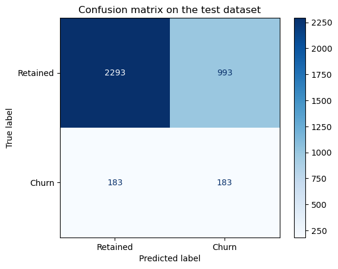

``` python
print("Report with train dataset")
yt_pred = rf_best.predict(X=X_train)
print(classification_report(y_true=y_train, y_pred=yt_pred))

print("Report with test dataset")
y_pred = rf_best.predict(X=X_test)
print(classification_report(y_true=y_test, y_pred=y_pred))
```

    Report with train dataset
                  precision    recall  f1-score   support

               0       0.95      0.71      0.81      9901
               1       0.19      0.65      0.30      1053

        accuracy                           0.70     10954
       macro avg       0.57      0.68      0.55     10954
    weighted avg       0.88      0.70      0.76     10954

    Report with test dataset
                  precision    recall  f1-score   support

               0       0.93      0.70      0.80      3286
               1       0.16      0.50      0.24       366

        accuracy                           0.68      3652
       macro avg       0.54      0.60      0.52      3652
    weighted avg       0.85      0.68      0.74      3652

# Plot Tree

``` python
from sklearn.tree import plot_tree
plt.figure(figsize=(80,40))
plot_tree(rf_best.estimators_[1], feature_names = X.columns, class_names=['Retained', "Churn"],filled=True)
plt.show()
```

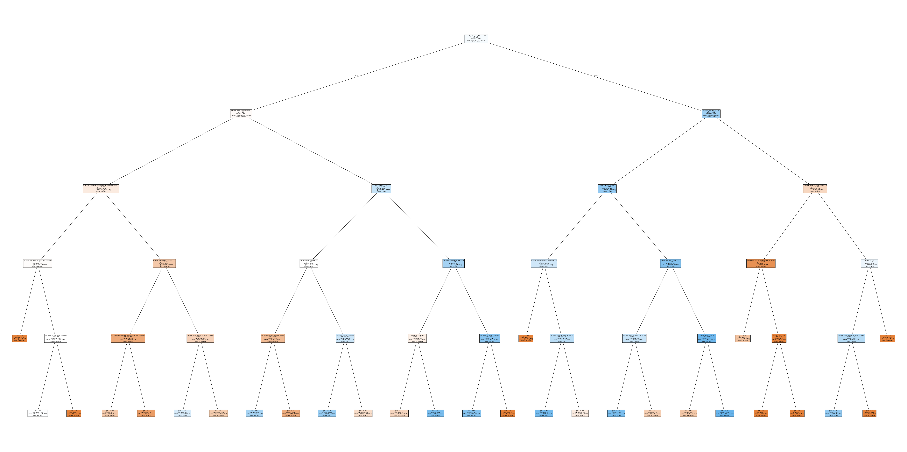

# Feature importance

``` python
imp_df2 = pd.DataFrame({
    "Varname": X_train.columns,
    "Imp": rf_best.feature_importances_
})

imp_df2.sort_values(by="Imp", ascending=False)
```

<div>
<style scoped>
    .dataframe tbody tr th:only-of-type {
        vertical-align: middle;
    }
&#10;    .dataframe tbody tr th {
        vertical-align: top;
    }
&#10;    .dataframe thead th {
        text-align: right;
    }
</style>

<table class="dataframe" data-quarto-postprocess="true" data-border="1">
<thead>
<tr style="text-align: right;">
<th data-quarto-table-cell-role="th"></th>
<th data-quarto-table-cell-role="th">Varname</th>
<th data-quarto-table-cell-role="th">Imp</th>
</tr>
</thead>
<tbody>
<tr>
<td data-quarto-table-cell-role="th">12</td>
<td>margin_net_pow_ele</td>
<td>0.106624</td>
</tr>
<tr>
<td data-quarto-table-cell-role="th">11</td>
<td>margin_gross_pow_ele</td>
<td>0.103133</td>
</tr>
<tr>
<td data-quarto-table-cell-role="th">49</td>
<td>months_activ</td>
<td>0.065080</td>
</tr>
<tr>
<td data-quarto-table-cell-role="th">60</td>
<td>origin_up_lxidpiddsbxsbosboudacockeimpuepw</td>
<td>0.053982</td>
</tr>
<tr>
<td data-quarto-table-cell-role="th">0</td>
<td>cons_12m</td>
<td>0.050567</td>
</tr>
<tr>
<td data-quarto-table-cell-role="th">...</td>
<td>...</td>
<td>...</td>
</tr>
<tr>
<td data-quarto-table-cell-role="th">57</td>
<td>channel_usilxuppasemubllopkaafesmlibmsdf</td>
<td>0.001222</td>
</tr>
<tr>
<td data-quarto-table-cell-role="th">46</td>
<td>peak_mid_peak_fix_max_monthly_diff</td>
<td>0.001065</td>
</tr>
<tr>
<td data-quarto-table-cell-role="th">30</td>
<td>var_6m_price_mid_peak_fix</td>
<td>0.001032</td>
</tr>
<tr>
<td data-quarto-table-cell-role="th">29</td>
<td>var_6m_price_peak_fix</td>
<td>0.000919</td>
</tr>
<tr>
<td data-quarto-table-cell-role="th">4</td>
<td>forecast_discount_energy</td>
<td>0.000374</td>
</tr>
</tbody>
</table>

<p>61 rows × 2 columns</p>
</div>

# Summary

The metric that we choose is the recall for class churn=1. We want to
correctly predict the churning clients. The recall meassures includes
the clients that are correctly predicted as churn and those that churn
but where incorrectly predicted as retained. We want to minimize the
clients that incorrectly predicted as retained when they should be in
churn. In this way we can try to offer them something better so they do
not churn.

We have an umbalanced dataset with more retained clients than churn. We
need to provide a solution so we can correctly predict the minority of
churning clients.

The first parameter that has to be modified is related to the depth of
the decision trees so they do not grow so much that they will always
overfit.
